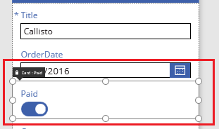
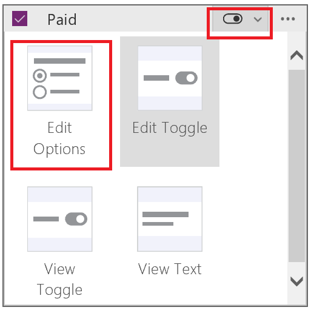
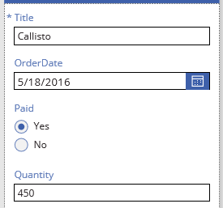
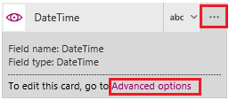

<properties
	pageTitle="Customize a card | Microsoft PowerApps"
	description="Perform basic and advanced customization on a card"
	services=""
	suite="powerapps"
	documentationCenter=""
	authors="skjerland"
	manager="anneta"
	editor=""
	tags="" />

<tags
ms.service="powerapps"
ms.devlang="na"
ms.topic="article"
ms.tgt_pltfrm="na"
ms.workload="na"
ms.date="10/30/2016"
ms.author="sharik"/>

# Customize a card in Microsoft PowerApps #
Perform basic customization (without unlocking a card) by, for example, changing its control. Perform advanced customization by unlocking the card and, for example, adding a control that isn't available for that card by default.

For an overview, see [Understand data cards](working-with-cards.md).

**Prerequisites**

- Learn how to [add and configure controls](add-configure-controls.md).
- You can review this topic for general concepts only. To follow it exactly (step by step), follow the steps in these topics:

	1. [Create an app from SharePoint](app-from-sharepoint.md).
	1. [Customize the layout](customize-layout-sharepoint.md).
	1. [Customize the form](customize-forms-sharepoint.md).

## Customize a locked card ##
In this procedure, you'll replace a **[Toggle](control-toggle.md)** control with a **[Radio](control-radio.md)** control without unlocking the card.

1. In **EditScreen1**, click or tap the **Paid** card to select it.

	

1. In the right-hand pane, click or tap the card selector for the **Paid** card, and then click or tap **Edit Options**.

	

	The screen reflects your change.

	

	For information about which types of SharePoint columns support which types of cards, see [Known issues](connection-sharepoint-online.md#known-issues).

## Unlock and customize a card ##
In this procedure, you'll unlock a card and then replace a **[Text input](control-text-input.md)** control with a **[Slider](control-slider.md)** control.

1. In **EditScreen1**, click or tap the **Quantity** card.

1. In the right-hand pane, click or tap the ellipsis icon for that card, and then click or tap **Advanced options**.

	

1. At the top of the right-hand pane, click or tap the lock icon to unlock the card.

	

1. In the card, delete the **Input text** control, add a **Slider** control, and name the new control **QtySlider**.

1.  In the right-hand pane, set the **Update** property of the **Quantity** card to this formula: 
**QtySlider.Value**

	**Note**: If the **Update** property doesn't appear, click or tap **More options** at the bottom of the **Data** section.

	

1. Click or tap the slider to select it, and then open the list of controls at the top of the right-hand pane.

1. Click or tap **ErrorMessage4**, and then set its **Height** property to this formula: 
**QtySlider.Y + QtySlider.Height**
