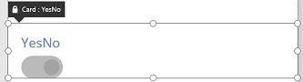
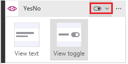
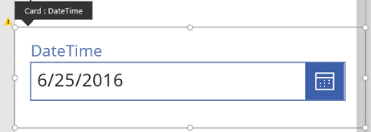
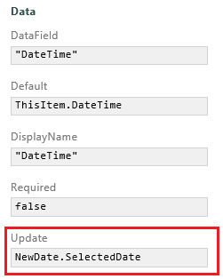

<properties
	pageTitle="Customize a card | Microsoft PowerApps"
	description=""
	suite="powerapps"
	documentationCenter=""
	authors="AFTOwen"
	manager="erikre"
	editor=""
	tags="" />

<tags
ms.service="powerapps"
ms.devlang="na"
ms.topic="article"
ms.tgt_pltfrm="na"
ms.workload="na"
ms.date="06/25/2016"
ms.author="anneta"/>

# Customize a card in Microsoft PowerApps #
Perform basic customization (without unlocking a card) by, for example, changing its default control or specifying a lookup field. Perform advanced customization by unlocking the card and, for example, adding a control that isn't available for that card by default.

**Prerequisites**

- Learn how to [add and configure controls](add-configure-controls.md).
- Create an app from data, such as the one in [create an app from SharePoint](app-from-sharepoint.md).

## Customize a locked card ##
1. In **DetailScreen1**, click or tap a card.  

1. In the right-hand pane, click or tap the card selector, and then click or tap the control that you want.  
  

	For information about which types of column support which types of cards, see [Common issues and resolutions](common-issues-and-resolutions.md#create-an-app-automatically-from-sharepoint).

1. For lookup data, specify which property of the field appears:

	1. Click or tap the ellipsis for the card, and then click or tap **Advanced options**.  

	

	1. In the **Data** section, open the **Value** list, and then click or tap the property that you want to show.  

## Unlock and customize a card ##
1. In **EditScreen1**, click or tap the card for the date field (for example, **DateTime**), and then set its **Height** property to **185**.

1. With the card still selected, click or tap its ellipsis icon in the right-hand pane, and then click or tap **Advanced options**.

	

1. At the top of the right-hand pane, click or tap the lock icon to unlock the card.

	

1. In the card, delete the **Input text** control, add a **DatePicker** control, and name the new control **NewDate**.

	

1.  In the right-hand pane, set the **Update** property of the **DateTime** card to this formula: 
**NewDate.SelectedDate**

	**Note**: If the **Update** property doesn't appear, click or tap the down arrow at the bottom of the **Data** section.

	

1. In the list of controls at the top of the right-hand pane, click or tap **ErrorMessage3**, and set its **Height** property to this formula: 
**NewDate.Y + NewDate.Height**
