<properties
   pageTitle="Customize a layout in PowerApps | Microsoft PowerApps"
   description="Specify which controls to show, which fields to show in each control, and which columns to use for sorting and searching for records."
   services=""
   suite="powerapps"
   documentationCenter="na"
   authors="aftowen"
   manager="erikre"
   editor=""
   tags=""/>

<tags
   ms.service="powerapps"
   ms.devlang="na"
   ms.topic="article"
   ms.tgt_pltfrm="na"
   ms.workload="na"
   ms.date="09/03/2016"
   ms.author="anneta"/>

# Customize a layout in PowerApps #
After you generate an app automatically, customize the browse screen by specifying which controls to show, which fields to show in each control, and which columns to use for sorting and searching for records.

If you're unfamiliar with PowerApps, see [Introduction to PowerApps](getting-started.md).

This tutorial is based on a SharePoint list that contains these columns, but the same principles apply to any generated app.

For illustration purposes, the list contains this data:

## Choose a layout ##
1. Open an app that you generated automatically.

	For example, open an app that you [generated based on a SharePoint list](app-from-sharepoint.md).

1. Ensure that the browse screen (**BrowseScreen1**) is selected by clicking or tapping the tap thumbnail in the left navigation bar.

	

1. In the right-hand pane, click or tap the layout that contains only a heading.

	

	**Tip**: After you finish this tutorial, you can choose whichever layout best suits your data.

1. Just under the search box, click or tap the **Text box** control to select it.

	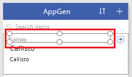

	**Note**: By default, the app shows information from the **Description** column of the sample data. If your data doesn't contain any information in the column that appears by default, the **Text box** control will be empty and won't appear because it has no border. But you can still click or tap the control to select it.

	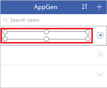

1. In the right-hand pane, click or tap the down arrow to open the list of columns that you can show.

	

1. In the list that appears, click or tap the **Title** column.

	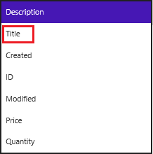

	**BrowseScreen1** reflects your change.

	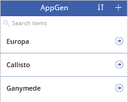

1. In the left navigation bar, click or tap the middle thumbnail to select **DetailsScreen1**.

	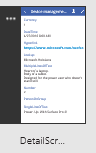

1. Click or tap any field in that screen to show the form-customization options in the right-hand pane.

	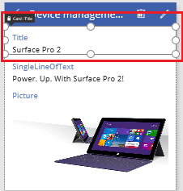

1. In the right-hand pane, click or tap the eye icon for each card to show or hide it in the app.

	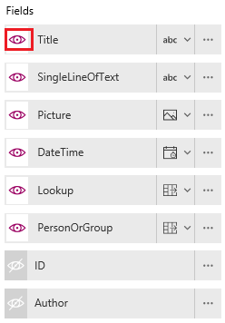

1. Change the order in which the cards appear by clicking or tapping a card to select it and then dragging its title bar up or down.

	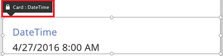

## Run the app ##
As you customize the app, you can test your changes by running the app in **Preview** mode, as the steps in this section demonstrate.

1. In the left navigation bar, click or tap the top thumbnail to select **BrowseScreen1**.

1. Open Preview mode by pressing F5 (or by selecting the **Preview** icon near the upper-right corner).  

	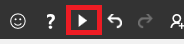

2. On **BrowseScreen1**, click or tap the arrow for an item to show details about that item.  

	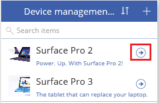

3. On **DetailsScreen1**, click or tap the edit icon (in the upper-right corner) to edit the record.  

	

4. On **EditScreen1**, change the information in one or more fields, and then click or tap the check mark in the upper-right corner to save your changes back to the SharePoint list.  

	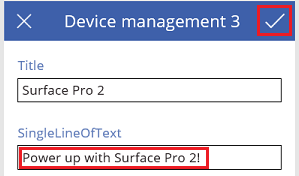

## Next steps ##
- Press Ctrl-S to save your app so that you can run it from other devices.
- [Customize one or more cards](customize-card.md) (for example, to change the control in which a type of data appears).
- [Share the app](share-app.md) so that other people can run it.
