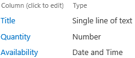
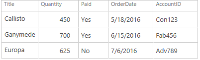
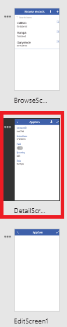
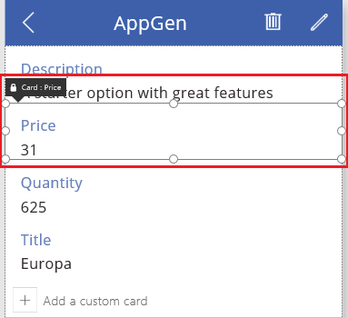
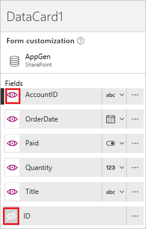
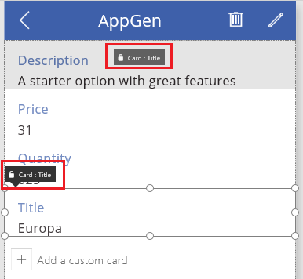
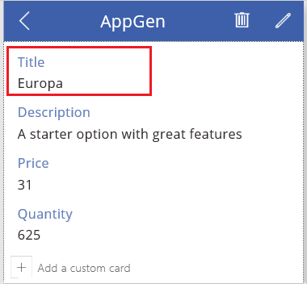
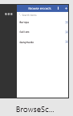
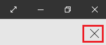

<properties
   pageTitle="Customize forms in PowerApps | Microsoft PowerApps"
   description="Specify which data to show, in which order to show them, and in which controls."
   services=""
   suite="powerapps"
   documentationCenter="na"
   authors="aftowen"
   manager="erikre"
   editor=""
   tags=""/>

<tags
   ms.service="powerapps"
   ms.devlang="na"
   ms.topic="article"
   ms.tgt_pltfrm="na"
   ms.workload="na"
   ms.date="09/03/2016"
   ms.author="anneta"/>

# Customize forms in PowerApps #
Customize a **Display form** control and an **Edit form** control so that they show the data that matters most, in the most intuitive order, and in the controls that help users easily understand and update the data.

Each form comprises one or more cards, each of which shows data from a particular column in the data source. By following the steps in this topic, you can specify which cards appear in a form, move cards up and down within a form, and configure how data from each column appears within a card.

If you're unfamiliar with PowerApps, see [Introduction to PowerApps](getting-started.md).

This tutorial is based on a SharePoint list that contains these columns, but the same principles apply to any generated app.

For illustration purposes, the list contains this data:

## Show and hide cards ##
1. Open an app that you generated automatically.

	For example, open an app that you [generated based on a SharePoint list](app-from-sharepoint.md).

1. In the left navigation bar, click or tap the middle thumbnail to select **DetailsScreen1**.

	

1. Click or tap any card to select it and show the form-customization options in the right-hand pane.

	

1. In the right-hand pane, click or tap the eye icon for each card to show or hide it in the app.

	

## Reorder the cards ##
- Click or tap a card to select it, and then drag its title bar up or down.

	

	The card that you're moving will appear just above the card that's highlighted when you release the mouse button.

	

## Run the app ##
1. In the left navigation bar, click or tap the top thumbnail to select **BrowseScreen1**.

	

1. Open Preview mode by pressing F5 (or by selecting the **Preview** icon near the upper-right corner).  

	

1. In the upper-right corner, click or tap the plus icon to add a record in **EditScreen1**.

	

1. Add whatever data you want, and then click or tap the checkmark icon in the upper-right corner to save your new record in the SharePoint list and return to **BrowseScreen1**.

	

1. Click or tap the arrow for the item that you just created to show details about that item in **DetailScreen1**.  

	

1. In the upper-right corner, click or tap the edit icon to update the record in **EditScreen1**.

	

1. Change the information in one or more fields, and then click or tap the check mark in the upper-right corner to save your changes in the SharePoint list and return to **DetailScreen1**.  

	

1. Near the upper-right corner, click or tap the trash-bin icon to delete the record that you just updated and to return to **BrowseScreen1**.

	

1. Close Preview mode by pressing F5 (or by clicking or tapping the close icon near the upper-left corner, *under* the title bar for PowerApps).

	

## Next steps ##
- Press Ctrl-S to save your app so that you can run it from other devices.
- [Customize one or more cards](customize-card.md) (for example, to change the control in which a type of data appears).
- [Share the app](share-app.md) so that other people can run it.
