<properties
   pageTitle="Customize a layout in PowerApps | Microsoft PowerApps"
   description="Specify which controls to show, which fields to show in each control, and which columns to use for sorting and searching for records."
   services=""
   suite="powerapps"
   documentationCenter="na"
   authors="aftowen"
   manager="erikre"
   editor=""
   tags=""/>

<tags
   ms.service="powerapps"
   ms.devlang="na"
   ms.topic="article"
   ms.tgt_pltfrm="na"
   ms.workload="na"
   ms.date="09/03/2016"
   ms.author="anneta"/>

# Customize a layout in PowerApps #
After you generate an app automatically in PowerApps, customize the browse screen, which appears by default. Specify which layout to use, which columns to show, and which columns to use when sorting and searching for records.

If you're unfamiliar with PowerApps, see [Introduction to PowerApps](getting-started.md).

This tutorial is based on a SharePoint list, but the same principles apply to any generated app.

## Generate an app ##
1. Create a SharePoint list that contains these columns, and name the list **AppGen**.

	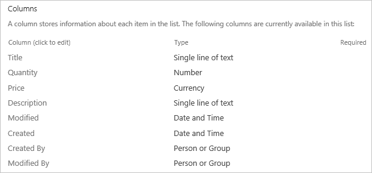

1. In the list that you just created, add this data.

	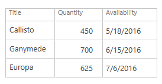

1. [Generate an app automatically](app-from-sharepoint.md) based on the list that you just created.

## Choose a layout ##
1. In the left navigation bar, click or tap the top thumbnail to ensure that the browse screen (**BrowseScreen1**) is selected.

	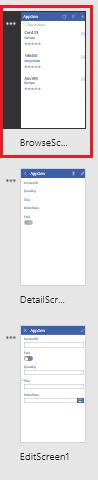

1. In the right-hand pane, click or tap the layout that contains a heading and a description.

	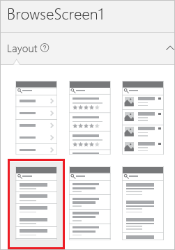

	**BrowseScreen1** shows the layout that you specified and the **Title** and **AccountID** for each item.

	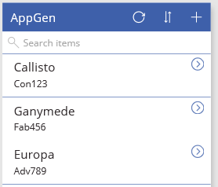

	Next, you'll specify that the **OrderDate** for each item will appear instead of the **AccountID**.

1. Click or tap the **AccountID** for the first item on the screen.

	When you click or tap a UI element (called a control), you select it, and a selection border with resize handles appears around that control.

	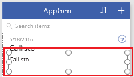

1. In the right-hand pane, click or tap the down arrow for the highlighted list.

	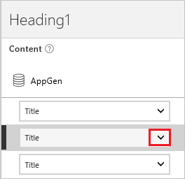

1. In the list of columns that you can show, click or tap **OrderDate**.

	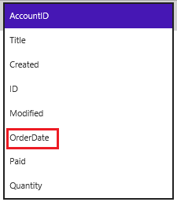

	**BrowseScreen1** reflects your change.

	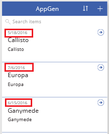

## Set the sort and search columns ##
1. Select the **Gallery** control by clicking or tapping any record except the first one.

	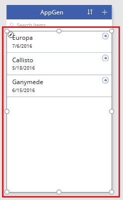

1. Near the upper-left corner, ensure that the property list shows **Items**.

	

	The value of this property, which appears in the formula bar, determines not only the source of data that appears on the screen but also the search and sort columns.

	For example, the formula bar might contain this formula by default.

	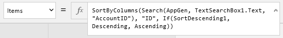

	Based on this formula, users can search for all records that contains one or more letters in either the **AccountID** column or the **Title** column.

	

	If a user typed, for example, the letter "v" into the search bar, the screen would show the record for Europa. The title of that record doesn't match the search criterion, but the account ID does. Later in this procedure, you'll change the formula to search only in the **Title** column.

	In any generated app, users can sort records alphabetically in ascending or descending order by clicking or tapping the sort button near the upper-right corner. This formula specifies that the records will be sorted based on the **AccountID** column.

	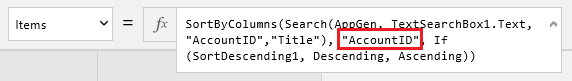

	Later in this procedure, you'll change the formula to sort the records based on the **Title** column instead.

1. In the formula bar, delete the first instance of **"AccountID"** and the comma that follows it.

1. In the formula bar, replace the remaining instance of **"AccountID"** with **"Title"** (including the double quotation marks).

	The formula bar should now contain a formula that resembles this example: 
	**SortByColumns(Search(AppGen, TextSearchBox1.Text, "Title"), "Title", If(SortDescending1, Descending, Ascending))**

	**Note**: The number that appears after **TextSearchBox** might be higher, depending on what actions you took previously. However, the formula should still work as expected.

## Test sorting and searching ##
1. Open Preview mode by pressing F5 (or by clicking or tapping the play button near the upper-right corner).

	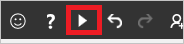

1. Near the upper-right corner of **BrowseScreen1**, click or tap the sort button one or more times to change the alphabetical sort order between ascending and descending.

	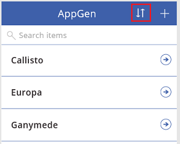

1. In the search box, type one more letters to show only those records of which the title contains the letter or letters that you type, regardless of case.

	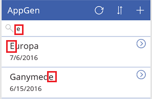

1. Remove all text from the search bar, and then close Preview mode by pressing Esc (or by clicking or tapping the close icon *under* the title bar for PowerApps).

	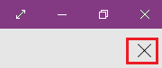

## Change the title of the screen ##
1. Click or tap the title of the screen to select it.

	

1. Ensure that the property list shows **Text**, and then type the name that you want, surrounded by double quotation marks, in the formula bar.

	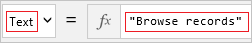

	**BrowseScreen1** reflects your change.

	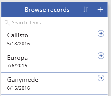

## Next steps ##
- Press Ctrl-S to save your changes.
- [Customize the forms](customize-forms-sharepoint.md) in the app by showing, hiding, and reordering the fields that the forms show.
