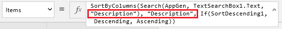
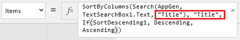

<properties
   pageTitle="Customize a layout in PowerApps | Microsoft PowerApps"
   description="Specify which controls to show, which fields to show in each control, and which columns to use for sorting and searching for records."
   services=""
   suite="powerapps"
   documentationCenter="na"
   authors="aftowen"
   manager="erikre"
   editor=""
   tags=""/>

<tags
   ms.service="powerapps"
   ms.devlang="na"
   ms.topic="article"
   ms.tgt_pltfrm="na"
   ms.workload="na"
   ms.date="09/03/2016"
   ms.author="anneta"/>

# Customize a layout in PowerApps #
After you generate an app automatically in PowerApps, customize the browse screen by specifying which layout to use, which columns to show, and which columns to use when sorting and searching for records.

If you're unfamiliar with PowerApps, see [Introduction to PowerApps](getting-started.md).

This tutorial is based on a SharePoint list that contains these columns, but the same principles apply to any generated app.

For illustration purposes, the list contains this data:

## Choose a layout ##
1. Open an app that you generated automatically in PowerApps.

	For example, open an app that you [generated based on a SharePoint list](app-from-sharepoint.md).

1. Ensure that the browse screen (**BrowseScreen1**) is selected by clicking or tapping the tap thumbnail in the left navigation bar.

	

1. In the right-hand pane, click or tap the layout that contains only a heading.

	

	**Tip**: After you finish this tutorial, you can choose whichever layout best suits your data.

1. Just under the search box, click or tap the **Text box** control to select it.

	When you select a control, a selection border with resize handles appears around it.

	

	**Note**: By default, the app shows information from the **Description** column of the sample data. If your data doesn't contain any information in the column that appears by default, the **Text box** control will be empty and won't appear because it has no border. But you can still click or tap the control to select it.

	

1. In the right-hand pane, click or tap the down arrow to open the list of columns that you can show.

	

1. In the list that appears, click or tap the **Title** column.

	

	**BrowseScreen1** reflects your change.

	

## Set the sort and search columns ##
1. Select the **Gallery** control by clicking or tapping any item in it except the first one.

	

1. Near the upper-left corner, ensure that the property list shows **Items**.

	

1. In the formula bar, replace the default search and sort columns with the columns that you want to use.

	For example, the formula bar might contain this formula by default.

	

	To search and sort by the **Title** column instead of the **Description** column, replace both instances of **"Description"** with **"Title"**. Make sure that you keep the double quotation marks around the column names.

	Now the formula bar should match this example:

	

## Test sorting and searching ##
1. Open Preview mode by pressing F5 (or by clicking or tapping the play button near the upper-right corner).

	

1. Near the upper-right corner of **BrowseScreen1**, click or tap the sort button one or more times to change the alphabetical sort order between ascending and descending.

	

1. In the search box, type one more letters to show only those records of which the title contains the letter or letters that you type, regardless of case.

	

1. Remove all text from the search bar, and then close Preview mode by pressing Esc (or by clicking or tapping the close icon *under* the title bar for PowerApps).

	

## Change the title of the screen ##
1. Click or tap the title of the screen to select it.

	

1. Ensure that the property list shows **Text**, and then type the name that you want, surrounded by double quotation marks, in the formula bar.

	

	**BrowseScreen1** reflects your change.

	

## Next steps ##
- Press Ctrl-S to save your changes.
- [Customize the forms](customize-forms-sharepoint.md) in the app by showing, hiding, and reordering the fields that the forms show.
