<properties
	pageTitle="Generate an app using the Common Data Model | Microsoft Common Data Model"
	description="Generate an app to add, update, and delete records in the Common Data Model"
	services="powerapps"
	documentationCenter="na"
	authors="karthik-1"
	manager="erikre"
	editor=""
	tags=""/>

<tags
   ms.service="powerapps"
   ms.devlang="na"
   ms.topic="article"
   ms.tgt_pltfrm="na"
   ms.workload="na"
   ms.date="07/21/2016"
   ms.author="karthikb"/>

# Generate an app using the Common Data Model #

[AZURE.VIDEO nb:cid:UUID:e0d83908-aedd-4db3-8ea9-2dbd4695c662]

Generate an app automatically to manage data that's stored in the Common Data Model. Manage data in one of many standard entities (which are built in to the model) or a custom entity (which you or someone else in your organization created).

If you're unfamiliar with the Common Data Model, see [Understand entities](data-platform-intro.md).

As this topic describes, you can automatically generate an app based on a single entity that you specify. You can also build an app from scratch that uses one or more entities that you specify. For more information, see [Build an app from scratch](data-platform-create-app-scratch.md).

Every app that PowerApps generates has three screens by default:

- The browse screen shows a subset of fields (perhaps just one) so that users can easily find a specific record.

	

- The details screen shows more or all fields for a specific record.

	

- The edit screen provides UI elements in which users can create or update a record.

	

When you generate an app from the Common Data Model, you don't need to create a connection from PowerApps, as you do with data sources such as SharePoint, Dynamics CRM, and Salesforce. You need only specify the entity that you want to show, manage, or both in the app.

## Generate an app ##
1. [Sign up for PowerApps](signup-for-powerapps.md), and then do *either* of the following:

	- [Open PowerApps](https://create.powerapps.com/api/start) in a browser.
	- [Install PowerApps](http://aka.ms/powerappsinstall) from the Windows Store. Open PowerApps, sign in, and then click or tap **New** on the **File** menu (along the left edge).

		

1. Under **Create an app from your data**, click or tap **Phone layout** on the **Common Data Model** tile.

	

1. If prompted, click or tap **Create my database**.

	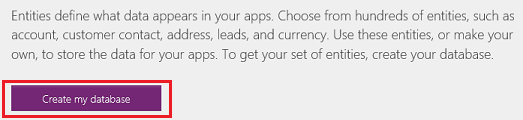

1. Under **Choose an entity**, click or tap the **Contact** entity.

	

1. Click or tap **Connect** to automatically generate an app.

	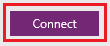

1. If you're not familiar with PowerApps, identify key areas of the app by taking the intro tour (or click or tap **Skip**).

	

	**Note**: You can always take the tour later by clicking or tapping the question-mark icon near the upper-right corner and then clicking or tapping **Take the intro tour**.

## Customize the browse screen ##
1. In the right-hand pane, click or tap the layout that shows just a header.

	

1. Under the search box, click or tap the **Text box** control to select it.

 	Whenever you select a control, a selection box (with resize handles) surrounds that control.

	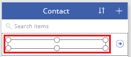

1. In the right-hand pane, click or tap the down arrow to open the list of fields.

	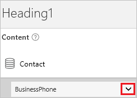

1. Click or tap **Last Name** to show data from that field in the **Text box** control that you selected.

	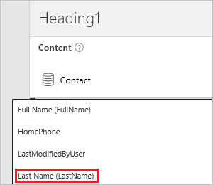

1. Select the gallery by clicking or tapping any name except the top one.

	A selection box surrounds the gallery.

	

1. Near the upper-left corner, ensure that the property list shows **Items**.

	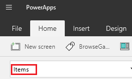

1. In the formula bar, highlight the default formula.

	

1. Press Delete to delete the default formula, and then copy this formula.
 **SortByColumns(Search(Contact, TextSearchBox1.Text, "LastName"), "LastName", If(SortDescending1, Descending, Ascending))**

1. In the formula bar, paste the formula that you just copied.

	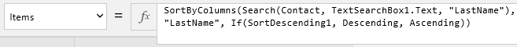

	The names are sorted alphabetically.

## Test the browse screen ##
1. Open Preview mode by pressing F5 (or by clicking or tapping the play icon near the upper-right corner).

	

1. Near the upper-right corner, click or tap the sort button one or more times to change order in which the names are listed.

	

1. In the search box, type a letter such as "w" to show only those names that contain the letter that you typed.

	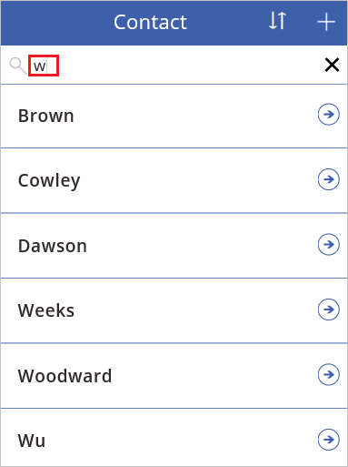

1. Click or tap the arrow to the right of the first name in the list.

	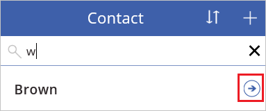

1. Return to the design workspace by pressing Esc (or by clicking or tapping the close icon near the upper-right corner, under the title bar).

	

## Customize the details screen ##
1. Click or tap the **CellPhone** card to select it.

	

1. In the right-hand pane, click or tap the eye icon for the **CellPhone** card to hide it.

	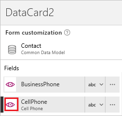

1. Repeat the previous step for each of these cards:

	- **Description**
	- **Facebook**
	- **FullName**

1. Click or tap the **FirstName** card to select it.

	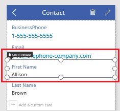

1. Drag its title up until the **BusinessPhone** card is highlighted.

	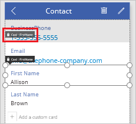

1. Release the mouse button so that the **FirstName** card appears above the **BusinessPhone** card.

	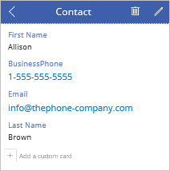

1. Repeat the last three steps except move the **LastName** card so that it appears between the **FirstName** card and the **BusinessPhone** card

## Customize the edit screen ##
1. Near the upper-right corner of the details screen, click or tap the pencil icon to select it, and then click or tap it again to open the edit screen.

	

1. Repeat the steps in the previous procedure to show, hide, and arrange the cards on the edit screen as you did on the details screen.
