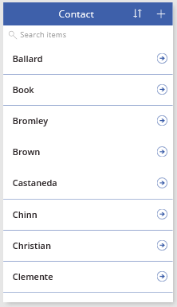
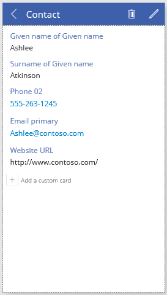
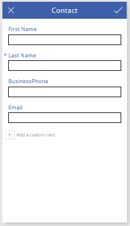
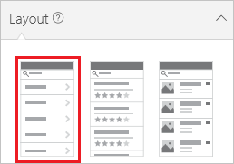
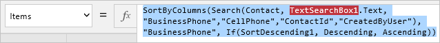

<properties
	pageTitle="Generate an app using a Common Data Service database | Microsoft PowerApps"
	description="Generate an app to add, update, and delete records."
	services="powerapps"
	documentationCenter="na"
	authors="robinarh"
	manager="robinarh"
	editor=""
	tags=""/>

<tags
   ms.service="powerapps"
   ms.devlang="na"
   ms.topic="article"
   ms.tgt_pltfrm="na"
   ms.workload="na"
   ms.date="10/18/2016"
   ms.author="robinr"/>

# Generate an app by using a Common Data Service database

[AZURE.VIDEO nb:cid:UUID:e0d83908-aedd-4db3-8ea9-2dbd4695c662]

You can automatically generate an app to manage data that is stored in Common Data Service. You can manage data in one of the many standard entities that are built into the model, or in a custom entity that you or someone else in your organization creates.

If you're unfamiliar with Common Data Service, see [Understand entities](data-platform-intro.md).

This topic describes how to automatically generate an app that is based on a single entity that you specify. For information about how to build an app that is based on more than one entity, see [Build an app from scratch](data-platform-create-app-scratch.md).

By default, every app that Microsoft PowerApps generates has three screens:

- The browse screen shows a subset of one or more fields, a search bar, and a sort button that lets users easily find a specific record.

	

- The details screen shows more or all fields for a specific record.

	

- The edit screen provides UI elements that let users create or update a record and save their changes.

	

**Note:** When you generate an app from Common Data Service, you don't have to create a connection from PowerApps, as you do for data sources such as Microsoft SharePoint, Microsoft Dynamics CRM, and Salesforce. You must specify only the entity that you want to show, manage, or show and manage in the app.

## Generate an app
1. Create a Common Data Service database. For more information, see [Create a Common Data Service database](create-cdm-database.md).
1. On [PowerApps.com](https://web.powerapps.com), in the left navigation pane, click or tap **New app**.
1. In the dialog box that appears, click or tap **PowerApps Studio for web**. (You can also click or tap **PowerApps Studio for Windows**, and then follow the instructions to install PowerApps Studio for Windows. Although the instructions that follow use PowerApps Studio for web, the instructions for the Microsoft Windows app are similar.)
1. Under **Start with your data**, on the **Common Data Service** tile, click or tap **Phone layout**.
1. Under **Choose an entity**, click or tap the **Contact** entity.
1. Click or tap **Connect** to automatically generate an app. (At this point, you can take an introductory tour. You can also take the tour later by clicking or tapping the question mark near the upper-right corner, and then clicking or tapping **Take the intro tour**.)

## Customize the browse screen
1. In the right pane, click or tap the layout that shows just a heading.

	

1. On the **Contact** screen, under the search box, click or tap the **Text box** control to select it. By default, this control doesn't have a border. A border appears only when you select the control. Whenever you select a control, a selection box that has resize handles surrounds the control.
1. In the right pane, click or tap **Data Sources**, and then, in the **Contact** field, select **Last Name** to show data from that field in the **Text box** control that you selected.
1. On the **Contact** screen, select the gallery by clicking or tapping any name except the top name. A selection box surrounds the gallery.
1. Copy the following formula by selecting it and then pressing Ctrl+C.

	**SortByColumns(Search(Contact, TextSearchBox1.Text, "LastName"), "LastName", If(SortDescending1, Descending, Ascending))**
	
1. Near the upper-left corner, make sure that the property list shows **Items**.
1. In the formula bar, select the default formula.

	

1. Press Delete to delete the default formula, and then paste the formula that you copied. The names in the gallery are sorted alphabetically.
1. Optional: If the users of this app won't have touchscreens or mouse wheels, click or tap the **Gallery** tab, and then click or tap **Show Scrollbar**.

	**Note:** If the **Gallery** tab doesn't appear, make sure that the gallery is still selected.

	

## Test the browse screen
1. Open Preview mode by pressing F5, or by clicking or tapping the **Play** button near the upper-right corner.
1. Scroll through all the records by using a touchscreen or a mouse wheel, or by pointing to the gallery with a mouse so that the scroll bar appears.
1. Near the upper-right corner, click or tap the sort button one or more times to change order that the names are listed in.

	

1. In the search box, type a letter to show only names that contain that letter.
1. Click or tap the arrow to the right of the first name in the list.
1. Return to the design workspace by pressing Esc, or by clicking or tapping the **Close** button near the upper-right corner, under the title bar.

## Customize the details screen
1. In the left pane, click or tap **DetailScreen**.
1. Click or tap the **CellPhone** card to select it.
1. In the right pane, click or tap the eye button for the **CellPhone** card to hide that card.
1. Repeat the previous step for each of the following cards:

	- Description
	- Facebook
	- FullName

1. Click or tap the **FirstName** card to select it.
1. Drag the card title up until the **BusinessPhone** card is highlighted.
1. Release the **FirstName** card title, so that the card now appears above the **BusinessPhone** card.
1. Repeat the last three steps to move the **LastName** card between the **FirstName** card and the **BusinessPhone** card.

## Customize the edit screen
1. In the left pane, click or tap **EditScreen**.
1. Near the upper-right corner of the edit screen, click or tap the pencil button to select it, and then click or tap it again to open the edit screen.

	

1. Repeat the steps in the previous procedure to hide and move the cards on the edit screen as you did on the details screen.

## Test the details and edit screens
1. In the left navigation bar, click or tap the top thumbnail image to open the browse screen.
1. Open Preview mode by pressing F5, or by clicking or tapping the **Play** button near the upper-right corner.
1. In the upper-right corner of the browse screen, click or tap the plus sign button (**+**) to create a record.
1. Add data, and then click or tap the check mark button to save your new record and return to the browse screen.
1. Show all records by removing any text from the search bar near the top of the browse screen.
1. Find the record that you just created, and then click or tap the arrow to the right of it to show the record on the details screen.
1. In upper-right corner, click or tap the pencil button to show the record on the edit screen.
1. Change the data in one or more fields, and then click or tap the check mark button to save your changes and return to the browse screen.
1. Find the record that you just updated, and then click or tap the arrow to the right of it.
1. Near the upper-right corner, click or tap the trash bin button to delete the record that you created and updated.
