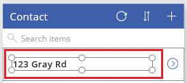
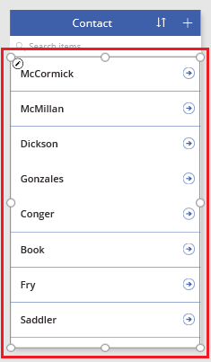

<properties
	pageTitle="Generate an app using a Common Data Service database | Microsoft PowerApps"
	description="Generate an app to add, update, and delete records."
	services="powerapps"
	documentationCenter="na"
	authors="kfend"
	manager="kfend"
	editor=""
	tags=""/>

<tags
   ms.service="powerapps"
   ms.devlang="na"
   ms.topic="article"
   ms.tgt_pltfrm="na"
   ms.workload="na"
   ms.date="12/06/2016"
   ms.author="kfend"/>

# Generate an app by using a Common Data Service database

[AZURE.VIDEO nb:cid:UUID:6d7aa0a1-cd31-47c6-9a32-93b4e5476ece]

You can automatically generate an app to manage data that is stored in Common Data Service. You can manage data in one of the many standard entities that are built into the model, or in a custom entity that you or someone else in your organization creates.

If you're unfamiliar with Common Data Service, see [Understand entities](data-platform-intro.md).

This topic describes how to automatically generate an app that is based on a single entity that you specify. For information about how to build an app that is based on more than one entity, see [Build an app from scratch](data-platform-create-app-scratch.md).

By default, every app that Microsoft PowerApps generates has three screens:

- The browse screen shows a subset of one or more fields, a search bar, and a sort button that lets users easily find a specific record.
- The details screen shows more or all fields for a specific record.
- The edit screen provides UI elements that let users create or update a record and save their changes.

**Note:** When you generate an app from Common Data Service, you don't have to create a connection from PowerApps, as you do for data sources such as SharePoint, Dynamics 365, and Salesforce. You must specify only the entity that you want to show, manage, or show and manage in the app.

## Generate an app
1. Create a Common Data Service database. For more information, see [Create a Common Data Service database](create-database.md).
1. In PowerApps Studio for Windows, click or tap **New** on the **File** menu (near the left edge).
1. Under **Start with your data**, on the **Common Data Service** tile, click or tap **Phone layout**.
1. Under **Choose an entity**, click or tap the **Contact** entity.
1. Click or tap **Connect** to automatically generate an app.

	At this point, you may be prompted to take an introductory tour. You can also take the tour later by clicking or tapping the question mark near the upper-right corner, and then clicking or tapping **Take the intro tour**.

1. In the left navigation bar, click or tap an icon in the upper-right corner to switch to the thumbnail view. 

	

## Customize the browse screen
1. In the right pane, click or tap the layout that shows just a heading.

	

1. Under the search box, click or tap the **Label** control to select it.

	

1. In the right pane, select **Surname of Given name** in the dropdown list

 	The **Label** control that you selected shows data from that field.

1. In the browse screen, select the gallery by clicking or tapping any name except the top name.

	A selection box surrounds the gallery.

	

1. Copy the following formula by selecting it and then pressing Ctrl+C.

	**SortByColumns(Search(Contact, TextSearchBox1.Text, "Name_Surname"), "Name_Surname", If(SortDescending1, Descending, Ascending))**

1. Near the upper-left corner, make sure that the property list shows **Items**.

1. In the formula bar, select the default formula.

	

1. Press Delete to delete the default formula, and then paste the formula that you copied. The names in the gallery are sorted alphabetically.

1. Optional: If the users of this app won't have touchscreens or mouse wheels, click or tap the **Gallery** tab, and then click or tap **Show Scrollbar**.

	**Note:** If the **Gallery** tab doesn't appear, make sure that the gallery is still selected.

## Test the browse screen
1. Open Preview mode by pressing F5, or by clicking or tapping the **Play** button near the upper-right corner.
1. Scroll through all the records by using a touchscreen or a mouse wheel, or by pointing to the gallery with a mouse so that the scroll bar appears.
1. Near the upper-right corner, click or tap the sort button one or more times to change order that the names are listed in.

	

1. In the search box, type a letter to show only names that contain that letter.

1. Remove all text from the search box, and then click or tap the arrow to the right of the first name in the list.

	The details screen opens and shows more information about the contact you selected.

1. Return to the design workspace by pressing Esc, or by clicking or tapping the **Close** button near the upper-right corner, under the title bar.

## Customize the other screens
1. If **DetailScreen** isn't showing, click or tap the middle thumbnail in the left navigation bar.
1. Near the top of **DetailScreen**, click or tap **Full name**  to show options for customizing the form on that screen.
1. In the right pane, click or tap the eye button for **Name_MiddleName** to hide that field.
1. In the right pane, click or tap the eye button for **Name_Surname** to show that field.
1. In the right pane, drag **Name_Surname** up, and drop it just under **Name_GivenName**.

	The **DetailScreen** reflects your changes.

1. In the left navigation bar, click or tap the bottom thumbnail to show **EditScreen**, and then repeat the previous steps in this procedure so that **EditScreen** matches **DetailScreen**.

## Test the app
1. In the left navigation bar, click or tap the top thumbnail image to open the browse screen.
1. Open Preview mode by pressing F5, or by clicking or tapping the **Play** button near the upper-right corner.
1. In the upper-right corner of the browse screen, click or tap the plus sign button (**+**) to create a record.
1. Add text in the **Given name** and **Surname** fields, and then click or tap the check mark button to save your new record and return to the browse screen.
1. Find the record that you just created, and then click or tap the arrow to the right of it to show the record on the details screen.
1. In upper-right corner, click or tap the pencil button to show the record on the edit screen.
1. Change the data in the **Given name** field, and then click or tap the check mark button to save your changes.
1. Near the upper-right corner, click or tap the trash-can button to delete the record that you created and updated.

## Next steps
[Create an app from scratch using a Common Data Service database](data-platform-create-app-scratch.md)
