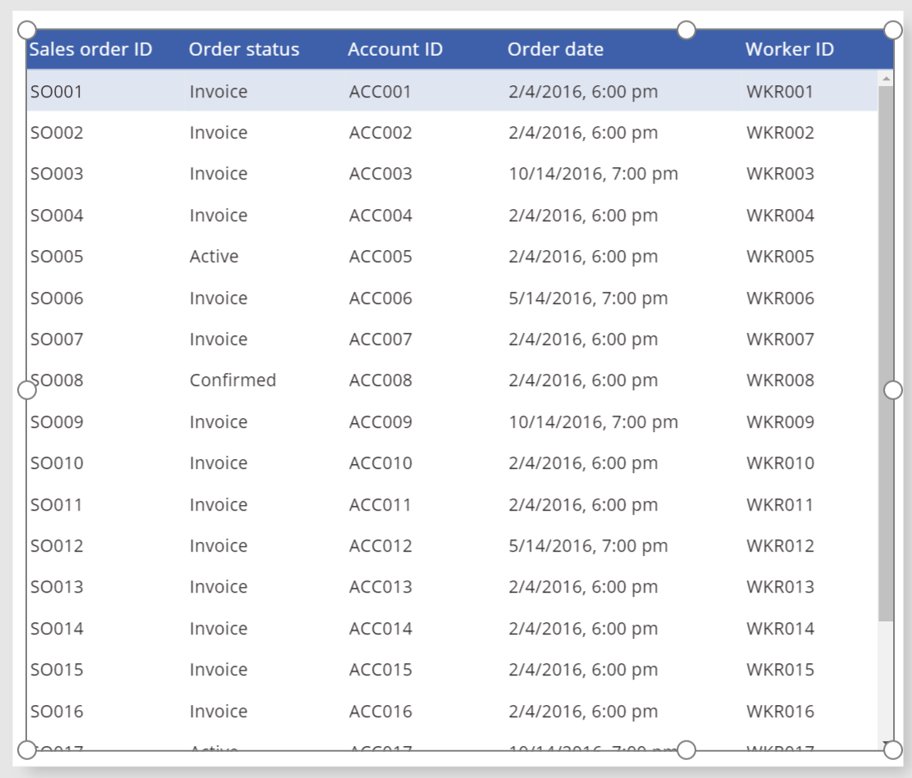

<properties
	pageTitle="Show tabular data | Microsoft PowerApps"
	description="This topic introduces the Data table control in Microsoft PowerApps."
	services="powerapps"
	documentationCenter="na"
	authors="jasongre"
	manager="kfend"
	editor=""
	tags=""/>

<tags
   ms.service="powerapps"
   ms.devlang="na"
   ms.topic="article"
   ms.tgt_pltfrm="na"
   ms.workload="na"
   ms.date="04/24/2017"
   ms.author="kfend"/>

# Show tabular data in PowerApps #
Show tabular data in an app, where each column represents a field and each row represents a record. Examples of this type of data include a list of sales orders, a set of service tickets, or a directory of contacts. To easily present tabular data, add a **Data table** control, link it to a data source, and then specify which fields to show.

## What the **Data table** control includes ##
+ **Connected data sources** You can use the **Data table** control in conjunction with connected data sources.

+ **Single-record selection** Users can select only one row at a time in the **Data table** control. You can then use the **Selected** property to access field values from that row and provide data context to other controls in the app.

+ **Read-only data** As in **Gallery** controls, **Data table** controls show read-only data. To enable a record to be edited, you must link the selected row in the **Data table** control to an **Edit form** control or another control that supports updating data.

+ **Column headings** A row of column headings appears at the top of the **Data table** control for reference. You can style the column headings to achieve the appearance that you want.

+ **Broad customization support** You can restyle a **Data table** control by customizing several properties. For example, you can adjust the style for the whole set of data rows, the selected row, or the row to which the user is pointing with a mouse.   

To learn more about the **Data table** control, its properties, and how to use it, see its [reference topic](control-data-table.md).

## We want your feedback ##
We hope that you find the **Data table** control useful for building apps that have the visuals that you want. As always, we're extremely interested in any feedback that you have about this feature. You can leave your comments on this page or in the [PowerApps community](http://aka.ms/powerapps-community). We look forward to improving this control and PowerApps as a whole by incorporating your feedback and suggestions!
