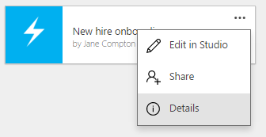

<properties
    pageTitle="Delete an app | Microsoft PowerApps"
    description="How to delete an existing app in PowerApps"
    services=""
    suite="powerapps"
    documentationCenter="na"
    authors="jamesol-msft"
    manager="erikre"
    editor=""
    tags=""
 />
<tags
    ms.service="powerapps"
    ms.devlang="na"
    ms.topic="article"
    ms.tgt_pltfrm="na"
    ms.workload="na"
    ms.date="05/19/2016"
    ms.author="jamesol"/>

# Delete an app

This article shows you how to delete an app from your PowerApps account.

## Delete an app from your account

1. On [powerapps.com][1], select **My Apps** in the left navigation bar:  

	

1. Select the ellipsis on tile of the app that you want to delete, and click **Details**:  
	

1. Select **Delete**:  
	

  **NOTE** You only have the delete option to apps that you created or apps where you have the "Can edit" permission.

1. In the dialog window, select **Delete from cloud**:  

  This action will permanently delete this app from your PowerApps account, and from the  accounts of all users that were shared this app.

	

## Resources

Here are some other good resources for managing your apps:

[Share an app](share-app.md)  
[Change app name and tile](set-name-tile.md)  
[Restore an app to a previous version](restore-an-app.md)  

<!--Reference links in article-->
[1]: http://go.microsoft.com/fwlink/p/?LinkId=715583
