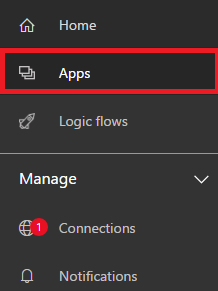
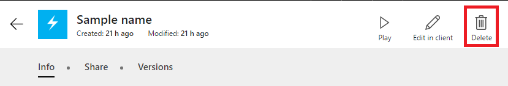
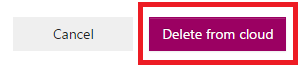

<properties
    pageTitle="Delete an app | Microsoft PowerApps"
    description="Delete an existing app."
    services=""
    suite="powerapps"
    documentationCenter="na"
    authors="jamesol-msft"
    manager="darshand"
    editor=""
    tags=""
 />
<tags
    ms.service="powerapps"
    ms.devlang="na"
    ms.topic="article"
    ms.tgt_pltfrm="na"
    ms.workload="na"
    ms.date="04/07/2016"
    ms.author="jamesol"/>

# Delete an app#

This article introduces you on how to delete an app from your PowerApps account.

## Delete an app from your account##

1. On [web.powerapps.com](1), select **My Apps** in the left navigation bar.

	

1. Select the tile of the app that you want to share.

1. Select **Delete**.

  

  NOTE: You will only have the option to delete apps that you have created or for which you have "Can edit" permission.

1. In the dialog box that appears select **Delete from cloud**

  This action will permanently delete this app from your PowerApps account, and from the  accounts of all users that were shared this app.

  

  <!--Reference links in article-->
  [1]: https://web.powerapps.com
