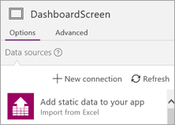

<properties
   pageTitle="AppSource Test Drive | Microsoft PowerApps"
   description="Use AppSource to share apps with customers, and generate leads for your business."
   services=""
   suite="powerapps"
   documentationCenter="na"
   authors="linhtranms"
   manager="anneta"
   editor=""
   tags=""/>

<tags
   ms.service="powerapps"
   ms.devlang="na"
   ms.topic="article"
   ms.tgt_pltfrm="na"
   ms.workload="na"
   ms.date="04/28/2016"
   ms.author="litran"/>


# AppSource Test Drive #

Are you passionate about building apps in PowerApps? Do you have an app you would like to share with customers? We now support a PowerApps Test Drive solution on [AppSource.com](https://appsource.microsoft.com) as a way for you to share apps with customers, and generate leads for your business.

## What is a Test Drive solution? ##

A Test Drive solution enables your customers to try out a real app, without signing up for a PowerApps plan or installing any applications. Customers just sign into AppSource.com using their Azure Active Directory (AAD) account and run the app in a web browser. Without Test Drive, customers can only read about your app or watch a video that describes it. With Test Drive, customers get a better idea of what your solution is and what functionality your app has. And they have the experience of actually using the app. Customers won't be able to look under the hood to see how your app is built, so your intellectual property is protected. We collect and share lead information with you to help you grow your business.

## How do I build a Test Drive solution? ##

Building an app for a Test Drive solution is just like building any app in PowerApps, but you use embedded data instead of external data connections. Using embedded data reduces the barrier of deploying the app to your customer, so there is zero friction for them to try it out. The full solution that you ultimately distribute to customers typically includes data connections, but embedded data works well for a Test Drive solution.

PowerApps natively supports building apps with embedded data, so you just need sample data for your app to use. This data should be captured in an Excel file as one or more tables. In PowerApps, you then pull the data from the Excel tables into the app and work with it there, rather than through an external connection. The three-step process below shows you how to pull data in and use that data in your app.

### Step 1: Import data into the app ###

Assume you have an Excel file with two tables: **SiteInspector** and **SitePhotos**. 


Import these two tables into PowerApps by using the option **Add static data to your app**.



You now have the tables as data sources in your app.


### Step 2: Handling read-only and read-write scenarios ###

The data you imported is _static_, therefore read-only. If your app is read-only (i.e. it only displays data to the user), reference the tables directly in the app. For example, if you want to access the **Title** field in the **SiteInspector** table, use **SiteInspector.Title** in your formula.

If your app is read-write, first pull the data from each table into a _collection_, which is a tabular data structure in PowerApps. Then work with the collection rather than the table. To pull data from the **SiteInspector** and **SitePhotos** tables into the **SiteInspectorCollect** and **SitePhotosCollect** collections:

```
ClearCollect(SiteInspectorCollect,SiteInspector); ClearCollect(SitePhotosCollect,SitePhotos)
```

The formula clears both collections, then collects data from each table into the appropriate collection:

- Call this formula somewhere in your app to load the data. 
- View all collections in your app by navigating to **File** > **Collections**. 
- For more information, see [Create and update a collection in your app](create-update-collection.md).

Now if you want to access the **Title** field, use **SiteInspectorCollect.Title** in your formula.

### Step 3: Add, update, and delete data in your app ###

You've seen how to read data directly and from a collection; now we'll show you how to add, update, and delete data in a collection:

**To add a row to a collection**, use [Collect( DataSource, Item, ... )](functions/function-clear-collect-clearcollect.md): 

```
Collect(SiteInspectorCollect,{ID:Value(Max(SiteInspectorCollect, ID)+1),Title:TitleText.Text,SubTitle:SubTitleText.Text,Description:DescriptionText.Text)
```

**To update a row in a collection**, use [UpdateIf( DataSource, Condition1, ChangeRecord1 [, Condition2, ChangeRecord2, ...] )](functions/function-update-updateif.md): 

```
UpdateIf(SiteInspectorCollect,ID=record.ID,{Title:TitleEditText.Text,SubTitle:SubTitleEditText.Text,Description:DescriptionEditText.Text)
```

**To delete a row from a collection**, use [RemoveIf( DataSource, Condition [, ...] )](functions/function-remove-removeif.md):

```
RemoveIf(SiteInspectorCollect,ID=record.ID)
```

**Note** : Collections hold data only while the app is running; any changes are discarded when the app is closed.

In summary, you can create a version of your app with embedded data, which simulates the experience of your app connecting to external data data. After the data is embedded, you can publish this app as a Test Drive solution, and host it on AppSource.com.

## How do I list my Test Drive solution on AppSource.com? ##

Now that your app is ready, it's time to publish it to AppSource.com. Follow the step-by-step instructions on how to complete this proces in the [Publishing Guide for Cloud Solutions Apps](https://aka.ms/publishinguideforwebapps). After you have entered the app metadata through the publishing portal, click or tap **PUSH TO STAGING**, and we will circle back to the next steps.