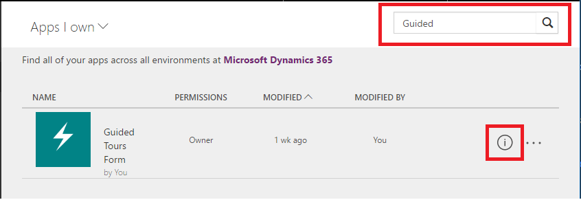
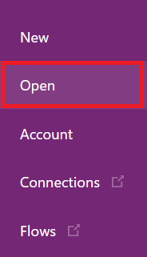

<properties
	pageTitle="Edit an app | Microsoft PowerApps"
	description="Step-by-step instructions for editing apps and session locking scenarios."
	services=""
	suite="powerapps"
	documentationCenter="na"
	authors="karthik-1"
	manager="karthikb"
	editor=""
	tags=""/>

<tags
   ms.service="powerapps"
   ms.devlang="na"
   ms.topic="article"
   ms.tgt_pltfrm="na"
   ms.workload="na"
   ms.date="5/19/2017"
   ms.author="karthikb"/>

# Edit an app in PowerApps #
This article shows you how you can edit your app. It also talks about cases when more than one person or session attempts to edit an app simultaneously.

**Prerequisites**

1. An app authored by you or shared with you with contributor permissions

1. (Optional) The app authored by you is shared with one or more members in your organization

## Permissions ##
Only apps with Owner or Can edit permissions will be editable. You can check your permissions to any app from powerapps.com. Go to Apps section and click on the **All apps** dropdown. Choose either **Apps I Own** or **Apps I contribute to**. All apps in these two categories can be edited.

## Edit an app from the portal ##
You can edit apps from either the powerapps.com or from PowerApps Studio on Windows.

1. Open [powerapps.com](https://web.powerapps.com), and then click or tap **Apps** in the left navigation bar.

	

1. (optional) Near the upper-left corner, filter the list of apps to show only those apps that you own or only those apps to which you contribute.

	**Note**: If the app that you want to edit doesn't appear, make sure that you're in the right environment.

1. Near the right edge, click or tap the info icon for the app that you want to edit.

	

1. Near the upper-right corner, click or tap the edit icon and choose **Edit on the web (preview)**

	

## Edit an app on Windows ##
1. To edit apps on Windows, login to PowerApps Studio and click on the  app page
	

1. (optional) Near the upper-right corner, search the list of apps to show only those apps that match the name. Notice apps which have a dark pencil icon can be edited.
app-editstudio

1. Near the right edge, click or tap the pencil icon for the app that you want to edit.
	

## Session locks ##
When more than one user attempts to edit the same app simultaneously from the portal or from Studio, there is a good chance for the app to get corrupted. PowerApps will prevent such a scenario by locking the app edited by a user. The following two cases apply to session locks:

 1. An app edited by a user reopened for edit by the same user in another machine or browser. In this case PowerApps provides the option to override the previous session and continue editing on the client.

	

 **Note** If the user chooses to override, there is a chance that unsaved edits from the previous session can be lost.

 1. An app edited by one user is opened for editing by another user. In this case the app cannot be edited unless the first user closes the app or the session times out for that user. Authors cannot override sessions of other authors.

 

 ## Next Steps ##
 Learn more about how to add a [screen](add-screen-context-variables.md), add a [control](add-configure-controls.md) or add a [data connection](add-data-connection.md).
