 <properties
	pageTitle="Use the Entity Form control | Microsoft PowerApps"
	description="Create apps faster by using the Entity Form control to add rich forms for a Common Data Service entity."
	services="powerapps"
	documentationCenter="na"
	authors="aneesmsft"
	manager="anneta"
	editor=""
	tags=""/>

<tags
   ms.service="powerapps"
   ms.devlang="na"
   ms.topic="article"
   ms.tgt_pltfrm="na"
   ms.workload="na"
   ms.date="03/01/2017"
   ms.author="aneesa"/>

# Use the Entity Form control#

Create apps faster by using the **Entity Form** control to add rich forms for a [Common Data Service entity](guided-learning/learning-common-data-service-entities.md).
For an introduction to the **Entity Form** control, please refer to this blog post: [New entity form control for Common Data Service (experimental feature)](https://powerapps.microsoft.com/blog/new-entity-form-control-for-common-data-service-experimental-feature/). **Please be aware of the experimental nature of the Entity Form control** as outlined in the blog post, and be careful about using the **Entity Form** control in production apps, at least for now.

## Key Properties
Here are the key properties of an **Entity Form** control.

**DataSource** Specifies the data source that contains the record(s) that you want to display.  
Note: Currently only entities in the Common Data Service are supported as data sources for the **Entity Form** control.  

**Pattern** – Specifies the style of the form that you want to display in the **Entity Form** control. Set this property by using the **FormPattern** enumeration.  
- **FormPattern.List** – Displays a tabular list of records.
- **FormPattern.CardList** – Displays a card list of records.
- **FormPattern.Details** – Displays a form to view or edit the details of a single record.
- **FormPattern.None** – No style has been explicitly specified. Defaults to **List** for tablet apps and **CardList** for phone apps.

**Item** – Specifies the record in the data source that the **Entity Form** control should display. This property is used only when **Pattern** is set to **FormPattern.Details**.

**Selected** – Gets the record that’s currently selected.  
Example: If the **Entity Form** control displays a list of sales order records, the **Selected** property will give you the record that’s currently selected. You can also access a field within a record (for example, specify the value of the **Account** field of the selected record as **Selected.Account**).

**SelectableFields** – Specifies which fields should appear as links. Set the value of this property by using this syntax:  
**{Field1Name : true, Field2Name : true}**  
Example: If you want the **SalesOrderId** and **Account** fields to appear as links in a form, set the **SelectableFields** property of that form to this value:  
**{SalesOrderId : true, Account : true}**

**SelectedField** – Determines which field was clicked or tapped. Only fields specified in the **SelectableFields** property are valid for the **SelectedField** property.  
Example: If you set the **SelectableFields** property to **{SalesOrderId : true, Account : true}** and the user clicks or taps the **Account** field, **SelectedField.Account** is set to true.

**OnFieldSelect** – Specifies the function that’s called when the user clicks or taps a field. Only fields specified in the **SelectableFields** property initiate a call to the OnFieldSelect function.

**Mode** – Determines the mode of the form. To change the mode, use the **ViewForm**, **EditForm**, or **NewForm** function. These functions work only when the **Pattern** property is set to **FormPattern.Details**. Set the value of the **Mode** property to a value of the **FormMode** enumeration. 
- **FormMode.View** – Allows users to view but not edit a record.
- **FormMode.Edit** – Allows users to edit a record.
- **FormMode.New** – Allows users to add a record.

**OnSuccess** – A function that’s called when a user successfully saves the changes to a record.

**OnFailure** - A function that’s called when a user edits a record but can’t save the changes.

**Unsaved** – Determines whether a record that a user is editing has unsaved changes.

## Related Functions
You can use these  shared functions with either the **Entity Form** control or the [Edit Form control](functions/function-form.md). These functions work with the **Entity Form** control only when its **Pattern** property is set to **FormPattern.Details**.

**ViewForm** – Sets the Mode property of an **Entity Form** control to FormMode.View.

**EditForm**- Sets the Mode property of an **Entity Form** control to FormMode.Edit.

**NewForm** - Sets the Mode property of an **Entity Form** control to FormMode.New.

**SubmitForm** - Saves changes when a user edits a record in an **Entity Form** control.

**ResetForm** - Abandons unsaved changes when a user edits a record in an **Entity Form** control.

Now that you have an overview of the various properties and functions, let’s look at them in action. 

*Note: If you don’t have access to a Common Data Service database, [create one](guided-learning/learning-common-data-service.md) before you start to follow these steps.*

## Display a list of records
Add a form that shows a list of sales orders.  

1. Create a blank tablet app.  
 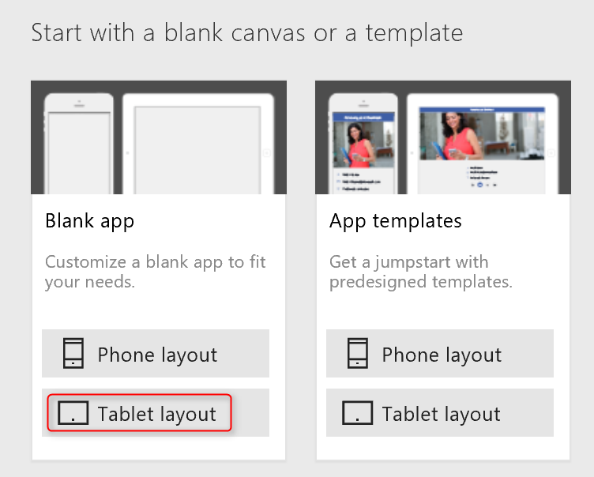

2. Rename the first screen **SalesOrderListScreen**.  
 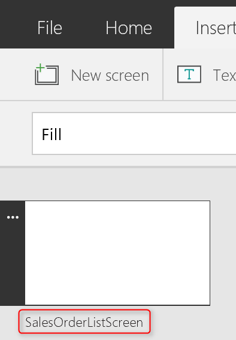

3. On the **Insert** tab, click or tap **Forms**, and then click or tap **Entity form (experimental)**.  
An **Entity Form** control is added to the screen.  
 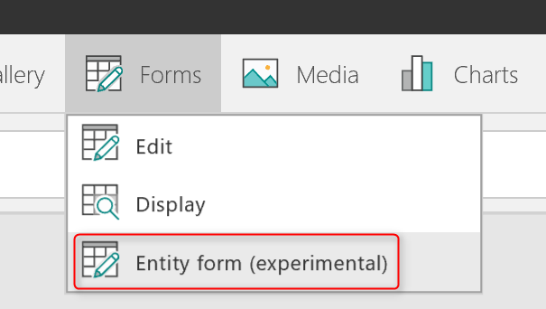

4. Rename the **Entity Form** control **SalesOrderListForm**, and resize it to cover the entire screen.

5. In the right-hand pane, click or tap the database icon next to the text **No data source selected**, and then click or tap **Add a data source**.  
 

6. In the list of connections, click or tap the connection for your database.  
 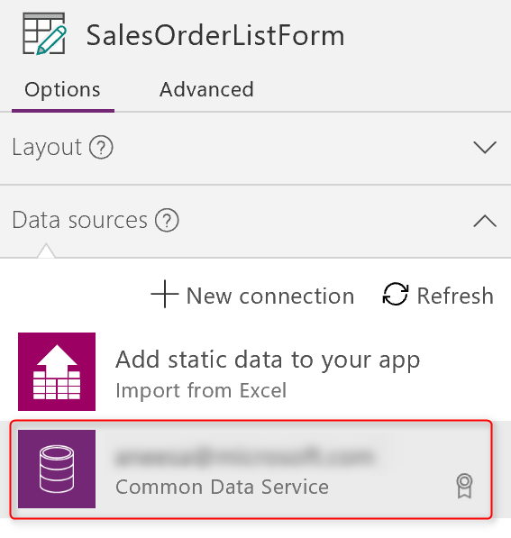

7. In the list of entities, click or tap **Sales order**, and then click or tap **Connect**. 
A data source for the **Sales order** entity is created, and the **DataSource** property of the **SalesOrderListForm** is set to that data source.  
 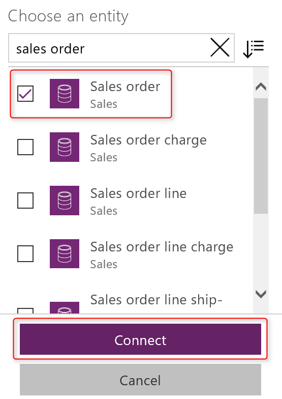  
 The **Entity Form** control shows a list of sales orders. By using the **Entity Form** control, you quickly displayed a list form without having to manually build it.
 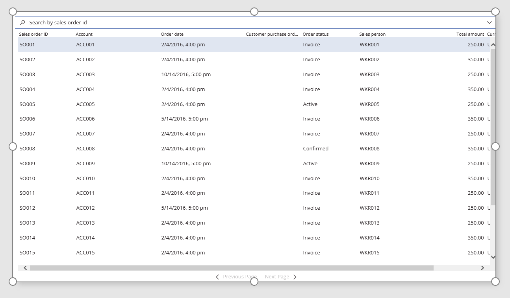  
 You didn’t set the **Pattern** property for the Entity Form control, so it defaults to the **List** pattern. In addition, the **DefaultList** field group of the Sales order entity is used to display the list form. The form is also dynamic and will automatically reflect any change in the field group.

8. (*Optional*) View the **DefaultList** field group of the **Sales order** entity:  
a. Sign in to [powerapps.com](https://web.powerapps.com), click or tap **Common Data Service** in the left navigation pane, and then click or tap **Entities**.  
b. In the list of entities, click or tap **Sales order**, click or tap the **Field groups** tab, and then click or tap the **DefaultList** field group.  
The fields in the sales order list match those listed here.  
 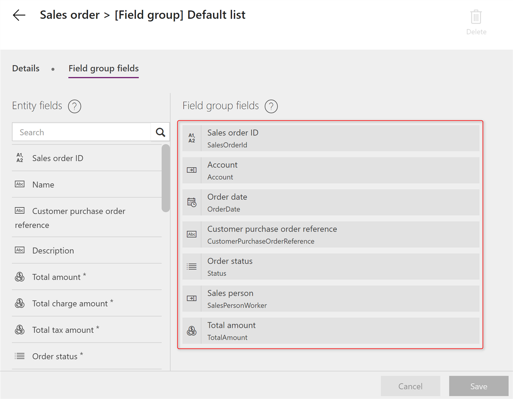   
 In the **Common Data Service**, you can [modify field groups](field-groups.md) for custom entities (but not [standard entities](guided-learning/learning-common-data-service-entities.md)) to change the fields that appear on the corresponding forms that the **Entity Form** control displays. Best of all, any change to the field group is automatically reflected in all the apps that use an **Entity Form** control to display the corresponding form.

## Display the details of a record
Let’s add another **Entity Form** control to display the details of the sales order that’s selected in the list that you created earlier.  

1. Resize **SalesOrderListForm** to cover half the screen, and add a second **Entity Form** control to cover the other half of the screen.  
 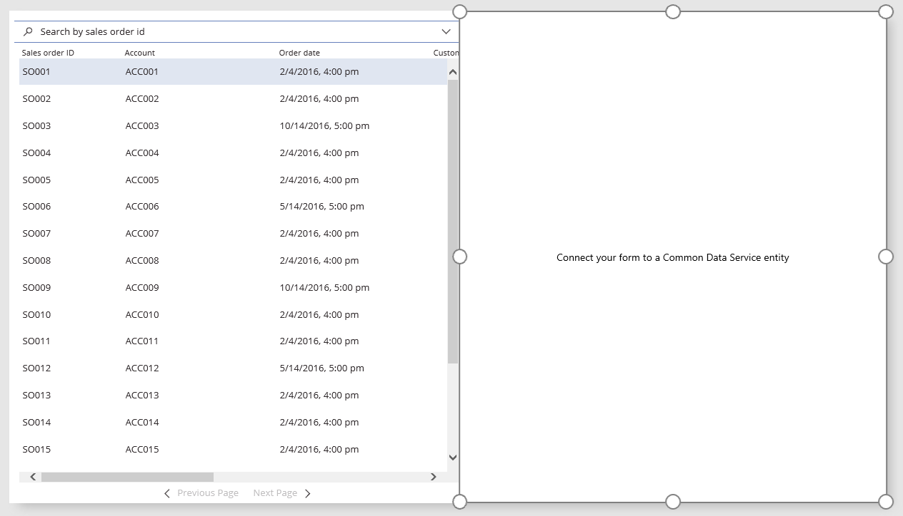

2. Rename the second **Entity Form** control **SalesOrderDetailsForm**, and connect it to the **Sales order** data source that you created earlier.  
 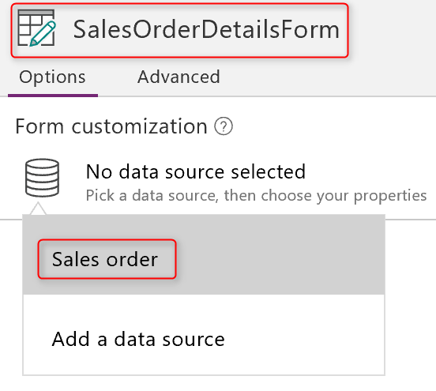

3. Set the **Pattern** property of **SalesOrderDetailsForm** to **FormPattern.Details**.  
**SalesOrderDetailsForm** uses the **DefaultDetails** field group of the **Sales order** entity to display the form. As with the **SalesOrderListForm**, you can quickly show record details without having to manually build a form.  
 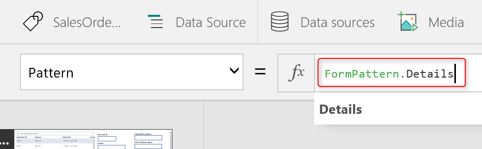

4. Set the **Item** property of **SalesOrderDetailsForm** to **SalesOrderListForm.Selected**.  
**SalesOrderDetailsForm** will display the details of the record that the user clicks or taps in **SalesOrderListForm**.  
 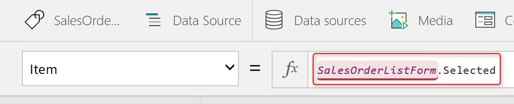

5. Preview the app by pressing F5, and then click or tap a sales order in the list on the left.  
The details of the order that you selected appear on the right side.  
 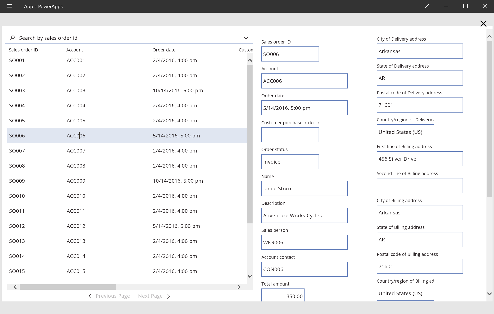  

## Configure a field to navigate to another screen
Next let’s add more screens to our app and configure fields in an **Entity Form** control to navigate to another screen in the app when the user clicks or taps a field.  

1. Add a second screen to the app, and rename the screen **SalesOrderDetailsScreen**.

2. Cut the **SalesOrderDetailsForm**, paste it on the **SalesOrderDetailsScreen**, and resize the form to cover most of the screen, leaving enough space for an icon at the top.

3. Add a back-arrow icon near the upper-left corner of **SalesOrderDetailsScreen**.

4. Set the **OnSelect** property of the back-arrow icon to the [**Back**](functions/function-navigate.md) function.  
 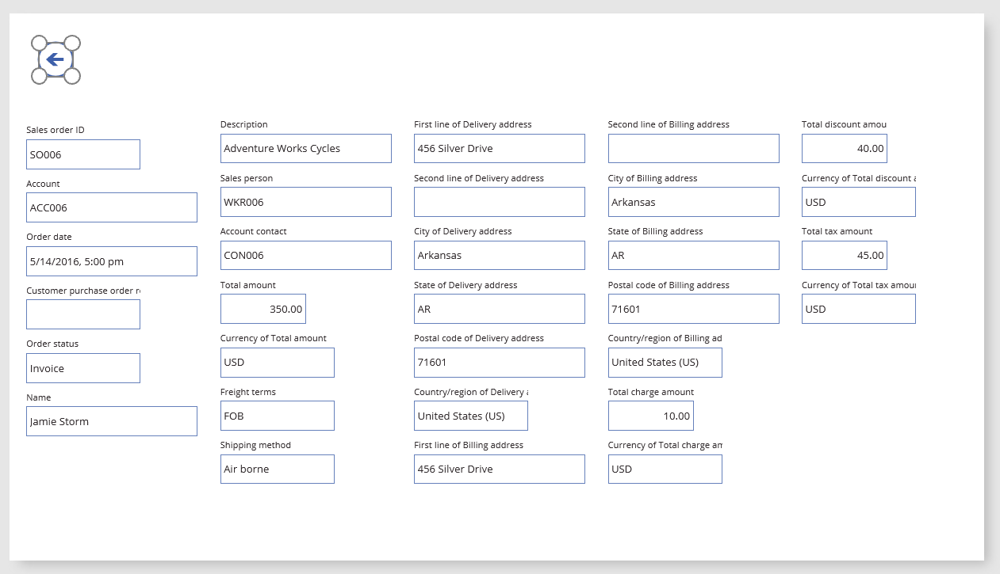

5. On the **SalesOrderListScreen**, resize the **SalesOrderListForm** to cover the entire screen.

6. Click or tap the **SalesOrderListForm** to select it.

7. In the right-hand pane, under **Fields**, set **SalesOrderId** to navigate to the **SalesOrderDetailsScreen**.  
 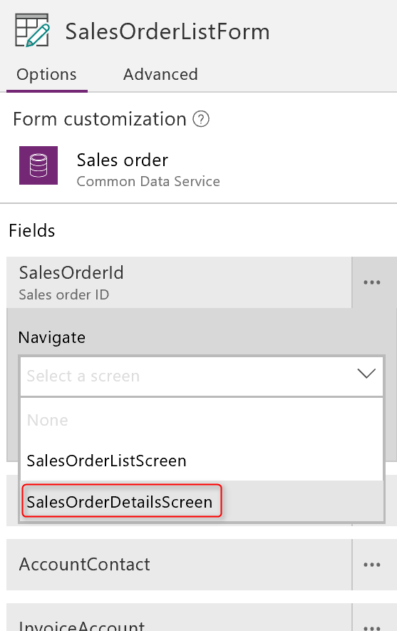   
 The **Entity Form** control displays the values in the **SalesOrderId** field (the first column in the list) as links.  
 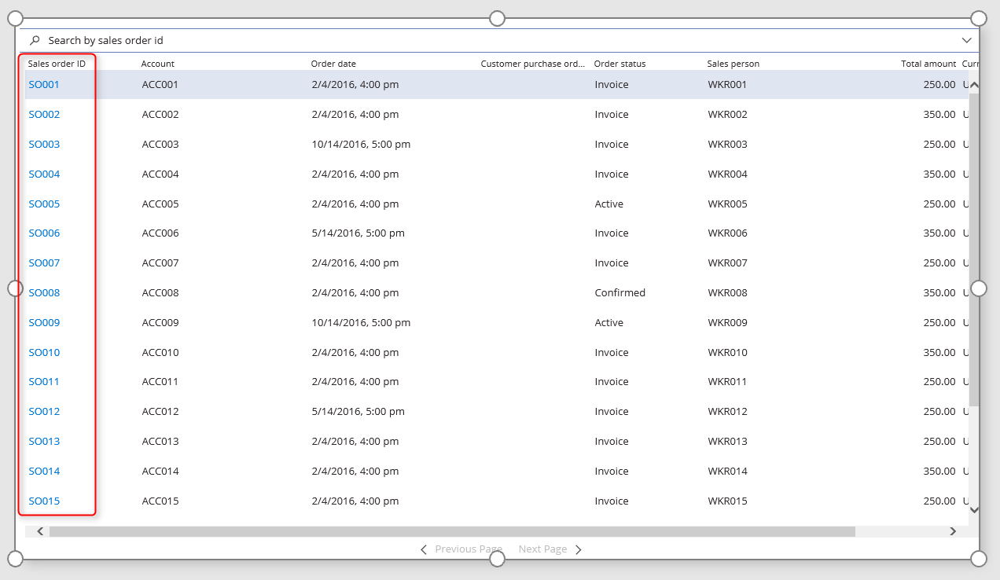  

8. Preview the app by pressing F5, and then click or tap a link in the sales order list.  
   
 The second screen opens and displays the details of the sales order that you specified.  
 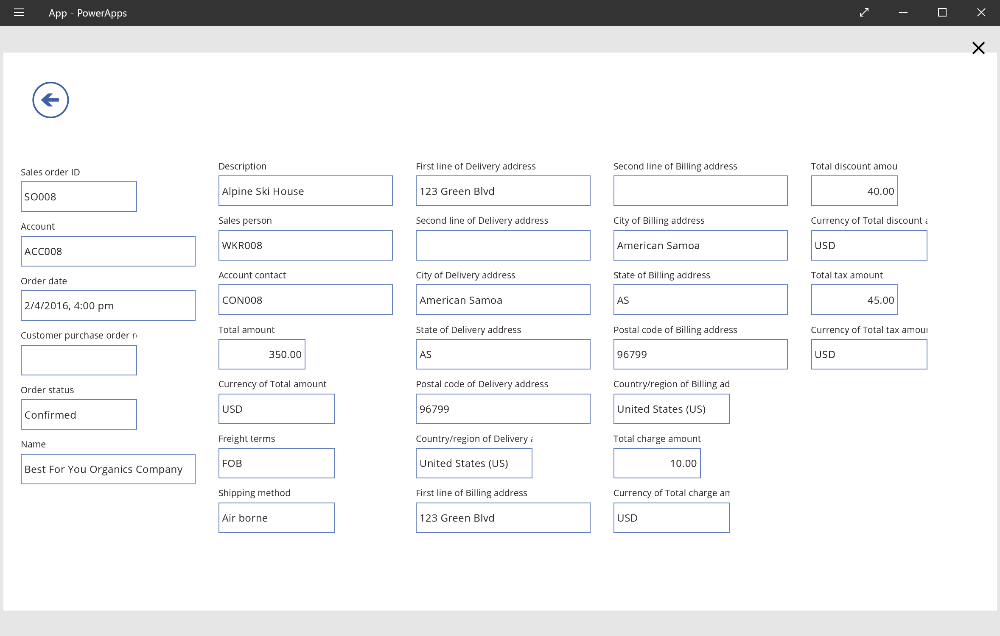  
 To display the details of a different sales order, click or tap the back arrow to navigate back to the list, and then click or tap the link of the order for which you want to show details.

## Navigate with a context variable
The Item property of the **SalesOrderDetailsForm** is set to **SalesOrderListForm.Selected** so that **SalesOrderDetailsForm** shows details about the record that the user selects in **SalesOrderListForm**. You can also get the context of the selected record by using the **NavigationContext** context variable, which gets automatically created when you use the form-customization pane to configure a field to navigate.  

1. Set the **Item** property of **SalesOrderDetailsForm** to **NavigationContext**.  
 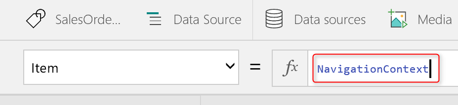

2. Preview the app by pressing F5, and then click or tap a link in the sales order list.
The app opens **SalesOrderDetailsScreen** and displays the details of the sales order that you specified. Let’s dig into how the form-customization pane sets up the navigation and context for us.  
 The **SelectableFields** property of the **SalesOrderListForm** specifies SalesOrderId as a selectable field.  
 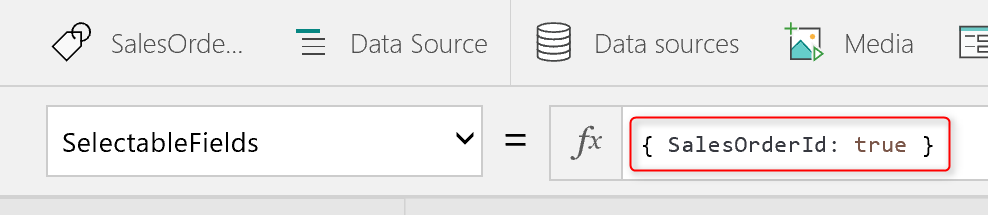  
 This was set up automatically when we used the form-customization pane to make the **SalesOrderId** field navigate to the **SalesOrderDetailsScreen**. Therefore, the values in the **SalesOrderId** field appear as links.  
 The **OnFieldSelect** property of the **SalesOrderListForm** is set to an [**If**](functions/function-if.md) function that determines whether the user clicks or taps the sales order ID field: **SalesOrderListForm.SelectedField.SalesOrderId = true**.  
 If the function is evaluated as true, the **SalesOrderDetailsScreen** opens with the context variable named **NavigationContext** that we used earlier. All this was also set up automatically when we used the form-customization pane to make the **SalesOrderId** field navigate to the **SalesOrderDetailsScreen**.  
 Therefore, when the user clicks or taps a sales order ID field, the [**If**](functions/function-if.md) function evaluates to true, and the [**Navigate**](functions/function-navigate.md) function is called with the corresponding context, opening the details screen.  
 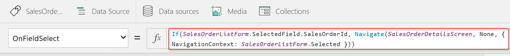  
 *Note: When you use the form-customization pane, the **NavigationContext** is intelligently determined for you. When the user clicks or taps **SalesOrderId**, **NavigationContext** is set to **SalesOrderListForm.Selected**, as the earlier formula shows. If we had specified the **Account** field for navigation instead, **NavigationContext** would have been set to **SalesOrderListForm.Selected.Account**, ensuring that the correct context is passed. However, to consume that context, you would need an **Entity Form** control connected to the **Account** entity in the Common Data Service.*

## Edit and save a record
Finally let’s look at how we can edit and save a record in an **Entity Form** control.  

1. On the **SalesOrderDetailsScreen**, add an edit icon, and then set its **OnSelect** property to this formula:  
**EditForm(SalesOrderDetailsForm)**  
 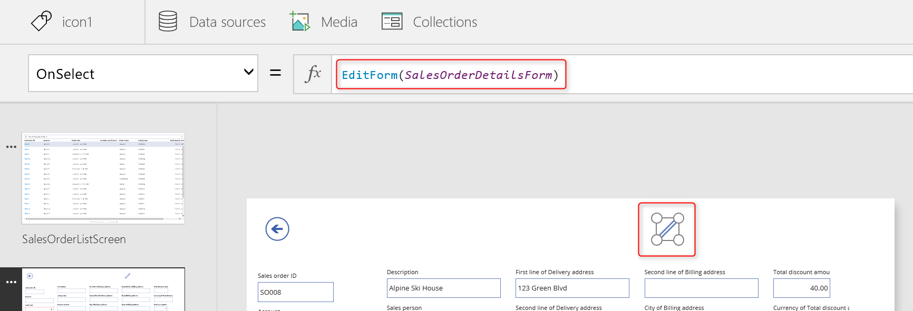

2. Add a checkmark icon next to the edit icon, ad then set the **OnSelect** property of the checkmark icon to this formula:  
**SubmitForm(SalesOrderDetailsForm)**  
 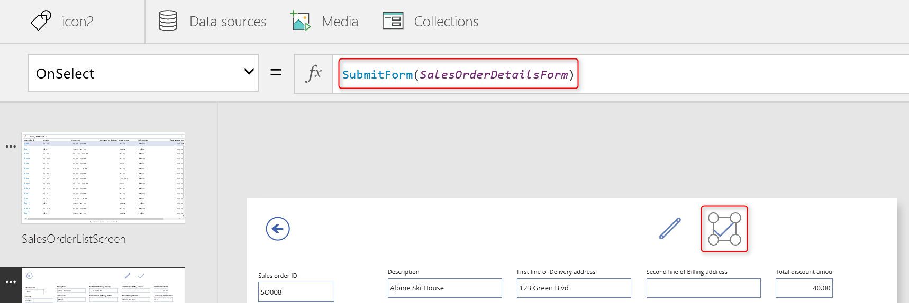

3. Preview the app by pressing F5, click or tap a sales order ID link to view the details of a sales order, and then click or tap the edit icon. 
The **Mode** of the **Entity Form** control is set to **FormMode.Edit** so that you can edit the record.

4. Update the **Order status** to **Invoice**.  
 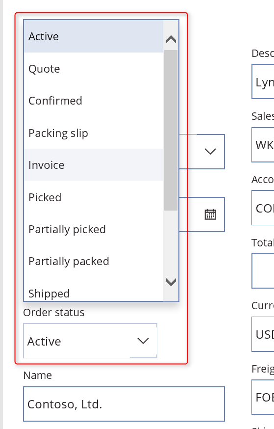

5. Update the **Sales person** to **WRK014**.
To help you pick the **Sales person**, the **Entity Form** control automatically renders a rich detailed lookup. To generate and display this lookup, the control uses the **DefaultLookup** field group of the **Worker** entity in the Common Data Service. The **Worker** entity is used because the **Sales person** field is of type **Worker**.  
 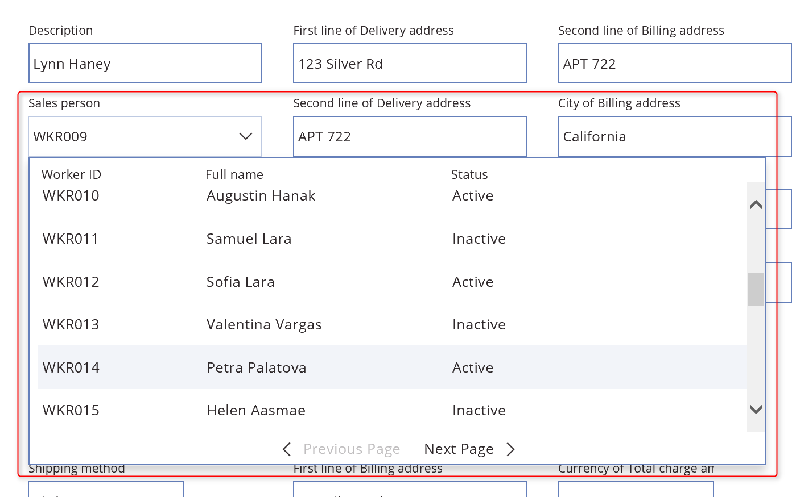

6. Click or tap the checkmark icon to save your changes.

This step concludes this article on how to use the **Entity Form** control in your apps. We hope that you find the information covered here useful to get started using the **Entity Form** control. We look forward to hearing what you think about the **Entity Form** control and our overall push toward helping you quickly add rich forms to your apps.
