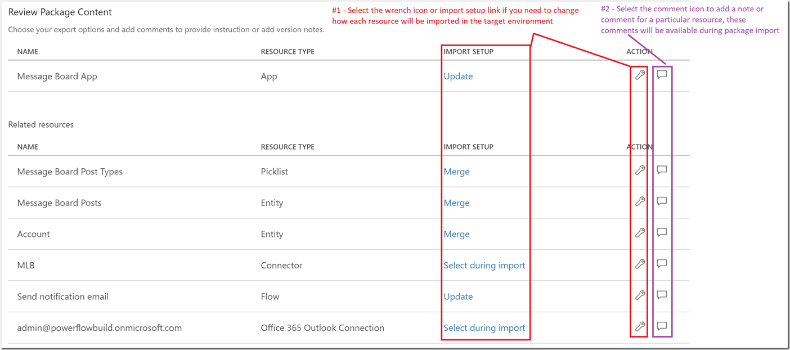
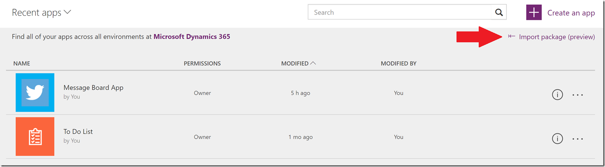
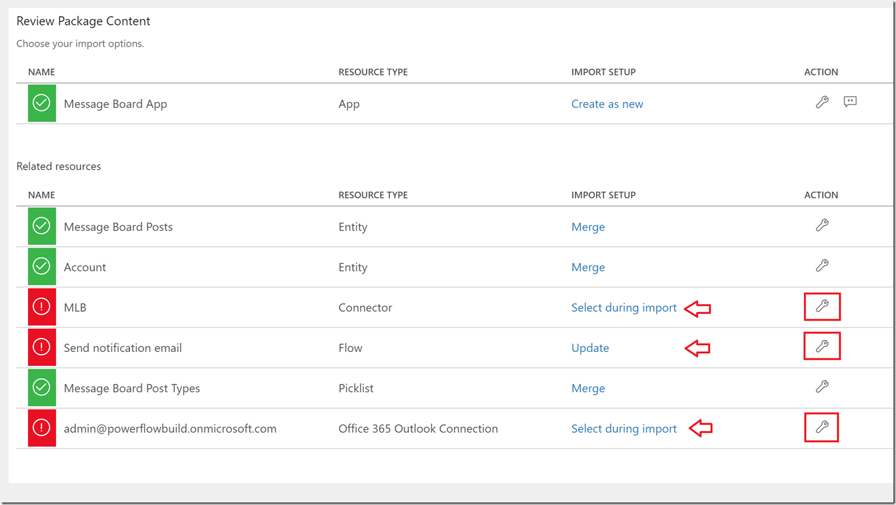
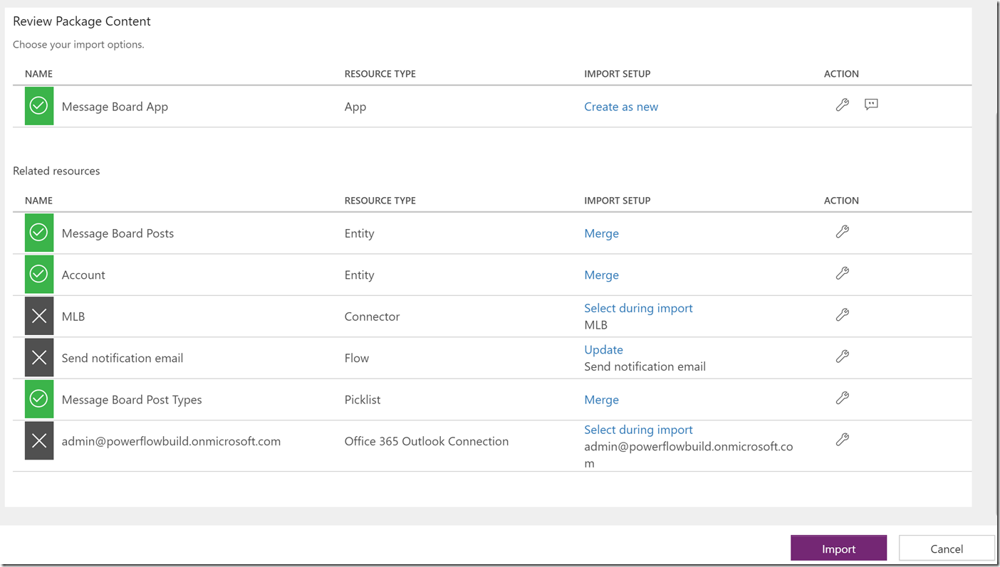

<properties
	pageTitle="Migrate apps between environments and tenants | Microsoft PowerApps"
	description="Migrate apps among environments and tenants"
	services=""
	suite="powerapps"
	documentationCenter="na"
	authors="RickSaling"
	manager="anneta"
	editor=""
	tags=""/>

<tags
   ms.service="powerapps"
   ms.devlang="na"
   ms.topic="article"
   ms.tgt_pltfrm="na"
   ms.workload="na"
   ms.date="10/30/2016"
   ms.author="ricksal;jamesol"/>

[comment]: <> (#sign-off)

# Environment and tenant app migration through Packaging
Learn how to migrate resources from one environment to another with packaging. These environments can be within the same tenant or across different tenants.

> **NOTE**  The packaging preview will launch on 07/31/2017 eliminating the  need to manually move  apps by locally saving .msapp files from a DEV/UAT environment and re-saving the apps in your production environment from PowerApps Studio.

## The scenario
One common scenario where you may want to migrate resources is where you have Test or Dev environments and a Production environment. Developers and testers have wide access to the apps in their environments. But when it comes time to migrate a new app to production, that environment has rigorous control over permissions to update and change it.

Another scenario is one where each customer has their own environment and data. When a new customer is added, a new environment is created for them, and you would migrate apps into their environment.

## Which resources can I migrate through packaging?

When you export an app, the dependent resources for your app will also get exported into the package.  Initially only a subset of all possible resource types will be supported as outlined in the table below.

| Resource type                           | Supported | Import options                                                                                                                                                                                                                                                                                                                                                                                                                                                                                             |
|-----------------------------------------|-----------|------------------------------------------------------------------------------------------------------------------------------------------------------------------------------------------------------------------------------------------------------------------------------------------------------------------------------------------------------------------------------------------------------------------------------------------------------------------------------------------------------------|
| App                                     | Yes       | There are two options to import an app into an environment: <ol><li><b>Create new</b> – The app will be created as a new app into the environment where the package is imported.</li> <li><b>Update</b> - the app already exists in the environment and will be updated when this package is imported.</li></ol>                                                                                                                                                                                           |
| Flow                                    | Yes       | There are two options to import an flow into an environment: <ol><li><b>Create new</b> – The flow will be created as a new flow into the environment where the package is imported.</li> <li><b>Update</b> - The flow already exists in the environment and will be updated when this package is imported.</li></ol> 
 <i> NOTE: All resources that the flow depends on will also be included within the app package that is exported and will need to be configured with the package is imported </i> |
| CDS Entity Customizations and Picklists | Yes       | There are two options to import CDS Entities or Picklists into an environment: <ol><li><b>Overwrite</b> - If there's a resource with the same name, this import will replace it. If there isn’t a matching resource, a new resource will be created. <li><b>Merge</b> – If there's an entity or picklist with the same name, new fields or entries will be added, but missing fields or entries won’t be removed.</li></ol>                                                                                |
| Custom Connectors                       | No        | If an app depends on a custom connector <b>we do not</b> currently support exporting the connector as a part of the package. 

 If you have an app that relies on a custom connector, your only current option is to manually re-create or update the connector in your target environment and select that connector when you import the package.                                                                                                                                                     |
| Connections                             | No        | If an app depends on a connection (such as a SQL connection w/ credentials),we do not currently support exporting the connection or credentials as a part of the package. 

 If you have an app that relies on a shared connection (like SQL), your only current option is to manually re-create,that connection with the appropriate credentials in your target environment and select that connection when you import the package.                                                                  |
| CDS Custom Roles and Permission Sets    | No        | Exporting custom CDS roles and/or permission sets is not currently supported, so the only option today is to manually re-create these entities in your target environment.                                                                                                                                                                                                                                                                                                                                 |
| Gateways                                | No        | Gateways are only supported in the default (and {tenant name} (from preview) ) environments, so export/migration is not supported.                                                                                                                                                                                                                                                                                                                                                                         |

## Exporting an app

1. In http://web.powerapps.com, click or tap **Apps**, select the ellipses for the app you want to migrate, and then select **Export (preview)**.

	

1. When the export package page opens, enter a Name and Description for the package.

	

1. Within the ‘Review Package Content’ section you can optionally add comments or notes or change the setting for how each individual resource will be imported into the target environment during package import.

	

1. When you are done select **Export** and the package file will begin downloading within a few seconds.

## Importing an app

1. In http://web.powerapps.com, click or tap **Apps**, and then select **Import package (preview)**.

	

1. Select **Upload** and select the app package file that you want to import.

	

1. Once the package has been uploaded you will need to review the package contents and will need to provide additional input for any item marked with a red icon by selecting the wrench icon for each item and entering the required information.

	

1. Once you have provided all of the required information select **Import**.

	

1. When import completes you will be automatically redirected to a page (similar to the one below) that outlines whether or not the import operation was successful.

	

> **NOTE**  If you are importing an app and chose to **Update** an existing app, the new changes will be saved as a draft of the applications.  You will need to [publish](http://powerapps.microsoft.com/tutorials/save-publish-app/#publish-an-app) those changes in order for them to be available all other users of the applications.

## Known limitations
| Limitation                                                                                                                                | Status                                                                                    |
|-------------------------------------------------------------------------------------------------------------------------------------------|-------------------------------------------------------------------------------------------|
| Importing app packages that contains more than ~3 resources has been reported to,take several minutes to complete.                        | A fix for this issue should be rolled out by 08/04/2017                                   |
| Ability to export/import custom connectors                                                                                                | This work is on the backlog and we are working to deliver this within the next 6 months.  |
| Ability to re-configure the data sources for my app during import(for example switch from one SharePoint list or SQL database to another) | This work is on the backlog and we are working to deliver this within the next 6 months.  |
| Ability to export/import CDS Custom Roles and Permission Sets                                                                             | This work is on the backlog and we are working to deliver this within the next 6 months.  |
| Ability to export/import CDS data (i.e. sample data rows)                                                                                 | This work is on the backlog and we are working to deliver this within the next 12 months. |
