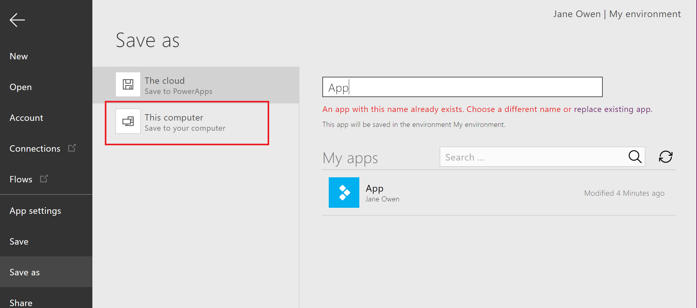
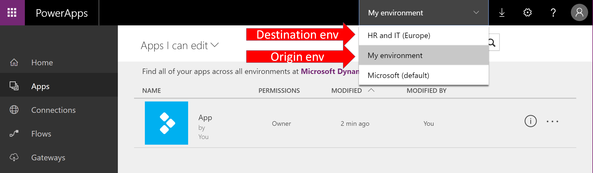
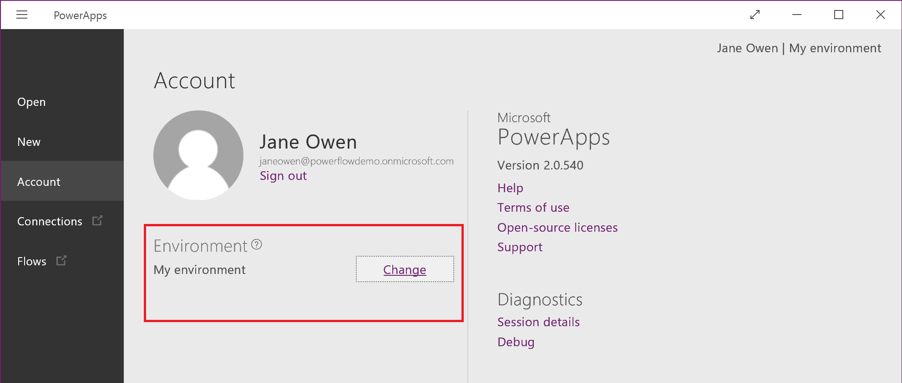
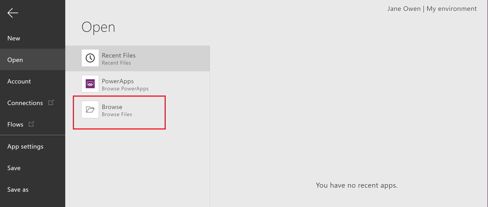

<properties
	pageTitle="How to migrate PowerApps between environments and tenants | Microsoft PowerApps"
	description="How to migrate apps among environments and tenants"
	services=""
	suite="powerapps"
	documentationCenter="na"
	authors="RickSaling"
	manager="anneta"
	editor=""
	tags=""/>

<tags
   ms.service="powerapps"
   ms.devlang="na"
   ms.topic="article"
   ms.tgt_pltfrm="na"
   ms.workload="na"
   ms.date="10/30/2016"
   ms.author="ricksal;jamesol"/>

# Environment and tenant app migration
Learn how to migrate resources from one environment to another.  These environments can be within the same tenant or across different tenants.

## The scenario
One common scenario where you may want to migrate resources is where you have Test or Dev environments and a Production environment. Developers and testers have wide access to the apps in their environments. But when it comes time to migrate a new app to production, that environment has rigorous control over permissions to update and change it.

Another scenario is one where each customer has their own environment and data. When a new customer is added, a new environment is created for them, and you would migrate apps into their environment.

## What resources you can migrate

There are different procedures for migrating each kind of resource.

1.	Connections, Custom APIs, Flows: cannot be migrated, must be re-created in the destination environment.
2.  Gateways: gateways are only supported in the default (and {tenant name} (from preview) ) environments, so migration is not supported.
3.  PowerApps: you save the app locally in the origin environment from PowerApps studio (or webauth), and then open the app and recreate it in the destination environment.
4.  CDS entity schema changes, new entities, new permission sets, new roles: export a package from the origin environment from the admin center, and import the package in the destination environment.

##  Connections, Custom APIs, Flows

These resources cannot be migrated. You must create each one you need in the destination environment.

## Gateways

Gateways are only supported in the default, and {tenant name} (from preview)  environments, so migration is not supported. You must create any needed gateways in the destination environment.

## Migrating an app

1. In http://web.powerapps.com, click or tap on **Apps**, select the ellipses for the app you want to migrate, and then choose to edit the app in either the PowerApps Studio or PowerApps Studio for web.

	

2. When PowerApps Studio opens, click **Save as** in the left nav bar column, then select **This computer**, then click or tap **Save**. Note where the file was saved on your local machine.

	

3. Change environment to destination environment.  
	For PowerApps Studio for web you will need to return to http://web.powerapps.com to switch your environment and then re-open the PowerApps Studio for web in the browser:

	

	For PowerApps Studio you can change you environment:

	

4. Open PowerApps Studio, which will now be in the destination environment. Click or tap **Open** in the left nav bar, and then click or tap **Browse**.

	

5. Select your file from where you saved it when in the original environment, and click or tap **Open**.

	

6. You may need to address any compilation issues in the app, in accessing resources that may have different names, such as data connections and sources. An easy way to resolve compilation issues with the app is to remove and re-add the data sources for the app in the destination environment, see [Understand data sources](working-with-data-sources.md).

7. Test the app to verify all compilation issues have been resolved.

## Common Data Service entity schema changes, new entities, new permission sets, new roles
We do not currently support a way of migrating entities, permission sets and roles from one Common Data Service database to another in a separate environment, however, this functionality is coming very soon.
