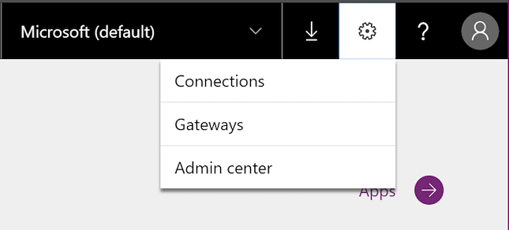
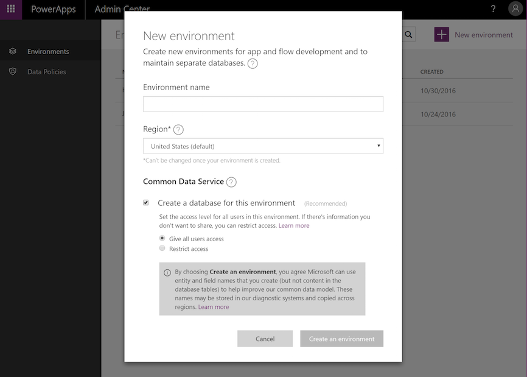
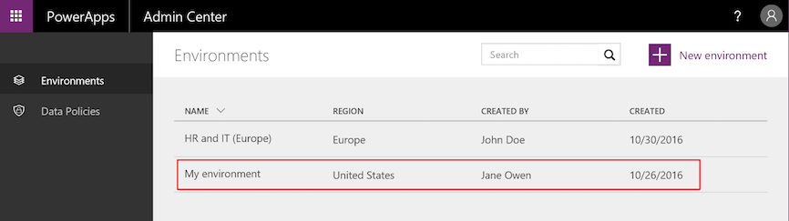
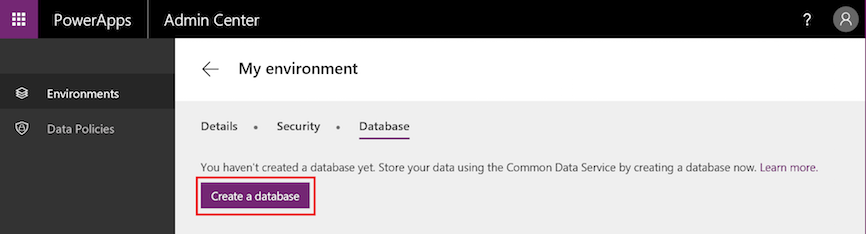
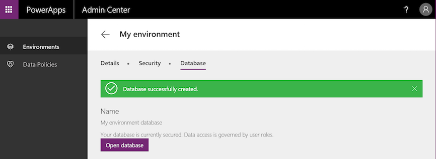
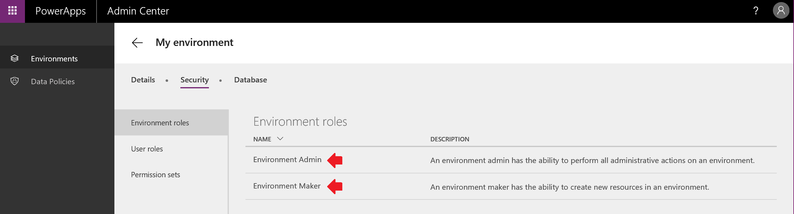
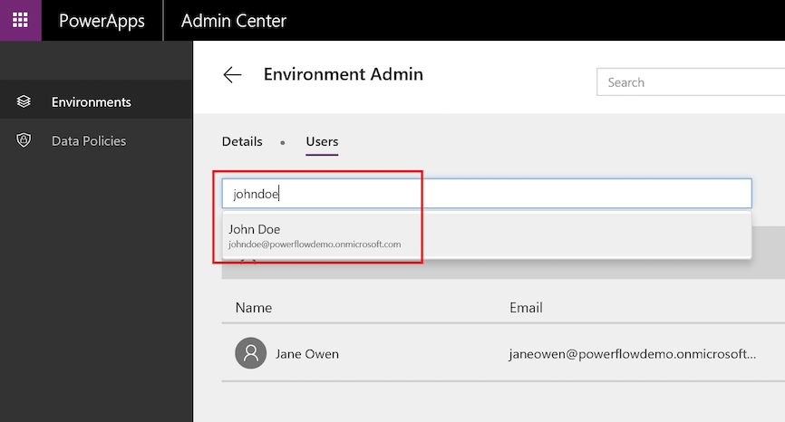
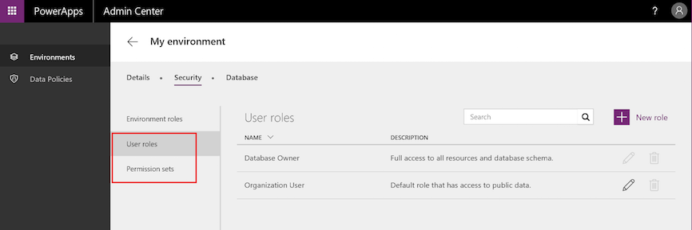

<properties
	pageTitle="How to administer environments | Microsoft PowerApps"
	description="How to administer environments"
	services=""
	suite="powerapps"
	documentationCenter="na"
	authors="RickSaling"
	manager="anneta"
	editor=""
	tags=""/>

<tags
   ms.service="powerapps"
   ms.devlang="na"
   ms.topic="article"
   ms.tgt_pltfrm="na"
   ms.workload="na"
   ms.date="10/30/2016"
   ms.author="ricksal;jamesol"/>

# Environments administration
With the introduction of environments, we will also be launching a new [PowerApps admin center][1], which will allow you to manage all of the environments that you have created or to which you have been added to the Environment Admin role. From the Admin center you will be able to perform the following administrative actions for environments:

* Create new environments.
* Add or remove a user or group from either the Environment Admin or Environment Maker role.
* Provision a Common Data Service database for the environment.
* Set Data Loss Prevention policies.
* Set database security policies (as open or restricted by database roles).
* Members of their Azure AD tenant Global administrator role (includes Office 365 Global admins) will also be able to manage all environments that have been created in their tenant and set tenant-wide policies from the PowerApps admin center.

## Accessing PowerApps admin center
The PowerApps admin center can be accessed by going directly to [admin.powerapps.com][1] selecting the gear icon in the [PowerApps.com][2] navigation header:

	

In order to be able to manage an environment from the PowerApps admin center you meet either of the following requirements:
1. Be a member of the Environment Admin role of the environment
1. Be a member of the Global Administrator role of your Azure AD or Office 365 tenant

You will als0 need either a PowerApps Plan 2 or Flow Plan 2 to access the admin center. For more information see [PowerApps pricing page][3]

Please note that any changes you make in PowerApps Admin center will impact the [Flow admin center][4] and vice versa.

## Create a new environment
1. Click on **+ New environment** to launch a modal dialogue and create an environment

	

1. Enter the following info:

	| Property | Description |
	|----------------------------------------|------------------------------------------------------------------------------------------------------------------------------------------------------------------------------------------------------------------------------------------------------------------------------------------------------------|
	| Environment name | Enter the name of your environment. |
	| Region | Choose the location to host your environment. We recommend using a location closest to your users. For example, if your app users are in London, then choose a Europe location. If your app users are in New York, then choose the U.S. See [Supported regions](regions-overview.md) for a list of supported environment regions. |
	| Create a database for this environment | Check this setting to create a Common Data Service database for this environment. A database can be configured to either be open to all users in the environment or restricted to database roles. For more information see [Configure database security](database-security.md). |

		

1. Select **Create an environment**, the environment should now be displays in the environments table.

> [AZURE-NOTE] When you create an environment, you are automatically added to the Environment Admin role for that environment.

## View your environments
When you land on the admin center, you arrive in the Environments tab and will see the list of all environments you are admin for (as shown below)

	

If you are a member of the Global Administrator role of your Azure AD or Office 365 tenant then you will see all the environments that have been created by users in your tenant.

## Create Common Data Service database for an environment
If an environment does not already have a database, then an Environment Admin can create one with the following steps from the [PowerApps admin center][1].  Only users with a PowerApps Plan 2 license are allowed to create Common Data Service databases.

1. Select the environment from environments table

	

1. Select the **Database** tab

1. Select **Create database**

	

	If the database is provisioned successfully, you will see the following confirmation message:
	

Once your database has been created, you will need to decide on a security model, for more information, see [Configure database security](database-security.md).

## Manage security your environments

### Environment permissions
In an environment, all the users in the Azure AD tenant are users of that environment. However, for them to play a more privileged role, they need to be added to a specific environment roles. Environments have two built-in roles that provide access to permissions within an environment:

*	The **Environment Admin** role can perform all administrative actions on an environment including the following:

	o	Add or remove a user or group from either the Environment Admin or Environment Maker role

	o	Provision a Common Data Service database for the environment

	o	View and manage all resources created within an environment

	o	Set Data loss prevention policies. For more information see [Data loss prevention policies](prevent-data-loss.md).

*	The **Environment Maker** role can create new resources within an environment including apps, connections, custom APIs, gateways, and flows using Microsoft Flow.  Environment Makers can also distribute the apps they build in an environment to other users in your organization by sharing the app with individual users, security groups, or to all users in the organization. For more information see [Share an app in PowerApps](share-app.md).

In order to assign a user or security group to an environment role, an Environment Admin can take the following steps from the [PowerApps admin center][1]:

1. Select the environment from environments table

	

1. Select **Environment roles** in the **Security** tab  

1. Select either the **Environment Admin** or **Environment Maker** role

	

1. Specify the names of one or more users or security groups in Azure Active Directory, or specify that you want to add your entire organization.

	

1. Select **Save** to update the assignments to the environment role.

To remove all permissions for a user or group, click or tap the **x** icon for that user or group.

> [AZURE-NOTE] Users or groups assigned to these environment roles are not automatically given access to the environment’s database (if it exists) and must be given access separately by a Database owner. For more information see [Configure database security](database-security.md).  

### Database security
If there is a database provisioned in your environment then the ability to create and modify the database schema and to connect to the data stored within the database is controlled by the database's user roles and permission sets. Managing the user roles and permission sets for your environment's database can be done from the **User roles** and **Permission sets** section of the **Security** tab. For more information, see [Configure database security](database-security.md).

	

> [AZURE-NOTE] Environment admins do not have access to create and manage user roles and permission sets for an environment's database; this is limited to members of the **Database owner** user role.  

## Data policies
An organization's data needs to be protected so that it isn't shared with audiences that should not have access to it. To protect this data, you can create and enforce policies that define which consumer services and connectors specific business data can be shared with. These policies that define how data can be shared are referred to as data loss prevention (DLP) policies. Managing the DLP policies for your environments can be done from the **Data Policies** section of the [PowerApps admin center][1].  For more information see [Data loss prevention policies](prevent-data-loss.md).

	

## Frequently asked questions

### Is there a limit on the number of environments that I can create?

Yes, each user will be able to create up to 5 databases.

### Is there a limit on the number of databases that I can provision?

Yes, each user will be able to provision up to 2 databases.

### Can I rename an environment?

Not yet, but this functionality will be coming soon to the PowerApps admin center.

### Can I delete an environment?

Not yet, but this functionality will be coming soon to the PowerApps admin center.

### Can I view & manage all resources (apps, flows, APIs, etc.) for an environment as an Environment Admin?

Not yet, but this functionality will be coming soon to the PowerApps admin center.

### Which license includes Common Data Service?

PowerApps Plan 2.  See [PowerApps pricing page][3] for details on all of the plans that include this license.

### Can the Common Data Service be used outside of an environment?

No. Common Data Service requires an environment.

<!--Reference links in article-->
[1]: https://admin.powerapps.com
[2]: https://web.powerapps.com
[3]: https://powerapps.microsoft.com/pricing/
[4]: https://admin.flow.microsoft.com
