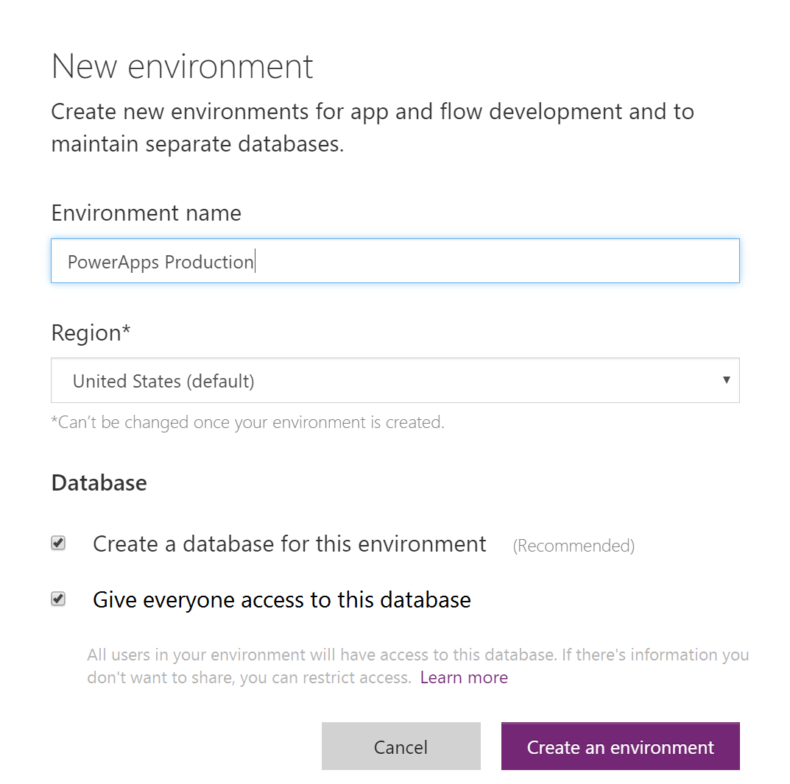

<properties
	pageTitle="Overview of environments | Microsoft PowerApps"
	description="What environments are and how to use them"
	services=""
	suite="powerapps"
	documentationCenter="na"
	authors="RickSaling"
	manager="anneta"
	editor=""
	tags=""/>

<tags
   ms.service="powerapps"
   ms.devlang="na"
   ms.topic="article"
   ms.tgt_pltfrm="na"
   ms.workload="na"
   ms.date="10/30/2016"
   ms.author="ricksal;jamesol"/>

# Environments overview
Environments are a new concept in PowerApps. Put simply, an environment is a space to store, manage, and share your organization’s business data, apps, and flows. They also serve as containers to separate apps that may have different roles, security requirements, or target audiences. How you choose to leverage environments depends on your organization and the apps you are trying to build, for example:

1.	You may choose to only build your apps in a single environment.
2.	You might create separate environments that group the Test and Production versions of your apps.
3.	You might create separate environments that correspond to specific teams or departments in your company, each containing the relevant data and apps for each audience.
4.	You might also create separate environments for different global branches of your company.  

## Environment scope
Each environment is created under an Azure AD tenant and its resources can only be accessed by users within that tenant.  An environment is also bound to a geographic location, like the US. When you create a app in an environment, that app is routed to only datacenters in that geographic location.  Any items you create in that environment, including connections, gateways, flows using Microsoft Flow, and more, are also bound to their environment’s location.

Every environment can have zero or one Common Data Service databases, which provides storage for your apps. The ability to create a database for your environment will depend on the license you purchase for PowerApps and your permission within that environment. For more information see [Billing, Licensing, and SKUs](pricing-billing-skus.md).

When you create an app in an environment, that app is only permitted to connect to the data sources that are also deployed in that same environment, including connections, gateways, flows, and Common Data Service databases.  For example, let’s consider a scenario where you have created two environments named ‘Test’ and ‘Dev’ and created a Common Data Service database in each of the environments. If you create an app in the ‘Test’ environment, it will only be permitted to connect to the ‘Test’ database, it will not be able to connect to the ‘Dev’ database.

There is also a process to move resources between environments. For more information, see [Migrate resources](environment-and-tenant-migration.md).

## Environment permissions

Environments have two built-in roles that provide access to permissions within an environment:

*	The Environment Admin role can perform all administrative actions on an environment including the following:

	o	Add or remove a user or group from either the Environment Admin or Environment Maker role

	o	Provision a Common Data Service database for the environment

	o	View and manage all resources created within an environment

	o	Set Data loss prevention policies. For more information see [Data loss prevention policies](prevent-data-loss.md).

*	The Environment Maker role can create new resources within an environment including apps, connections, custom APIs, gateways, and flows using Microsoft Flow.  Users or groups assigned to these environment roles are not automatically given access to the environment’s database (if it exists) and must be given access separately by a Database owner. For more information see [Configure database security](database-security.md).

Users or security groups can be assigned to either of these two roles by an Environment Admin from the [PowerApps admin center][1]. For more information see [Environment Administration](environments-administration.md).

Environment Makers can also distribute the apps they build in an environment to other users in your organization by sharing the app with individual users, security groups, or to all users in the organization. For more information see [Share an app in PowerApps](share-app.md).

## The default environment
A single default environment is automatically created by PowerApps for each tenant and shared by all users in that tenant. Whenever a new user signs-up for PowerApps they are automatically added to the Maker role of the default environment. The default environment is created in region that is closest to the default region of the AAD tenant.

> [AZURE-NOTE] No users will be added to the Environment Admin role of the default environment automatically. For more informaton, see [Environment Administration](environments-administration.md).

The default environment is named as follows: “{Azure AD tenant name} (default)”

## Choosing an environment
With the introduction of environments, you will now see a new experience when you come to https://web.powerapps.com.  The apps, connections, and other items that are visible in the site will now be filtered based on the current environment that is selected.  Your current environment is specified in the environment picker in the top bar on the right. To choose a different environment, click or tap the picker, and a list of available environments appears. Click or tap the one you wish to enter.

An environment will show up in the picker for you if you meet one of the following conditions:

1. You are a member of the Environment Admin role for the environment.
1. You are a member of the Environment Maker role for the environment.
1. You are not an Environment Admin or Environment Maker of the environment, but you have been given ‘Contributor’ access to at least one app within the environment. For more information, see [share an app](share-app.md). NOTE: in this case, you will not be able to create new apps in this environment. You will only be able to modify the existing apps that have been shared with you.

## Creating an environment

### Who can create environments?
Your license determines whether you can create environments.

|License|Environment creation is allowed|
|-------|-------------------------------|
|PowerApps P2|√|
|PowerApps P2 Trial|√|
|PowerApps P1|x|
|PowerApps P1 Trial|x|
|Dynamics 365 Plans|x|
|Office 365 Plans|x|
|Dynamics 365 Apps and Teams Plans|x|

There is a limit of 5 environments that can be created per user.

At present you cannot delete an environment.

### Where can environments be created?
You will be able to create new environments from [PowerApps.com][2] and from the [PowerApps admin center][1]. If you create an environment, they you will automatically be added to the Environment Admin role for that environment. There is not be a limit on the number of environments that you can be participate in as a member of the Environment Admin or Environment Maker role. For more information, see [Environment Administration](environments-administration.md).

## What will change for PowerApps Preview users?
Any user that has participated in the PowerApps preview will see some changes in their experience with the introduction of environments.  The following table lists what U.S. users and non-U.S. users can expect:

| User | What happens |
|--------------------------------------------------------------|---------------------------------------------------------------------------------------------------------------------------------------------------------------------------------------------------------------------------------------------------------------------------------------------------------------------------------------------------------------------------------------------------------------------------------------------------------------------------------------------------------------------------------------------------------------------------------------------------------------------------------------------------------------------------------------------------------------------------------------------------------------------------------------------------------------------------------------------------------------------------------------------------------------------------------------------------------------------------------------------------------------------------------------------------------------------------------------------------------------------------------------------------------------------|
| Preview user that created a Common Data Model (CDM) database | You will see an environment called “{Your name}’s environment” that contains your preview CDM database and any other apps that you built against the database.  You will be added to the Environment Maker role and Environment Admin role of this environment and as a Database owner of the database. When PowerApps enters general availability, we will be upgrading the metadata of the CDM. The impact of this change means that you will still be able to use the entities & apps you have already built against your preview CDM database, however you will not be able to create new fields or entities in your preview CDM database. We will soon publish guidance on how you can create a new environment with a database that contains the upgraded metadata and migrate your apps over to that environment. NOTE: If any of your apps that were built against your preview CDM database also leverage a custom API as a data source, they will be temporarily broken in this environment since all custom APIs will be migrated to the default environment.,You will need to re-create the custom API in this environment to repair any affected apps. |
| Preview user in U.S. | You will see your tenant’s default environment and the following resources you created during the PowerApps preview period will be available there: * All apps you created (except any that connected to a preview CDM database)  *All connections and custom API you created * All on-premises data gateways you installed|
| Preview user not in U.S. | In addition to the default environment, you will also see an environment called “{Azure AD tenant} (from preview)” that contains the following resources you created during the PowerApps preview period:  * All apps you created (except any that connected to a preview CDM database)  * All connections and custom API you created  * All on-premises data gateways you installed  You will be added to the Environment Maker role of this environment.|

A *Preview user* is someone who was using Microsoft Flow before it's release to General Availability (GA).

Two weeks after PowerApps enters general availability (GA), environments containing preview content will be marked as read-only (with the exception of the default environment); all existing apps & flows will continue to work in these environments, but you will not be able to create new apps or flows. We highly recommend that users of these environments migrate their content to the default environment or another custom environment. Please refer to the following blog (which will be posted this week) for more information about the migration process: see the [Common Data Service features announcement blog][3].

### Example environments for a preview user in U.S.

### Example environments for a preview user not in U.S.

## Managing environments for your organization
With the introduction of environments, we will also be launching a new PowerApps admin center, which will allow you to manage all of the environments that you have created or to which you have been added to the Environment Admin role. From the Admin center you will be able to perform all administrative actions on an environment including the following:

* Add or remove a user or group from either the Environment Admin or Environment Maker role.  For more information, see [Environment Administration](environments-administration.md).
* Provision a Common Data Service database for the environment. For more information see [Create a Common Data Service database](create-database.md).
* View and manage all resources created within an environment.
* Set Data Loss Prevention policies. For more information see [Data loss prevention policies](prevent-data-loss.md).
* Set database security policies (as open or restricted by database roles). For more information see [Configure database security](database-security.md).
* Members of their Azure AD tenant Global administrator role (includes Office 365 Global admins) will also be able to manage all environments that have been created in their tenant and set tenant-wide policies from the PowerApps admin center.

<!--Reference links in article-->
[1]: https://admin.powerapps.com
[2]: https://web.powerapps.com
[3]: https://aka.ms/cdspreviewtoga
