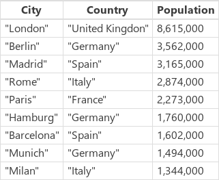
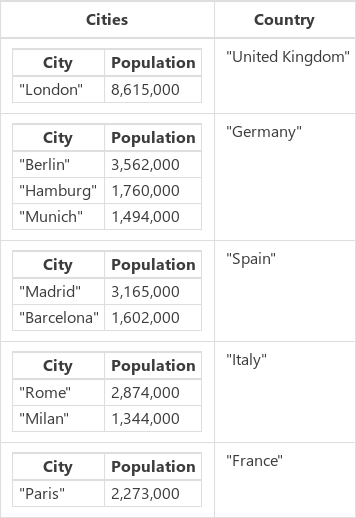
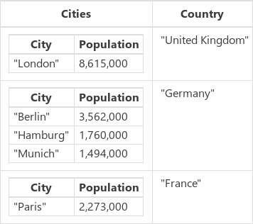
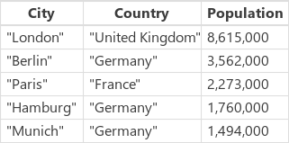

<properties
	pageTitle="PowerApps: GroupBy and Ungroup functions"
	description="Reference information for the GroupBy and Ungroup functions in PowerApps, including syntax and examples"
	services=""
	suite="powerapps"
	documentationCenter="na"
	authors="gregli-msft"
	manager="dwrede"
	editor=""
	tags=""/>

<tags
   ms.service="powerapps"
   ms.devlang="na"
   ms.topic="article"
   ms.tgt_pltfrm="na"
   ms.workload="na"
   ms.date="11/07/2015"
   ms.author="gregli"/>

# GroupBy and Ungroup functions in PowerApps #

Groups and ungroups [records](working-with-tables.md#records) of a [table](working-with-tables.md).

## Description ##

The **GroupBy** function groups records together, based on the values in one or more [columns](working-with-tables.md#columns).  Records in the same group are placed into a single record, with a column added that holds a nested table of the remaining columns.  **GroupBy** returns a table.   

The **Ungroup** function reverses the **GroupBy** process.  Records that were grouped together are broken out into separate records.  **Ungroup** also returns a table.

You can modify the table returned by **GroupBy** before passing it back to **Ungroup**.  For example to remove a group of records, you can **GroupBy**, use **[Filter](function-filter-lookup.md)** to remove the entire group of records, and then **Ungroup**.  

**Ungroup** does its best to preserve the original order of the records that were fed to **Group**.  This cannot always be accomplished, for example if *blank* records are in the original table. 

Tables are a value in PowerApps, just like a string or number.  They can be passed to and returned from functions.  **GroupBy** and **Ungroup** do not modify a table, instead they take a table as an argument and return a new table.  See [working with tables](working-with-tables.md) for more details.

## Syntax ##

**GroupBy**( *Table*, *ColumnName1* [, *ColumnName2*, ... ], *GroupColumnName* )

- *Table* - Required. Table to be grouped.
- *ColumnName(s)* - Required.  The column names in *table* to group on.  These columns become columns in the resulting table.
- *GroupColumnName* - Required.  The column name for the storage of record data not in the *ColumnName(s)*. 

**Ungroup**( *Table*, *GroupColumnName* )

- *Table* - Required. Table to be ungrouped.
- *GroupColumnName* - Required.  The column containing the record data setup with the **GroupBy** function. 

## Examples ##

1. Let's begin with a **CityPopulations** data source:

	

1. You can group this by the value in the **Country** column with:

	- **GroupBy( CityPopulations, "Country", "Cities" )**

	

2. Let's capture the result of the GruopBy in a collection named **CitiesByCountry**:

	- **ClearCollect( CitiesByCountry, GroupBy( CityPopulations, "Country", "Cities" ) )**

3. Now, let's filter out countries that do not have an "e" in their names:

	- **Filter( CitiesByCountry, "e" in Country )**

	

4. Let's capture this result in another collection, named **CitiesByCountryFiltered**:

	- **ClearCollect( CitiesByCountryFiltered, Filter( CitiesByCountry, "e" in Country )**

5. And finally, let's ungroup the table.  We need to supply the column that contains the unique information for each city:

	- **Ungroup( CitiesByCountryFiltered, "Cities" )**

	

