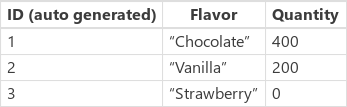

<properties
	pageTitle="Patch function | Microsoft PowerApps"
	description="Reference information, including syntax and examples, for the Patch function in PowerApps"
	services=""
	suite="powerapps"
	documentationCenter="na"
	authors="gregli-msft"
	manager="dwrede"
	editor=""
	tags=""/>

<tags
   ms.service="powerapps"
   ms.devlang="na"
   ms.topic="article"
   ms.tgt_pltfrm="na"
   ms.workload="na"
   ms.date="10/21/2015"
   ms.author="gregli"/>

# Patch function in PowerApps #

Modifies or creates a [record](working-with-tables.md#records) in a [data source](working-with-data-sources.md), or merges records outside of a data source.

## Overview ##

Use the **Patch** function to modify a record of a data source.  The values of specific [properties](working-with-tables.md#elements-of-a-table) are modified without affecting other properties.

Use **Patch** with the **[Defaults](function-defaults.md)** function to create records. You can use this behavior to build a [single screen](working-with-data-sources.md) for both creating and editing records.  

Even if you're not working with a data source, you can use **Patch** to merge two or more records.

## Description ##

### Modify or create a record in a data source ###

To use this function with a data source, specify the data source, and then specify a base record:

- To modify a record, the base record needs to have come from a data source.  The base record may have come through a gallery's **Items** property, been placed in a [context variable](working-with-variables.md#create-a-context-variable), or come through some other path. But you should be able to trace the base record back to the data source.  This is important as the record will include additional information to help find the record again for modification.  

- To create a record, use the **[Defaults](function-defaults.md)** function to create a base record with default values.  

Then specify one or more change records, each of which contains new property values that override property values in the base record. Change records are processed in order from the beginning of the argument list to the end, with later property values overriding earlier ones.

The return value of **Patch** is the record that you modified or created.  If you created a record, the return value may include properties that the data source generated automatically.

When you update a data source, one or more issues may arise. Use the **[Errors](function-errors.md)** function to identify and examine issues, as [Working with Data Sources](working-with-data-sources.md) describes.

Related functions include the **[Update](function-update-updateif.md)** function, which you can use to replace an entire record, and the **[Collect](function-clear-collect-clearcollect.md)** function, which you can use to create a record.  You can use the **[UpdateIf](function-update-updateif.md)** function to modify specific properties of multiple records based on a condition.

### Merge records outside of a data source ###

Specify two or more records that you want to merge. Records are processed in order from the beginning of the argument list to the end, with later property values overriding earlier ones.

**Patch** returns the merged record and doesn't modify its arguments or records in any data sources.

## Syntax ##

#### Modify or create a record in a data source ####

**Patch**( *DataSource*, *BaseRecord*, *ChangeRecord1* [, *ChangeRecord2*, … ])

- *DataSource* – Required. The data source that contains the record that you want to modify or will contain the record that you want to create.

- *BaseRecord* – Required. The record to modify or create.  If the record came from a data source, the record is found and modified. If the result of **[Defaults](function-defaults.md)** is used, a record is created.

- *ChangeRecord(s)* – Required.  One or more records that contain properties to modify in the *BaseRecord*.  Change records are processed in order from the beginning of the argument list to the end, with later property values overriding earlier ones.

#### Merge records ####

**Patch**( *Record1*, *Record2* [, …] )

- *Record(s)* - Required.  At least two records that you want to merge. Records are processed in order from the beginning of the argument list to the end, with later property values overriding earlier ones.

## Examples ##

#### Modify or create a record (in a data source) ###

In these examples, you'll modify or create a record in a data source, named **IceCream**, that contains the data in this [table](working-with-tables.md) and automatically generates the values in the **ID** [column](working-with-tables.md#columns):

| Formula | Description | Result |
|---------|-------------|--------|
| **Patch(&nbsp;IceCream, First( Filter( IceCream, Flavor = "Chocolate" ) ), {&nbsp;Quantity:&nbsp;400&nbsp;} )** | Modifies a record in the **IceCream** data source:<ul><li> The **ID** column of the record to modify contains the value of **1**. (The **Chocolate** record has that ID.)</li><li>The value in the **Quantity** column changes to **400**. | {&nbsp;ID:&nbsp;1, Flavor:&nbsp;"Chocolate", Quantity:&nbsp;400 }  The **Chocolate** entry in the **IceCream** data source has been modified. |
| **Patch( IceCream, Defaults(&nbsp;IceCream ), {&nbsp;Flavor:&nbsp;“Strawberry”&nbsp;}&nbsp;)** | Creates a record in the **IceCream** data source:<ul><li>The **ID** column contains the value **3**, which the data source generates automatically.</li><li>The **Quantity** column contains **0**, which is the default value for that column in the **IceCream** data source, as the **[Defaults](function-defaults.md)** function specifies.<li>The **Flavor** column contains the value of **Strawberry**.</li> | { ID:&nbsp;3, Flavor:&nbsp;“Strawberry”, Quantity:&nbsp;0&nbsp;}  The **Strawberry** entry in the **IceCream** data source has been created. |

After the previous formulas have been evaluated, the data source ends with these values:

#### Merge records (outside of a data source) ####

| Formula | Description | Result |
|---------|-------------|--------|
|**Patch(&nbsp;{&nbsp;Name:&nbsp;"James",&nbsp;Score:&nbsp;90&nbsp;}, {&nbsp;Name:&nbsp;"Jim",&nbsp;Passed:&nbsp;true&nbsp;} )** | Merges two records outside of a data source: <ul><li>The values in the **Name** column of each record don't match. The result contains the value (**Jim**) in the record that's closer to the end of the argument list instead of the value (**James**) in the record that's closer to the start.</li><li>The first record contains a column (**Score**) that doesn't exist in the second record. The result contains that column with its value (**90**).</li><li>The second record contains a column (**Passed**) that doesn't exist in the first record. The result contains that column with its value (**true**). | {&nbsp;Name:&nbsp;"Jim", Score:&nbsp;90, Passed:&nbsp;true&nbsp;} |
