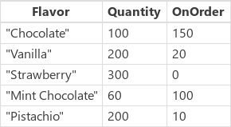

<properties
	pageTitle="PowerApps: Sort function"
	description="Reference information for the Sort function in PowerApps, including syntax and examples"
	services=""
	suite="powerapps"
	documentationCenter="na"
	authors="gregli-msft"
	manager="dwrede"
	editor=""
	tags=""/>

<tags
   ms.service="powerapps"
   ms.devlang="na"
   ms.topic="article"
   ms.tgt_pltfrm="na"
   ms.workload="na"
   ms.date="10/21/2015"
   ms.author="gregli"/>

# Sort function in PowerApps #

Sorts a [table](working-with-tables.md).

## Description ##

The **Sort** function sorts a table based on a formula.  

The formula is evaluated for each [record](working-with-tables.md#records) of the table, and the results are used to sort the table.  [Columns](working-with-tables.md#columns) of the table can be used in the formula.  The formula must result in a number, string, or boolean value; it cannot result in a table or record.

To sort first by one column, and then by another, you wrap one call to **Sort** within another.  For example, if a **Contacts** table has **FirstName** and **LastName** columns, use **Sort( Sort( Contacts, LastName ), FirstName )** in order to sort first by **LastName** and then by **FirstName**.

Tables are a value in PowerApps, just like a string or number.  They can be passed to and returned from functions.  **Sort** does not modify a table, instead it takes a table as an argument and return a new table that has been sorted.  See [working with tables](working-with-tables.md) for more details.

## Syntax ##

**Sort**( *Table*, *Formula* [, *SortOrder* ] )

- *Table* - Required. Table to sort.
- *Formula* - Required. This formula is evaluated for each record of the table, and the results are used to sort the table.  You can reference columns within the table.
- *SortOrder* - Optional.  **SortOrder!Ascending** or **SortOrder!Descending**.  **SortOrder!Ascending** is the default.

## Examples ##

For the following examples, we will use the **IceCream** data source:

| Formula | Description | Result |
|---------|-------------|--------|
| **Sort( IceCream, Flavor )** | Sorts **IceCream** by its **Flavor** column.  As **Flavor** is a column that contains strings, the sort is done alphabetically.  By default, the sort order is ascending.  |   |
| **Sort( IceCream, Quantity )** | Sorts **IceCream** by its **Quantity** column.  As **Quantity** is a column that contains numbers, the sort is done numerically.  By default, the sort order is ascending.  |  |
| **Sort( IceCream, Quantity, SortOrder!Descending )** | Sorts **IceCream** by its **Quantity** column.  As **Quantity** is a column that contains numbers, the sort is done numerically.  The sort order has been specified as descending.  |  |
| **Sort( IceCream, Quantity + OnOrder )** | Sorts **IceCream** by the sum of its **Quantity** and **OnOrder** columns for each record individually.  As the sum is a number, the sort is done numerically.  By default, the sort order is ascending.  |  |
| **Sort( Sort( IceCream, OnOrder ), Quantity )** | Sorts **IceCream** first by its **OnOrder** column, and then by its **Quantity** column.  Note that "Pistachio" rose above "Vanilla" in the first sort based on **OnOrder**, and then together they moved to their appropriate place based on **Quantity**.  |  |

To run these examples yourself, create the **IceCream** data source as a collection: 

- Insert a Button control
- Cut-and-paste the following formula into its **OnSelect** property: **ClearCollect( IceCream, { Flavor: "Chocolate", Quantity: 100, OnOrder: 150 }, { Flavor:  "Vanilla", Quantity: 200, OnOrder: 20 }, { Flavor: "Strawberry", Quantity: 300, OnOrder: 0 }, { Flavor: "Mint Chocolate", Quantity: 60, OnOrder: 100 }, { Flavor: "Pistachio", Quantity: 200, OnOrder: 10 } )**
- Preview the app 
- Press the button  

Return to authoring with the *escape* key and view the resulting **IceCream** collection by selecting **File** at the top of the screen.

To see the results from each of the example formulas above, create another button, wrap the formula with **ClearCollect( *collection*, *formula* )**, preview the app and press the button.  You can view all your collections by selecting **File** at the top of the screen.

