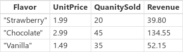

<properties
	pageTitle="PowerApps: AddColumns, DropColumns, RenameColumns, and ShowColumns functions"
	description="Reference information for the AddColumns, DropColumns, RenameColumns, and ShowColumns functions in PowerApps, including syntax and examples"
	services=""
	suite="powerapps"
	documentationCenter="na"
	authors="gregli-msft"
	manager="dwrede"
	editor=""
	tags=""/>

<tags
   ms.service="powerapps"
   ms.devlang="na"
   ms.topic="article"
   ms.tgt_pltfrm="na"
   ms.workload="na"
   ms.date="11/07/2015"
   ms.author="gregli"/>

# AddColumns, DropColumns, RenameColumns, and ShowColumns functions in PowerApps #

Shapes a [table](working-with-tables.md) by adding, dropping, renaming, and selecting [columns](working-with-tables.md#columns) of a table.

## Overview ##

These functions shape a table by making adjustments to its columns:

- Reduce a table down to one column, for passing to single-column functions such as **[Lower](function-lower-upper-proper.md)** or **[Abs](function-numericals.md)**.  
- Add a calculated column to a table, for example a "Total Price" column which is equal to "Quantity" multiplied by "Unit Price".
- Rename a column to something more meaningful, for display to users or for use in formulas.

Tables are a value in PowerApps, just like a string or number.  They can be passed to and returned from functions.  The functions described here do not modify a table, instead they take a table as an argument and return a new table with a transform applied.  See [working with tables](working-with-tables.md) for more details.  

The columns of a [data source](working-with-data-sources.md) cannot be modified with these functions.  You need to go to the source of the data and modify it there.  You can add columns to a collection with the **[Collect](function-clear-collect-clearcollect.md)** function.  See [working with data sources](working-with-data-sources.md) for more details.  

## Description ##

The **AddColumns** functions adds a column to a table, with values given by a formula.  Existing columns remain unmodified.  The formula is evaluated for each [record](working-with-tables.md#records) of the table and can reference other columns in the table.

The **DropColumns** function excludes columns from a table.  All other columns remain unmodified.  **DropColumns** excludes columns while **ShowColumns** includes columns.

The **RenameColumns** function renames columns of a table.  All other columns retain their original names.

The **ShowColumns** function includes columns of a table.  All other columns are dropped.  You can use **ShowColumns** to create a single-column table.  **ShowColumns** includes columns while **DropColumns** excludes columns.  

For all these functions, the result is a new table with the transform applied.  The original table is not modified.

## Syntax ##

**AddColumns**( *Table*, *ColumnName1*, *Formula1* [, *ColumnName2*, *Formula2*, ... ] )

- *Table* - Required.  Table to operate on.
- *ColumnName(s)* - Required. Names of the column to add.  This name must be a string, for example **"Name"** with double quotes included.
- *Formula(s)* - Required.  Formulas to evaluate for each record, the result is added as the value of the corresponding new column.  Other columns in the table can be referenced in this formula.

**DropColumns**( *Table*, *ColumnName1* [, *ColumnName2*, ... ] )

- *Table* - Required.  Table to operate on.
- *ColumnName(s)* - Required. Names of the columns to drop. This name must be a string, for example **"Name"** with double quotes included.

**RenameColumns**( *Table*, *OldColumneName*, *NewColumnName* )

- *Table* - Required.  Table to operate on.
- *OldColumnName* - Required. Names of the column to rename. This name must be a string, for example **"Name"** with double quotes included.
- *NewColumnName* - Required. Replacement name. This name must be a string, for example **"Customer Name"** with double quotes included.

**ShowColumns**( *Table*, *ColumnName1* [, *ColumnName2*, ... ] )

- *Table* - Required.  Table to operate on.
- *ColumnName(s)* - Required. Names of the columns to include. This name must be a string, for example **"Name"** with double quotes included.

## Examples ##

For the following examples, we will use the **IceCreamSales** data source:

Throughout all of these examples, the **IceCreamSales** data source is not modified.  The value of the data source as a table is transformed by each of these functions and returned as the function's result.

| Formula | Description | Result |
|---------|-------------|--------|
| **AddColumns( IceCreamSales, "Revenue", UnitPrice * QuantitySold )** | Adds a **Revenue** column to the result.  For each record, **UnitPrice * QuantitySold** is evaluated and placed in this column. |   |
| **RemoveColumns( IceCreamSales, "UnitPrice" )** | Excludes the **UnitPrice** column from the result.  This function selects columns to exclude, whereas **SelectColumns** selects columns to include. |  |
| **ShowColumns( IceCreamSales, "Flavor" )** | Includes only the **Flavor** column in the result.  This function selects columns to include, whereas **RemoveColumns** selects columns to exclude. |  |
| **RenameColumns( IceCreamSales, "UnitPrice", "Price")** | Renames the **UnitPrice** colum in the result. |  |
| **DropColumns( RenameColumns( AddColumns( IceCreamSales, "Revenue", UnitPrice * QuantitySold ), "UnitPrice", "Price" ), "Quantity" )** | Performs the following table transforms in order, starting from the inside of the formula: <ol><li>Adds a **Revenue** column based on the per record calculation of **UnitPrice * Quantity**.<li>Renames **UnitPrice** to **Price**.<li>Excludes the **Quantity** column.</ol>  Note that order is important, for example we can't calculate with **UnitPrice** after it has been renamed. |  |

### Step by step ###

1. Import or create a collection named Inventory as Create your first app describes.

2. Add an image gallery with text, name it TableHolder, and set its Items property to this function:

	**RenameColumns(Inventory, "ProductName", "JacketID")**

3. Add a button, and set its OnSelect property to this function:

	**Collect(Inventory2, TableHolder!AllItems)**

4. Press F5, click the button you just created, and then press Esc to return to the design workspace.

5. Press Alt-D, and then click Collections in the left navigation bar.

6. Confirm that you've duplicated the Inventory collection, except that the new collection, named Inventory2, contains the same information in a column named JacketID as the original collection did in a column named ProductName.
