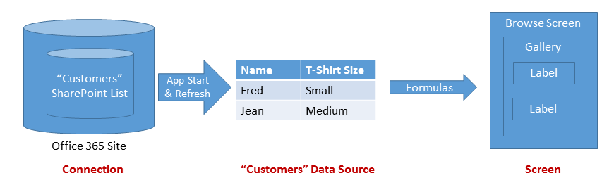
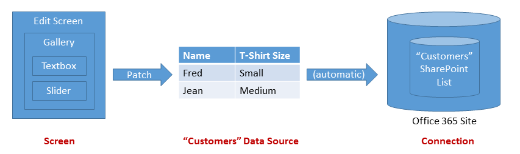

<properties
	pageTitle="Understand data sources | Microsoft PowerApps"
	description="Reference information for working with connections and data sources in Microsoft PowerApps."
	services=""
	suite="powerapps"
	documentationCenter="na"
	authors="gregli-msft"
	manager="dwrede"
	editor=""
	tags=""/>

<tags
   ms.service="powerapps"
   ms.devlang="na"
   ms.topic="article"
   ms.tgt_pltfrm="na"
   ms.workload="na"
   ms.date="11/10/2015"
   ms.author="gregli"/>

# Understand data sources in PowerApps #

Data sources are extensions of [tables](working-with-tables.md) that can retrieve and store information.  Connected data sources read and write data in Microsoft Excel workbooks, SharePoint lists, SQL Server tables, and many other services.  Static data sources and collections are alternative data sources that can be loaded and saved locally.

Using the **Gallery**, **Display form**, and **Edit form** controls, it is easy to create an app that reads and writes data from a data source.  To get started, read the article [Understand data forms](../working-with-forms.md).  When you ask PowerApps to create an app from data, these controls are used.

Sometimes you will want more control over how data flows in and out of your app.  This article describes how the **Patch**, **DataSourceInfo**, **Validate**, and **Errors** functions provide more control.

## Data sources ##

As we learned in [Working with tables](working-with-tables.md), tables in PowerApps are values, just as a number or a string is a value. Tables aren't stored anywhere. You can't directly modify the structure and data of a table, only derivative tables that you create through a formula.

Some of the most interesting tables are stored for later retrieval and sharing.  PowerApps provides "connections" to read and write stored data.  Within a connection, you can access multiple tables of information.  You'll select which tables to use in your app, and each will become a separate *data source*.  

A data source is an extension of a table, and you can use it in any context that you use a table.  Just like a table, each data source has [records](working-with-tables.md#records), [columns](working-with-tables.md#columns), and properties that you can use in formulas.  In addition:

- The data source has the same column names and data types as the underlying table in the connection.
- The data source is loaded from the service automatically when the app is loaded.  You can force the data to refresh by using the **[Refresh](function-refresh.md)** function.
- As users run an app, they can create, modify, and delete records and push those changes back to the underlying table in the service.
	- Records can be created with the **[Patch](function-patch.md)** and **[Collect](function-clear-collect-clearcollect.md)** functions.  
	- Records can be modified with the **[Patch](function-patch.md)**, **[Update](function-update-updateif.md)**, and **[UpdateIf](function-update-updateif.md)** functions.
	- Records can be removed with the **[Remove](function-remove-removeif.md)** and **[RemoveIf](function-remove-removeif.md)** functions.
	- Errors when working with a data source are available through the **[Errors](function-errors.md)** function.
- The **[DataSourceInfo](function-datasourceinfo.md)**, **[Defaults](function-defaults.md)**, and **[Validate](function-validate.md)** functions provide information about the data source that you can use to optimize the user experience.

PowerApps can't be used to create or modify a data source; the table must already exist in a service elsewhere.  To create a table (for example, in an Excel workbook stored on OneDrive), you would use Excel Online on OneDrive first to create a workbook and then create a connection to it from your app.  Collections can be created and modified in an app but are only temporary.

## Display one or more records ##

The diagram above shows the flow of information when an app reads the information in a data source:

- The information is stored and shared through a storage service (in this case, a SharePoint list of an Office 365 site).
- A connection makes this information available to the app.  The connection takes care of authentication of the user to access the information.
- When the app is started or the **[Refresh](function-refresh.md)** function invokes, information is drawn from the connection into a data source in the app for local use.
- Formulas are used to read the information and expose it in controls that the user can see. You can display the records of a data source by using a gallery on a screen and wiring the **Items** property to the data source: **Gallery.Items = DataSource**.  You wire controls within the gallery, to the gallery, using the controls' **Default** property.  
- The data source is also a table.  So you can use **[Filter](function-filter-lookup.md)**, **[Sort](function-sort.md)**, **[AddColumns](function-table-shaping.md)**, and other functions to refine and augment the data source before using it as a whole.  You can also use the **[Lookup](function-filter-lookup.md)**, **[First](function-first-last.md)**, **[Last](function-first-last.md)**, and other functions to work with individual records.

## Modify a record ##

In the last section, we showed you how to read a data source.  Note that the arrows in the diagram above are one way.  Changes to a data source aren't pushed back through the same formulas in which the data was retrieved.  Instead, new formulas are used.  Often a different screen is used for editing a record than for browsing records, especially on a mobile device.

Note that, to modify an existing record of a data source, the record must have originally come from the data source.  The record may have traveled through a gallery, a [context variable](working-with-variables.md#create-a-context-variable), and any number of formulas, but its origin should be traceable back to the data source.  This is important because additional information travels with the record that uniquely identifies it, ensuring that you modify the correct record.    

The diagram above shows the flow of information to update a data source:

- A gallery can also provide a container for input controls, such as an input-text box or a slider.  As with the browse screen, the **Items** property is used but, for a single record, often takes the form of  **Gallery.Items = Table( EditRecord )**.
- Each input control exposes an **Update** property.  This property maps the user's input to a specific property of the record.
- The gallery aggregates the **Update** property of each of the controls within it and exposes this as an **Updates** property.
- A button or an image control on the screen is used to submit changes to the data source's service.  You use a formula based on the **[Patch](function-patch.md)** function from the **OnSelect** formula of the control.
- Sometimes there will be issues.  A network connection may be down, or a validation check is made by the service that the app didn't know about.  The **[Errors](function-errors.md)** function is used to check if there was an issue and retrieve information about the issue.  In some cases, such as conflicting edits by another user, the **[Revert](function-revert.md)** function may be needed to reload the record and clear the error.

## Validation ##

Before making a change to a record, the app should do what it can to make sure the change will be acceptable.  There are two reasons for this:

- *Immediate feedback to the user*.  The best time to fix a problem is right when it happens, when it is fresh in the user's mind.  Literally with each touch or keystroke, red text can appear that identifies an issue with their entry.
- *Less network traffic and less user latency*.  More issues detected in the app means fewer conversations over the network to detect and resolve issues.  Each conversation takes time during which the user must wait before they can move on.

PowerApps offers two tools for validation:

- The data source can provide information about what is and isn't valid.  For example, numbers can have minimum and maximum values, and one or more entries can be required.  You can access this information with the **[DataSourceInfo](function-datasourceinfo.md)** function.  
- The **[Validate](function-validate.md)** function uses this same information to check the value of a single column or of an entire record.

## Error handling ##

Great, you've validated your record.  Time to update that record with **[Patch](function-patch.md)**!

But, alas, there may still be a problem.  The network is down, validation at the service failed, or the user doesn't have the right permissions, just to name a few of the possible errors your app may encounter.  It needs to respond appropriately to error situations, providing feedback to the user and a means for them to make it right.  

When errors occur with a data source, your app automatically records the error information and makes it available through the **[Errors](function-errors.md)** function.  Errors are associated with the records that had the problems.  If the problem is something the user can fix, such as a validation problem, they can resubmit the record, and the errors will be cleared.

If an error occurs when a record is created with **[Patch](function-patch.md)** or **[Collect](function-clear-collect-clearcollect.md)**, there is no record to associate any errors with.  In this case, *blank* will be returned by **[Patch](function-patch.md)** and can be used as the record argument to **[Errors](function-errors.md)**.  Creation errors are cleared with the next operation.

The **[Errors](function-errors.md)** function returns a table of error information.  This information can include the column information, if the error can be attributed to a particular column.  Use column-level error messages in label controls that are close to where the column is located on the edit screen.  Use record-level error messages where the **Column** in the error table is *blank*, in a location close to the **Save** button for the entire record.  

## Collections ##

Collections are a special kind of data source.  They're local to the app and not backed by a connection to a service in the cloud, so the information can not be shared across devices for the same user or between users.  They operate like any other data source, with a few exceptions:

- Collections can be created dynamically with the **[Collect](function-clear-collect-clearcollect.md)** function.  They don't need to be established ahead of time, as connection-based data sources do.
- The columns of a collection can be modified at any time using the **[Collect](function-clear-collect-clearcollect.md)** function.
- Collections allow duplicate records.  More than one copy of the same record can exist in a collection.  Functions such as **[Remove](function-remove-removeif.md)** will operate on the first match they find, unless the **All** argument is supplied.
- You can use the **[SaveData](function-savedata-loaddata.md)** and **[LoadData](function-savedata-loaddata.md)** functions to save and reload a copy of the collection.  The information is stored in a private location that other users, apps, or devices can't access.
- You can use the **[Export](control-export-import.md)** and **[Import](control-export-import.md)** controls to save and reload a copy of the collection to a file that the user can interact with.  

For more information on working with a collection as a data source, see [create and update a collection](create-update-collection.md).

Collections are commonly used to hold global state for the app.  See [working with variables](working-with-variables.md) for the options available for managing state.

