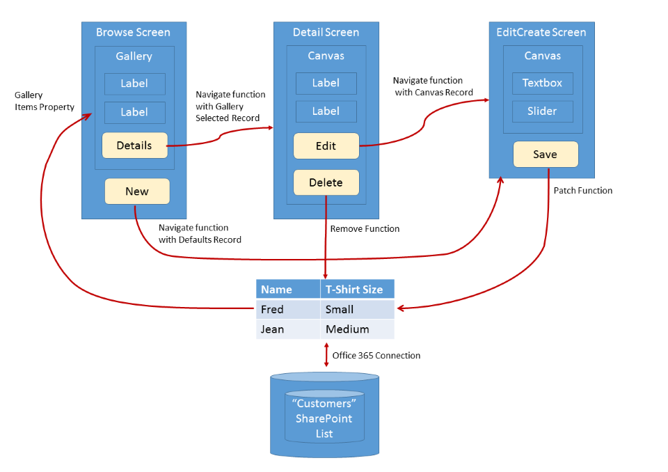

<properties
	pageTitle="Understanding data sources | Microsoft PowerApps"
	description="Reference information for working with connections and data sources in Microsoft PowerApps."
	services=""
	suite="powerapps"
	documentationCenter="na"
	authors="gregli-msft"
	manager="dwrede"
	editor=""
	tags=""/>

<tags
   ms.service="powerapps"
   ms.devlang="na"
   ms.topic="article"
   ms.tgt_pltfrm="na"
   ms.workload="na"
   ms.date="11/10/2015"
   ms.author="gregli"/>

# Understanding data sources in PowerApps #

Data sources are extensions of [tables](working-with-tables.md) that can retrieve and store information.  Connected data sources read and write data in Microsoft Excel workbooks, SharePoint lists, SQL Server tables, and many other services.  Static data sources and collections are alternative data sources that can be loaded and saved locally.

## Data sources ##

As we learned in [Working with tables](working-with-tables.md), tables in PowerApps are values, just as a number or a string is a value. Tables aren't stored anywhere. You can't directly modify the structure and data of a table, only derivative tables that you create through a formula.

Some of the most interesting tables are stored for later retrieval and sharing.  PowerApps provides "connections" to read and write stored data.  Within a connection, you can access multiple tables of information.  You'll select which tables to use in your app, and each will become a separate *data source*.  

A data source is an extension of a table, and you can use it in any context that you use a table.  Just like a table, each data source has [records](working-with-tables.md#records), [columns](working-with-tables.md#columns), and properties that you can use in formulas.  In addition:

- The data source has the same column names and data types as the underlying table in the connection.
- The data source is loaded from the service automatically when the app is loaded.  You can force the data to refresh by using the **[Refresh](function-refresh.md)** function.
- As users run an app, they can create, modify, and delete records and push those changes back to the underlying table in the service.
	- Records can be created with the **[Patch](function-patch.md)** and **[Collect](function-clear-collect-clearcollect.md)** functions.  
	- Records can be modified with the **[Patch](function-patch.md)**, **[Update](function-update-updateif.md)**, and **[UpdateIf](function-update-updateif.md)** functions.
	- Records can be removed with the **[Remove](function-remove-removeif.md)** and **[RemoveIf](function-remove-removeif.md)** functions.
	- Errors when working with a data source are available through the **[Errors](function-errors.md)** function.
- The **[DataSourceInfo](function-datasourceinfo.md)**, **[Defaults](function-defaults.md)**, and **[Validate](function-validate.md)** functions provide information about the data source that you can use to optimize the user experience.

PowerApps can't be used to create or modify a data source; the table must already exist in a service elsewhere.  To create a table (for example, in an Excel workbook stored on OneDrive), you would use Excel Online on OneDrive first to create a workbook and then create a connection to it from your app.  Collections can be created and modified in an app but are only temporary.

## Displaying records from a data source ##

The diagram above shows the flow of information when an app reads the information in a data source:

- The information is stored and shared through a storage service (in this case, a SharePoint list of an Office 365 site).
- A connection makes this information available to the app.  The connection takes care of authentication of the user to access the information.
- When the app is started or the **[Refresh](function-refresh.md)** function invokes, information is drawn from the connection into a data source in the app for local use.
- Formulas are used to read the information and expose it in controls that the user can see. You can display the records of a data source by using a gallery on a screen and wiring the **Items** property to the data source: **Gallery!Items = DataSource**.  You wire controls within the gallery, to the gallery, using the controls' **Default** property.  
- The data source is also a table.  So you can use **[Filter](function-filter-lookup.md)**, **[Sort](function-sort.md)**, **[AddColumns](function-table-shaping.md)**, and other functions to refine and augment the data source before using it as a whole.  You can also use the **[Lookup](function-filter-lookup.md)**, **[First](function-first-last.md)**, **[Last](function-first-last.md)**, and other functions to work with individual records.

For example, let's walk through the steps to display our SharePoint list:

1. Create a connection to an Office 365 site.  We are using Office 365 and SharePoint lists in this example, but you can use any connection that supports data sources.
2. Add the connection to your app.  You'll be asked which table you want to use from the connection.  In this case, we're using the SharePoint list that's named Customers, so the default name of the data source is **Customers**.
3. Insert a screen, and rename it to **BrowseScreen**.
4. Insert a text gallery to the screen.  This gallery includes labels to display individual properties of each record.
5. Set the Items property of the gallery to the data source, named **Customers**, that you added in step 2.  You can use the **Order** function to order the records in the gallery. You can use the **[Filter](function-filter-lookup.md)** function to select which records to show.
6. The gallery shows the Customers list, and you can scroll through the many records in that list.
7. You can change which columns are shown by changing the **Text** properties of the labels in the gallery.  You can also add and rearrange labels.
8. Preview the app, and browse and edit records of the SharePoint list.  

Other users can modify the SharePoint list outside of the app.  When it loads, the app will read the SharePoint list, and the data can be refreshed later with the **[Refresh](function-refresh.md)** function.

## Modifying a record in a data source ##

In the last section, we showed you how to read a data source.  Note that the arrows in the diagram above are one way.  Changes to a data source aren't pushed back through the same formulas in which the data was retrieved.  Instead, new formulas are used.  Often a different screen is used for editing a record than for browsing records, especially on a mobile device.

Note that, to modify an existing record of a data source, the record must have originally come from the data source.  The record may have traveled through a gallery, a [context variable](working-with-variables.md#context-variables), and any number of formulas, but its origin should be traceable back to the data source.  This is important because additional information travels with the record that uniquely identifies it, ensuring that you modify the correct record.    

The diagram above shows the flow of information to update a data source:

- A gallery can also provide a container for input controls, such as an input-text box or a slider.  As with the browse screen, the **Items** property is used but, for a single record, often takes the form of  **Gallery!Items = Table( EditRecord )**.
- Each input control exposes an **Update** property.  This property maps the user's input to a specific property of the record.
- The gallery aggregates the **Update** property of each of the controls within it and exposes this as an **Updates** property.
- A button or an image control on the screen is used to submit changes to the data source's service.  You use a formula based on the **[Patch](function-patch.md)** function from the **OnSelect** formula of the control.
- Sometimes there will be issues.  A network connection may be down, or a validation check is made by the service that the app didn't know about.  The **[Errors](function-errors.md)** function is used to check if there was an issue and retrieve information about the issue.  In some cases, such as conflicting edits by another user, the **[Revert](function-revert.md)** function may be needed to reload the record and clear the error.

Let's continue our walkthrough and add a screen for editing records:

3. On our browse screen, in the first item of the gallery, add a button, and label it "Edit".  Set the **OnSelect** property to the formula **Navigate( EditScreen, Transition!None, { EditRecord: ThisItem } )**.  You'll see an error because the EditScreen doesn't yet exist, but it will in the next step.
4. Insert another screen, and name it **EditScreen**.  This will resolve the error on the BrowseScreen.
4. Insert a card gallery, rename it **EditGallery**, and set its **Items** property to **Table( EditRecord )**  
5. Add a section for each record property that the user will be able to change.
6. Insert an input-text box:  
	- Name it **NameControl**.
	- Set its **Default** property to **Name**.  This is the name of the column in the SharePoint list.  We are mapping the column into the control.
	- Set its **Update** property to a record **{ *Name*: *NameControl!Text* }**.  This is aggregated with other control **[Update](function-update-updateif.md)** properties in the gallery to form the **EditGallery!Updates** property.  We are mapping the control back to the column.
7. Insert a second input-text box:  
	- Name it **SizeControl**.
	- Set its **Default** property to **T-Shirt Size**.  This is the name of the column in the SharePoint list.  We are mapping the column into the control.
	- Set its **Update** property to a record **{ *T-Shirt Size*: *SizeControl!Text* }**.  This is aggregated with other control **[Update](function-update-updateif.md)** properties in the gallery to form the **EditGallery!Updates** property.  We are mapping the control back to the column.
7. Insert a button outside the card gallery.  Label it **Save**, and set its **OnSelect** property to **Patch( Customers, EditRecord, EditGallery!Updates ); Back()**
8. Preview the app, browse and edit records of the SharePoint list, and verify changes on the SharePoint site.

## Validation ##

Before making a change to a record, the app should do what it can to make sure the change will be acceptable.  There are two reasons for this:

- *Immediate feedback to the user*.  The best time to fix a problem is right when it happens, when it is fresh in the user's mind.  Literally with each touch or keystroke, red text can appear that identifies an issue with their entry.
- *Less network traffic and less user latency*.  More issues detected in the app means fewer conversations over the network to detect and resolve issues.  Each conversation takes time during which the user must wait before they can move on.

PowerApps offers three tools for validation:

- The data source can provide information about what is and isn't valid.  For example, numbers can have minimum and maximum values, and one or more entries can be required.  You can access this information with the **[DataSourceInfo](function-datasourceinfo.md)** function.  
- The **[Validate](function-validate.md)** function uses this same information to check the value of a single column or of an entire record.
- You can add validation that's specific to your app with the **Valid** property of input controls.  The formula for this property should evaluate to *true* if the validation passes.  The **Valid** property of a gallery is a logical **[And](function-logicals.md)** of the **Valid** properties of all the input controls within it.

Let's continue our walkthrough and add validation to our screen:

1.  Let's add a commonly used red asterisk to indicate that a field is required:
	-  Insert a label control on our edit screen, just above the **NameControl**.
	-  Place a single asterisk ("*") in this label.
	-  Set the **[Color](function-colors.md)** to **Color!Red**.
	-  Set the **Visible** property of this label to **DataSourceInfo( Customers, DataSourceInfo!Required, "Name" )**.  When true, this will show the red asterisk to indicate that the control requires a value.
2.  Let's check that the Name control is filled in before we **[Patch](function-patch.md)**:
	-  Modify the **OnSubmit** property of the **Save** button to check if the **EditGallery** believes the record is valid.  The **[Validate](function-validate.md)** function checks for required fields using the same information that helped **[DataSourceInfo](function-datasourceinfo.md)** show the red asterisk:
		- **if( IsEmpty( Validate( Customers, EditRecord, EditGallery!Updates) ), Patch( Customers, EditRecord, EditGallery!Updates ); Back() )**.  
4.  Let's add a check that the "T-Shirt Size" has one of three possible values:
	-  Set the **Valid** property of the **Size** control to **Size!Text = "Small" || Size!Text = "Medium" || Size!Text = "Large"**.  This value will automatically be included in the **Valid** property for the gallery.
	-  Again, change our **[Patch](function-patch.md)** formula to now include a check for **Valid** properties in the **EditGallery**:
		- **if( EditGallery!Valid && IsEmpty( Validate( Customers, EditRecord, EditGallery!Updates) ), Patch( Customers, EditRecord, EditGallery!Updates ); Back() )**.

## Error handling ##

Great, you've validated your record.  Time to update that record with **[Patch](function-patch.md)**!

But, alas, there may still be a problem.  The network is down, validation at the service failed, or the user doesn't have the right permissions, just to name a few of the possible errors your app may encounter.  It needs to respond appropriately to error situations, providing feedback to the user and a means for them to make it right.  

When errors occur with a data source, your app automatically records the error information and makes it available through the **[Errors](function-errors.md)** function.  Errors are associated with the records that had the problems.  If the problem is something the user can fix, such as a validation problem, they can resubmit the record, and the errors will be cleared.

If an error occurs when a record is created with **[Patch](function-patch.md)** or **[Collect](function-clear-collect-clearcollect.md)**, there is no record to associate any errors with.  In this case, *blank* will be returned by **[Patch](function-patch.md)** and can be used as the record argument to **[Errors](function-errors.md)**.  Creation errors are cleared with the next operation.

The **[Errors](function-errors.md)** function returns a table of error information.  This information can include the column information, if the error can be attributed to a particular column.  Use column-level error messages in label controls that are close to where the column is located on the edit screen.  Use record-level error messages where the **Column** in the error table is *blank*, in a location close to the **Save** button for the entire record.  

Continuing our example:

1. Insert a label on the **EditScreen**.  Set its text property to **Lookup( Errors( Customers, EditRecord ), IsBlank( Column ) )!Message**.  This will show any errors for the **EditRecord**, recalculated as updates are attempted.  The **[Filter](function-filter-lookup.md)** call reduces what is shown here to record-level errors, as opposed to errors that can be attributed to a single column.  Before a change is made and if a change is successful, this formula will return *blank*.

2. Change the **OnSelect** for the **Save** button to:

	**If( EditGallery!Valid && IsEmpty( Validate( Customers, EditRecord, EditGallery!Updates) ),
	UpdateContext( { EditReturn: Patch( Customers, EditRecord, EditGallery!Updates ) } );  If( IsEmpty( Errors( Customers, EditReturn ) ), Back() )**.  

	That's a mouthful, so let's break it down:
	- As before, the validation logic prevents us from doing the **[Patch](function-patch.md)** until we're ready.
	- We're doing the same core **[Patch](function-patch.md)** we were doing previously.  But in addition, we are capturing the result from **[Patch](function-patch.md)** in a new context variable. If there's a problem, this will be *blank*.
	-  We're passing this return value to **[Errors](function-errors.md)**.  If there are no errors, **[Errors](function-errors.md)** will return *blank*, **[IsEmpty](function-isblank-isempty.md)** will be true, and we'll navigate **[Back](function-navigate.md)** to where we came from.  The change was successful.
	- If there was a problem, we'll stay on this screen.

If there's a problem, the user will remain on the screen, and the label we inserted in step 1 will display a message to the user.  They can take corrective actions and select **Save** again.

For extra credit, there are problems that the user can't fix by changing the controls on the **EditScreen**. For example, another user may have changed a record on the server, causing conflicting edits.  In addition to error messages, the **[Errors](function-errors.md)** function also returns an **ErrorKind** that can indicate this situation and others.  Use this information to make a button visible that will "Reload" the record by invoking **[Revert](function-revert.md)** on the record.  The user's edits will be lost, so they'll need to reapply them after the record has been reloaded.

## Screens working together ##

Now that we have our main building-block screens, let's bring it all together.  A simple and common app pattern for interacting with a data source consists of three screens:

- **Browse Screen**.  A scrollable surface that displays multiple records and offers search and sorting capabilities.  The user uses this screen to find the record they're looking for.
- **Details Screen**.  To make the browse screen efficient and show lots of records at a time, only a few properties from each record can be displayed.  To drill into a record, the details screen offers more or all of the properties of the record in a format that is designed for viewing one record at a time.  
- **Edit Screen**.  Often the most efficient way to view a record is not the same as the most efficient way to edit a record.  Labels should be replaced with input-text boxes that are larger and designed for editing, numeric properties can be edited with a slider control, etc.  The edit screen provides a user experience optimized for editing.  The edit screen is also used to create records.

This pattern is used when you create an app from data. We recommend that you create one of these apps and examine the formulas for more details.  This is also a great starting point for customizing an app for your needs.

This pattern is but one of many possibilities.  PowerApps is designed to help you create a unique experience that fits your situation very well.  The functionality on these screens can be broken apart, rearranged, and combined in different ways.  For example, you may want to break the edit screen for large records into separate screens that are more bite-size, or you may want to make changes to a record directly from the browse screen.  Examine the apps that are created from templates too. Each is unique in how it structures its screens.

The diagram below shows these three screens and how they're wired together to create the app's overall experience:

- It all starts with the browse screen, which is usually the first screen that the user will see. As we saw earlier, the browse screen is wired to the data source through the **Items** property.
- From the browse screen, a **Details** button takes the user to the details screen. The button's **OnSelect** formula invokes the **[Navigate](function-navigate.md)** function to show the detail screen and passes the record to display as a context variable.  This record is taken from the **ThisItem** record of the gallery, reflecting the record that the user has selected.
- From the details screen, an **Edit** button takes the user to the edit screen.  This button's **OnSelect** formula also invokes the **[Navigate](function-navigate.md)** function to show the edit screen and passes the record to edit as a context variable.  
- With the controls on the edit screen, the user can change the record.  When the user selects the *Save" button, it invokes the **[Patch](function-patch.md)** function to write the changes to the data source.  The **[Errors](function-errors.md)** function can be used to detect and report on any problems before leaving this screen.  If all is well, you can use the **[Navigate](function-navigate.md)** function to return to the details or browse screen to see the result of the change.
- The user could also abandon a change to the record.  By using the "Cancel" button, **[Back](function-navigate.md)** is invoked which returns the user to the previous screen.  Because any changes are being abandoned, no record needs to be passed back to this screen.  
- There are two more important paths.  First, the **New** button on the browse screen goes directly to the edit screen, using the result of the **[Defaults](function-defaults.md)** function as the record to edit.  When later used with the **[Patch](function-patch.md)** function, a record will be created.
- Second, the details screen offers a **Delete** button that invokes the **[Remove](function-remove-removeif.md)** function to delete a record.  After deletion, you can **[Navigate](function-navigate.md)** the user back to the browse screen.

Note that the records passed between screens don't have a connection back to the data source.  They are stand-alone records.  You can, therefore, manipulate them as records. For example, you can place them in context variables, use **[Collect](function-clear-collect-clearcollect.md)** to put them into a collection, or use **[Patch](function-patch.md)** to merge records.  Each data function such as **[Patch](function-patch.md)** and **[Remove](function-remove-removeif.md)** requires an argument that is the data source to operate on, and this establishes the connection back to the data source.

Continuing our example, let's add a details screen and wire all three screens together.

1. Insert another screen, and name it **DetailScreen**.
2. Insert a card gallery on the screen.
	- Rename it **DetailGallery**.  
	- Set its **Items** property to **Table( DetailRecord )**  
5. Add a section for each record property that the user will be able to view.
6. Insert an appropriate control for viewing data, such as a label control.  
	- Set its **Default** property to a column name of the data source (SharePoint list).
7. Insert a button outside the card gallery.  Name the button **Edit**, and set its **OnSelect** property to **Navigate( EditScreen, ScreenTransition!None, { EditRecord: DetailRecord } )**
8. Insert another button outside the card gallery.  Name the button **[Back](function-navigate.md)**, and set its **OnSelect** property to **Back()**.  This will return the user to the browse screen when they're done viewing the details.
8. Return to the browse screen, change the **Edit** button into a **Detail** button, and change its **OnSelect** property to **Navigate( DetailScreen, ScreenTransition!None, { DetailRecord: ThisItem } )**.
8. Preview the app, and browse, view details, and edit records of the SharePoint list.  Verify your changes on the SharePoint List too.

Two pieces of extra credit:

1. Add another button on the **BrowseScreen**, and label the button **New**.  Set its **OnSelect** property to **Navigate( EditScreen, ScreenTransition!None, { EditRecord: Defaults( Customers ) }**.  This will pass a record to the **EditScreen** that, when used with **[Patch](function-patch.md)**, will create a record.
2. Add another button on the **DetailScreen**, label it **Delete**, and set its **OnSelect** property to **Remove( Customers, DetailRecord ); Back()**.  This will delete the current record and return the user to the browse screen.

## Collections ##

Collections are a special kind of data source.  They're local to the app and not backed by a connection to a service.  They operate like any other data source, with a few exceptions:

- Collections can be created dynamically with the **[Collect](function-clear-collect-clearcollect.md)** function.  They don't need to be established ahead of time, as connection-based data sources do.
- The columns of a collection can be modified at any time using the **[Collect](function-clear-collect-clearcollect.md)** function.
- Collections allow duplicate records.  More than one copy of the same record can exist in a collection.  Functions such as **[Remove](function-remove-removeif.md)** will operate on the first match they find, unless the **All** argument is supplied.
- You can use the **[SaveData](function-savedata-loaddata.md)** and **[LoadData](function-savedata-loaddata.md)** functions to save and reload a copy of the collection.  The information is stored in a private location that other users, apps, or devices can't access.

Collections are commonly used to hold global state for the app.  See [working with variables](working-with-variables.md) for the options available for managing state.
