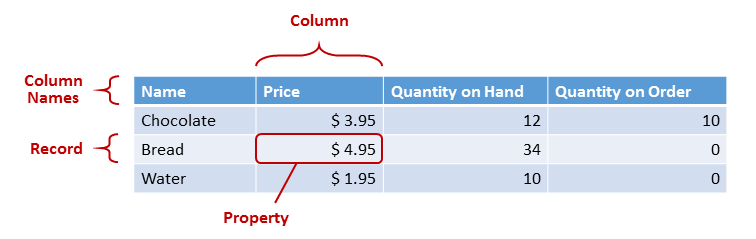
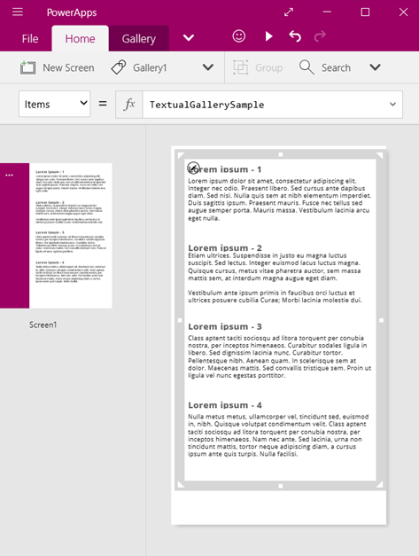
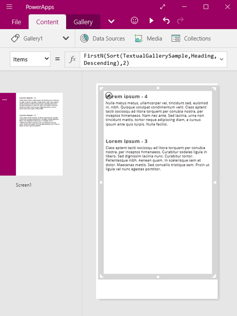
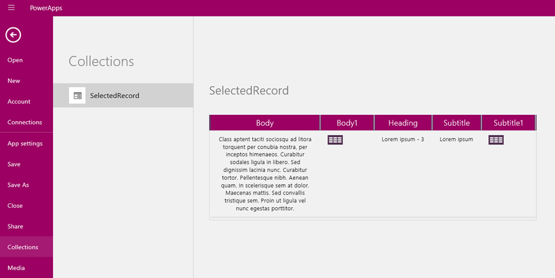

<properties
	pageTitle="Understanding tables | Microsoft PowerApps"
	description="Reference information for working with tables, columns, and records"
	services=""
	suite="powerapps"
	documentationCenter="na"
	authors="gregli-msft"
	manager="dwrede"
	editor=""
	tags=""/>

<tags
   ms.service="powerapps"
   ms.devlang="na"
   ms.topic="article"
   ms.tgt_pltfrm="na"
   ms.workload="na"
   ms.date="11/10/2015"
   ms.author="gregli"/>

# Understanding tables and records in PowerApps #
You can create an app that accesses information in Microsoft Excel, SharePoint, SQL Server, and several other sources that store data in records and tables. To work most effectively with this kind of data, review the concepts that underlie these structures.

- A record contains one or more categories of information about a person, a place, or a thing. For example, a record might contain the name, the email address, and the phone number of a single customer. Other tools refer to a record as a "row" or an "item."
- A table holds one or more records that contain the same categories of information. For example, a table might contain the names, the email addresses, and the phone numbers of 50 customers.

In your app, you'll use [formulas](../working-with-formulas.md) to create, update, and manipulate records and tables. You'll probably read and write data to an external [data source](working-with-data-sources.md), which is an extended table. In addition, you might create one or more internal tables, which are called [collections](working-with-data-sources.md#collections).

You can build a variety of formulas that take the name of a table as an argument, just as a formula in Excel takes one or more cell references as arguments. Some formulas in PowerApps return a table that reflects the other arguments that you specify. For example, you might create a formula:

- to update a record in a table by specifying that table as one of multiple arguments for the [**Patch**](function-patch.md) function
- to add, remove, and rename columns in a table by specifying that table as an argument for the [**AddColumns, DropColumns, or RenameColumns**](function-table-shaping.md) function. None of those functions modifies the original table. Instead, the function returns another table based on the other arguments that you specify.

## Elements of a table ##

### Records ###

Each record contains at least one category of information for a person, a place, or a thing. The example above shows a record for each product (**Chocolate**, **Bread**, and **Water**) and a column for each category of information (**Price**, **Quantity on Hand**, and **Quantity on Order**).

In a formula, you can refer to a record by itself, outside of a table's context, by using curly braces. For example, this record **{ Name: "Strawberries", Price: 7.99 }** isn't associated with a table.

### Properties ###

A property is an individual piece of information in a record. You can visualize this sort of property as a value in a column for a particular record.

Just as with a control, you refer to a property of a record by using the **.** [operator](operators.md) on the record.  For example, **First(Products).Name** returns the **Name** property for the first record in the **Products** table.

A property can contain another record or table, as the example for the [**GroupBy**](function-groupby.md) function shows. You can nest as many levels of records and tables as you want.

### Columns ###

A column refers to the same property for one or more records in a table. In the above example, each product has a price property, and that price is in the same column for all products.  The above table has four columns, shown vertically:

- **Name**
- **Price**
- **Quantity on Hand**
- **Quantity on Order**

The column's name reflects the properties in that column.

All values within a column are of the same data type. In the above example, the "Quantity on Hand" column always contains a number and can't contain a string, such as "12 units," for one record.  The value of any property may also be *blank*.  

You may have referred to columns as "fields" in other tools.

### Table ###

A table comprises one or more records, each with multiple properties that have consistent names across the records.

Any table that's stored in a data source or a collection has a name, which you use to refer to the table and pass it to functions that take tables as arguments.  Tables can also be the result of a function or a formula.

As in the following example, you can express a table in a formula by using the **[Table](function-table.md)** function with a set of records, which you express in curly braces:

**Table( { Value: "Strawberry" }, { Value: "Vanilla" } )**

You can also define a single-column table with square brackets.  An equivalent way to write the above:

**[ "Strawberry", "Vanilla" ]**

## Table formulas ##

In Excel and PowerApps, you use formulas to manipulate numbers and strings of text in similar ways:

- In Excel, type a value, such as **42**, in cell **A1**, and then type a formula, such as **A1+2**, in another cell to show the value of **44**.
- In PowerApps, set the **Default** property of **Slider1** to **42**, and set the **Text** property of a label to **Slider1.Value + 2** to show the value of **44**.

In both cases, the calculated value changes automatically if you change the values of the arguments (for example, the number in cell **A1** or the value of **Slider1**).

Similarly, you can use formulas to access and manipulate data in tables and records. You can use names of tables as arguments in some formulas, such as **Min(Catalog, Price)** to show the lowest value in the **Price** column of the **Catalog** table. Other formulas provide whole tables as return values, such as **RenameColumns(Catalog, "Price", "Cost")**, which returns all the records from the **Catalog** table but changes the name of the **Price** column to **Cost**.

Just as with numbers, formulas that involve tables and records are automatically recalculated as the underlying table or record changes. If the cost of a product in the **Catalog** table is lowered below the previous minimum, the return value of the **[Min](function-aggregates.md)** formula will automatically change to match it.

Let's walk through some simple examples.

1. Insert a textual gallery on a screen, with its **Items** property set to the name of a table.

	By default, the gallery shows placeholder text from a table named **TextualGallerySample**. The **Items** property of the gallery is automatically set to that table.

	**Note:** Some controls have been rearranged and enlarged for illustration purposes.

	

2. Instead of setting the **Items** property to the name of a table, set it to a formula that includes the name of the table as an argument, as in this example: 
**Sort(TextualGallerySample, Heading, Descending)**

	This formula incorporates the [**Sort**](function-sort.md) function, which takes the name of a table as its first argument and the name of a column in that table as its second argument. The function also supports an optional third argument, which stipulates that you want to sort the data in descending order.

	

3. Set the **Items** property to a formula that takes the formula from the previous step as an argument and returns a table, as in this example: 
**FirstN(Sort(TextualGallerySample, Heading, Descending), 2)**

	In this formula, you use the **[FirstN](function-first-last.md)** function to show a particular number of records in a table. You use the **[Sort](function-sort.md)** formula as the first argument of the **[FirstN](function-first-last.md)** function and a number (in this case, **2**) as the second argument, which specifies how many records to show.

	The entire formula returns a table that contains the first two records of the **TextualGallerySample** table, sorted by the **Heading** column in descending order.

	

### Table functions and control properties ###

Many functions in PowerApps take the name of a table as an argument, create a second table that contains the same data, manipulate the new table based the other arguments, and then return the result. These functions don't modify the original table, even if it's a data source.

- **[Sort](function-sort.md)**, **[Filter](function-filter-lookup.md)** - Sorts and filters records.
- **[FirstN](function-first-last.md)**, **[LastN](function-first-last.md)** - Returns the first N or last N records of the table.
- **[Abs](function-numericals.md)**, **[Sqrt](function-numericals.md)**, **[Round](function-round.md)**, **[RoundUp](function-round.md)**, **[RoundDown](function-round.md)** - Arithmetic operations on each record of a single-column table, resulting in a single-column table of results.
- **[Left](function-left-mid-right.md)**, **[Mid](function-left-mid-right.md)**, **[Right](function-left-mid-right.md)**, **[Replace](function-replace-substitute.md)**, **[Substitute](function-replace-substitute.md)**, **[Trim](function-trim.md)**, **[Lower](function-lower-upper-proper.md)**, **[Upper](function-lower-upper-proper.md)**, **[Proper](function-lower-upper-proper.md)** - String manipulations on each record of a single-column table, resulting in a single-column table of strings.
- **[Len](function-len.md)** - For a column of strings, returns a single-column table that contains the length of each string.
- **[Concatenate](function-concatenate.md)** - Concatenates multiple columns of strings, resulting in a single-column table of strings.
- **[AddColumns](function-table-shaping.md)**, **[DropColumns](function-table-shaping.md)**, **[RenameColumns](function-table-shaping.md)**, **[ShowColumns](function-table-shaping.md)** - Column manipulation of the table, resulting in a new table with different columns.
- **[Distinct](function-distinct.md)** - Removes duplicates records.
- **[Shuffle](function-shuffle.md)** - Shuffles records into a random order.
- **[HashTags](function-hashtags.md)** - Searches for hashtags in a string.
- **[Errors](function-errors.md)** - Provides error information when you work with a data source.

You can run a function on a table that contains multiple columns, even if the function requires a single column as an argument. To extract a single column from a multi-column table, use the **[ShowColumns](function-table-shaping.md)** function as an argument for the function that you want to use, as in this example: **Lower( ShowColumns( Products, "Name" ) )**

This formula creates a single-column table that contains all the data from the **Name** column of the **Products** table but converts any uppercase letters to lowercase letters. If you specify a table as an argument for the **[AddColumns](function-table-shaping.md)**, **[RenameColumns](function-table-shaping.md)**, or **[DropColumns](function-table-shaping.md)** function, you can completely reshape that table however you want.

If you specify a data source as an argument for one of these functions, it will modify the records of that data source and, in general, return the data source's new value as a table.

- **[Collect](function-clear-collect-clearcollect.md)**, **[Clear](function-clear-collect-clearcollect.md)**, **[ClearCollect](function-clear-collect-clearcollect.md)** - Create, clear, and add to a collection.
- **[Update](function-update-updateif.md)**, **[UpdateIf](function-update-updateif.md)** - Updates records that match one or more criteria that you specify.
- **[Remove](function-remove-removeif.md)**, **[RemoveIf](function-remove-removeif.md)** - Deletes records that match one or more criteria that you specify.

The following controls have properties that are tables:

- **Items** - Applies to galleries and listboxes.  Table to display in the gallery.
- **SelectedItems** - Applies to listboxes.  Table of the items the user has selected.

## Record formulas ##

You can also build a formula that calculates data for an individual record, takes an individual record as an argument, and provides an individual record as a return value. Returning to our gallery example above, let's use the **Gallery1.Selected** property to display information from whatever record the user selects in that gallery.

1. Add a button, and set its **OnSelect** property to this formula: 
	**Collect( SelectedRecord, Gallery1.Selected )**
1. If the button isn't selected, click it to select it, and then click it again to run the formula.
1. In the **File** menu, click **Collections.**

This formula returns a record that includes not only the data from the record that's currently selected in the gallery but also each control in that gallery. For example, the record contains both a **Body** column, which matches the **Body** column in the original table, and a **Body1** column, which represents the label that shows the data from that column. Click the table icon in the **Body1** column to drill into that data.

Now that we have the selected record, we can extract individual properties from it with the **.** operator.

1. Press Esc to return to the default workspace, and then add a label below the gallery.
1. Set the **Text** property of the label to this formula: 
	**Gallery.Selected.Heading**

We've taken the **Selected** property, which is a record, and extracted the **Heading** property from it.  

You can also use a record as a general-purpose container for related named values.

- If you build a formula around the **[UpdateContext](function-updatecontext.md)** and **[Navigate](function-navigate.md)** functions, use a record to gather the [context variables](working-with-variables.md#create-a-context-variable) that you want to update.
- Use the **Updates** property on a gallery to gather the changes that will be made to a data source.
- Use the **[Patch](function-patch.md)** function to update a data source but also to merge records.

In these cases, the record was never a part of a table.

### Record functions and control properties ###

Functions that return records:

- **[FirstN](function-first-last.md)**, **[LastN](function-first-last.md)** - Returns the first or last record or records of the table.
- **[Lookup](function-filter-lookup.md)** - Returns the first record from a table that matches one or more criteria.
- **[Patch](function-patch.md)** - Updates a data source or merges records.
- **[Defaults](function-defaults.md)** - Returns the default values for a data source.

Properties that return records:

- **Selected** - Applies to galleries and listboxes. Returns the currently selected record.
- **Updates** - Applies to galleries.  Pulls together all the changes that a user makes in a data-entry form.
- **[Update](function-update-updateif.md)** Applies to input controls such as input-text controls and sliders. Sets up individual properties for the gallery to pull together.

## Inline syntax ##

### Records ###

You express records by using curly braces that contain named property values.  For example, you can express the first record in the table at the start of this topic by using this formula:

**{ Name: "Chocolate", Price: 3.95, 'Quantity on Hand': 12, 'Quantity on Order': 10 }**

You can also embed formulas within other formulas, as this example shows:

**{ Name: First(Products).Name, Price: First(Products).Price * 1.095 }**

You can nest records by nesting curly braces, as this example shows:

**{ 'Quantity': { 'OnHand': ThisItem.QuantOnHand, 'OnOrder': ThisItem.QuantOnOrder } }**

Enclose each column name that contains a special character, such as a space or a colon, in single quotes.  To use a single quote within a column name, double it.

Note that the value in the **Price** column doesn't include a currency symbol, such as a dollar sign. That formatting will be applied when the value is displayed.  

### Tables ###

You can create a table by using the **[Table](function-table.md)** function and a set of records. You can express the table at the start of this topic by using this formula:

**Table( { Name: "Chocolate", Price: 3.95, 'Quantity on Hand': 12, 'Quantity on Order': 10 }, &nbsp;&nbsp;&nbsp;&nbsp;&nbsp;&nbsp;&nbsp;&nbsp;&nbsp;&nbsp;&nbsp;&nbsp;{ Name: "Bread", Price: 4.95, 'Quantity on Hand': 34, 'Quantity on Order': 0 }, &nbsp;&nbsp;&nbsp;&nbsp;&nbsp;&nbsp;&nbsp;&nbsp;&nbsp;&nbsp;&nbsp;&nbsp;{ Name: "Water", Price: 4.95, 'Quantity on Hand': 10, 'Quantity on Order': 0 } )**

You can also nest tables:

**Table( { Name: "Chocolate", &nbsp;&nbsp;&nbsp;&nbsp;&nbsp;&nbsp;&nbsp;&nbsp;&nbsp;&nbsp;&nbsp;&nbsp;'Quantity History': Table( { Quarter: "Q1", OnHand: 10, OnOrder: 10 }, &nbsp;&nbsp;&nbsp;&nbsp;&nbsp;&nbsp;&nbsp;&nbsp;&nbsp;&nbsp;&nbsp;&nbsp;&nbsp;&nbsp;&nbsp;&nbsp;&nbsp;&nbsp;&nbsp;&nbsp;&nbsp;&nbsp;&nbsp;&nbsp;{ Quarter: "Q2", OnHand: 18, OnOrder: 0 } ) } )**

You can create single-column tables by specifying values in square brackets. The resulting table has a single column, named "Value".

For example, **[ 1, 2, 3, 4 ]** is equivalent to **Table( { Value: 1 }, { Value: 2 }, { Value: 3 }, { Value: 4 } )** and returns this table:

| Value |
|:-----:|
|   1   |
|   2   |
|   3   |
|   4   |
