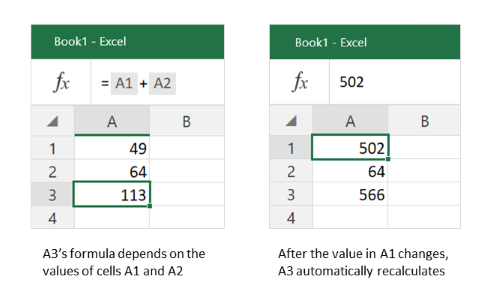
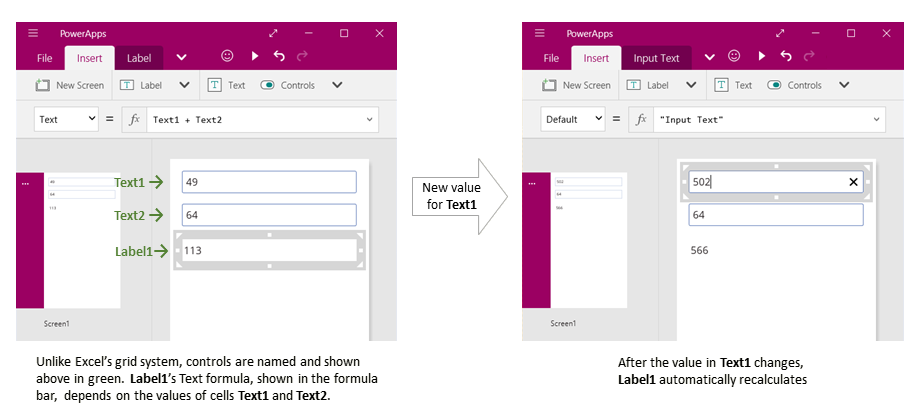
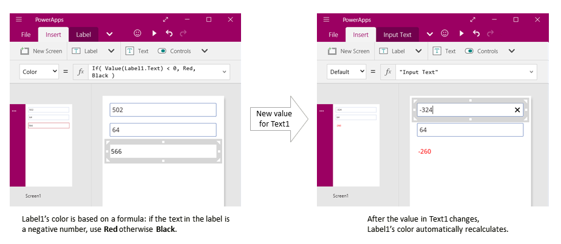
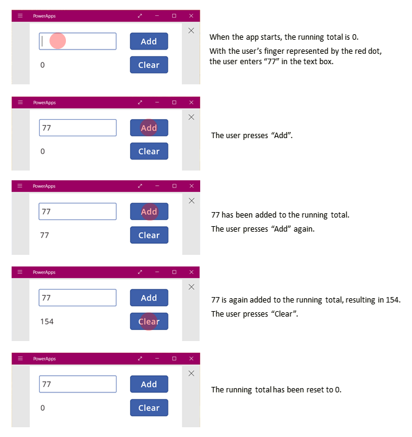
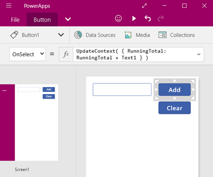
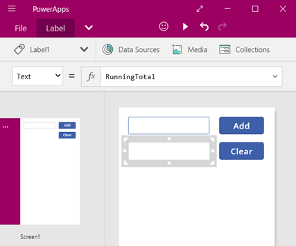
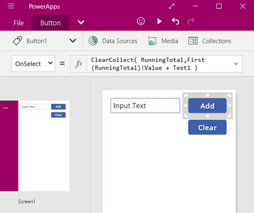
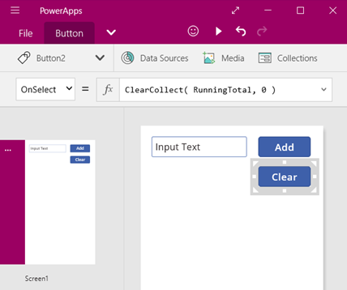
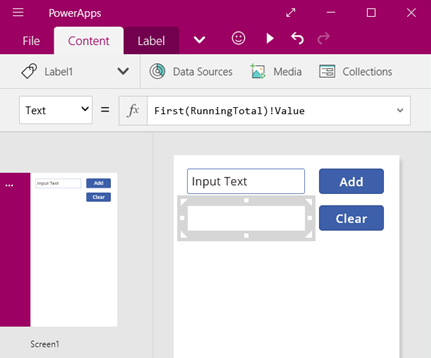
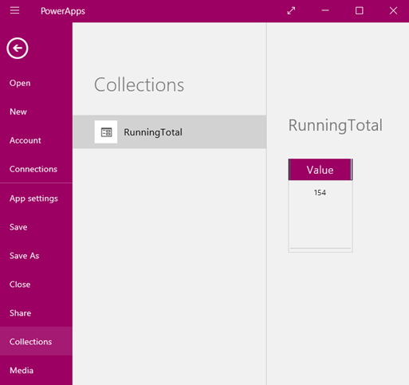

<properties
	pageTitle="PowerApps: Working with State"
	description="Reference information for working with state, context variables, and collections"
	services="powerapps"
	documentationCenter="na"
	authors="gregli-msft"
	manager="dwrede"
	editor=""
	tags=""/>

<tags
   ms.service="powerapps"
   ms.devlang="na"
   ms.topic="article"
   ms.tgt_pltfrm="na"
   ms.workload="na"
   ms.date="11/10/2015"
   ms.author="gregli"/>

# Working with Variables in PowerApps #

You may be asking: **Where are the variables?**

If you are asking this question, you have probably used another programming tool in the past, such as Visual Basic or JavaScript.  PowerApps is a little different, requiring a different approach.

When reaching for a variable, instead ask yourself: **What would I do in Excel?**  

PowerApps is modeled after Excel and what works there often works in PowerApps too.  The equivalent of Excel's cells are PowerApps controls.  In other tools you may have explicitly performed a calculation and placed the result in a variable.  In PowerApps you create a formula that connects controls together and is automatically recalculated, just like Excel.  With this approach, your app will be easier to create, understand, and maintain. 

There is a place for variables in PowerApps.  PowerApps extends Excel's model with [behavior formulas]() that execute when, for example, a button is clicked.  Within a behavior formula, it is often helpful to set a variable to be used in other formulas.

## Working without variables ##

### Excel ###

Let's review how Excel works.  A cell can contain a value, such as a number or a string, or it can contain a formula that is based on and floats with the values of other cells.  After a user enters a new value into a cell, Excel dutifully recalculates all the dependent formulas based on the new value.  This behavior is automatic and does not require any programming.

Excel does not have variables.  While a cell's value can float with a formula, there is no way to remember the result of a formula and store it in a cell or anywhere else.  If you change a cell's value, the entire spreadsheet may change, and any previously calculated values will be lost.  An Excel user can copy and paste cells, but that is under the user's manual control and is not possible with formulas.

### PowerApps ###

PowerApps behave very much like Excel.  Instead of cells, controls are used that can be named and placed wherever the author desires on to screens.  The equivalent PowerApp of the Excel example consists of:

- Input Text control, named **Text1**.  This takes the place of cell **A1**.  This allows the user to type in the first value to add.
- Another Input Text control, named **Text2**.  This takes the place of cell **A2**.  This allows the user to type in the second value to add.
- Label control, named **Label1**.  This takes the place of cell **A3**.  This will show the result of the addition.
- Formula for the **Text** property of **Label1** which performs the addition: **Label1!Text = Text1 + Text2**.

This app has the same recalculation behavior as Excel.  Change the value of either of the text boxes, and the label's formula is recalculated automatically and the new result displayed.

PowerApps can use formulas for more than the primary value of a control.  For example formulas can be used to control formatting.  In this next example, a formula for the Color property of the label will automatically show negative values in Red.  The **If** function should look very familiar from Excel.

Formulas can be used for a wide spectrum of situations:

- By using your device's GPS, a map control can display you current location with a formula that uses **Location!Lattitude** and **Location!Longtitude**.  As you move, the map will automatically track your location.
- [Data sources](working-with-data-sources) can be updated by other users.  For example, items in a SharePoint list might be edited by others on your team.  When you refresh a data source, any dependent formulas are automatically recalculated and displayed on the updated data.  Furthering the example, a gallery's **Items** property may be set to the formula **Filter( SharePointList )** which will automatically display the newly filtered set of records.

### Benefits ###

Using formulas to build apps has many advantages:

- If you know Excel, you know PowerApps.  The model and formula language are the same.
- If you have used other programming tools, think about how much code would be required toto accomplish the above examples.  In Visual Basic, event handlers would need to be written for the change event on each text box.  The code to perform the calculation in each of these is redundant and could get out of sync, or a common subroutine would need to be written.  In PowerApps, all of that was accomplished with a single one line formula.
- If you want to understand where **Label1**'s text is coming from, you know exactly where to look: the **Text** property's formula.  There is no other way to impact the text of this control.  In a traditional programming tool, any event handler or subroutine could change the value of the label, from anywhere in the program.  This can make it hard to track down when and where a variable was changed.
- If a user changes a slider control, and then changes their mind, they can change the slider back to its original value.  And it is if nothing had ever changed - the app shows the same control values as it did before.  There are no ramifications for experimenting and asking "what if," just as there are none in Excel.  

In general, if your desired behavior can be accomplished through a formula, you will be better off. Let PowerApps' formula engine work for you.  
   
## The need for variables ##

Let's change our simpler adder app to act like an old fashioned adding machine, with a running total.  Pressing an "Add" button will add a number to the running total, and pressing a "Clear" button will reset the running total to zero.

Our adding machine uses something that does not exist in Excel: a button.  In this app, the running total cannot be calculated as its value is dependent on a series of actions taken by the user.  Instead our running total must be recorded and updated manually.  It is what most programming tools call a *variable*.    

You will sometimes need a variable for your app to behave the way you want.  But it comes with some caveats:

- We must manually update the running total.  No longer will automatic recalculation do this for us.   
- The running total can no longer be calculated based on the values of other controls, it is dependent on how many times the button was pressed and the value that was then in the text box for each button press.  Did the user enter 77 and press "Add" twice, or did they use 24 and 130 for each of the additions?  You can't tell the difference after the total has reached 154.
- Changes to the total can come from different paths.  In this app both the "Add" and "Clear" buttons can update the total.  Which one is causing an undesired behavior in your app?

In general, the use of variables should be minimized.  But sometimes only a variable can enable the app experience you want.

## Context Variables ##

To create our adding machine, we require a variable to hold the running total.  The simplest variables in PowerApps are *context variables*.  

How context variables work:

- Context variables are created and set with the **[UpdateContext](funciton-updatecontext.md)** function.  If a context variable does not already exist when first updated, it will be created with a default value of *blank*.
- Context variables are created and updated with [records](working-with-tables.md).  In other programming tools, it is common to use "=" for assignment as in "x = 1".  For context variables, use **{ x: 1 }** instead.  When using a context variable, the name of the variable can be used directly.  
- Context variables can also be set when a screen is displayed, with the **[Navigate](function-nagivate.md)** function.  If you think of a screen as a kind of procedure or subroutine, this is similar to parameter passing in other programming tools.
- Except for **Navigate**, context variables are limited to the context of a single screen (which is where they get their name).  They cannot be used or set outside of this context.
- Context variables can hold any value including strings, numbers, records, and tables.
- When an app ends, all of its context variables are lost.   

Let's build our adding machine using context variables:

1. We start with an Input Text control, named **Text1**, and two button controls, named **Button1** and **Button2**.

	**Button1** will add to the running total with its **OnSelect** behavior.  **RunningTotal** will be updated with **RunningTotal + Text1** by using the **UpdateContext** function in the formula **UpdateContext( { RunningTotal: RunningTotal + Text1 } )**.    

	The first time **Button1** is pressed and **UpdateContext** is called, **RunningTotal** will not exist and will be created with a default value of *blank*.  In the addition, it will be treated as a zero.

	

2. **Button2** will clear the running total by setting it to 0.  Again, **UpdateContext** is used with the formula **UpdateCOntext( { RunningTotal: 0 } )**.

	

3. Finally, we insert a Label control, named **Label1**.  This will display the value of **RunningTotal**.  This formula will automatically be recalculated and show the user the value of **RunningTotal** as it changes based on the buttons being pressed.

	

4. Preview the app and we have our adding machine as described above.

## Collections ##

There are times when being limited to the context of a screen is inadequate.  You may need a variable that can be used and set from any screen.  In these cases, use a [collection](working-with-data-sources#collections) to hold a global variable.

How collections works:

- Collections are create and set with the **ClearCollect** function.  The **Collect** function can also be used, but it will effectively another variable rather than replacing the old one.  
- Collections are a data source, and therefore a table.  To access a single value stored in a collection, you will need to use the **First** function and extract one property from the resulting record.  If a single value was used with **ClearCollect** this will be the **Value** property.  For example, **First( VariableName )!Value**. 
- Collections can be accessed from any formula in the app, on any screen.
- When an app ends, all of its collections are emptied. 

Let's recreate our adding machine using a collection:

1. We again start with an Input Text control, named **Text1**, and two button controls, named **Button1** and **Button2**.

	**Button1** will add to the running total with its **OnSelect** behavior.  **RunningTotal** will be updated with **RunningTotal + Text1** by using the **ClearCollect** function in the formula **ClearCollect( RunningTotal, First( RunningTotal )!Value + Text1 )**.  By using **ClearCollect** in this form, with a single value, a record will be created in the collection with a single **Value** property.

	The first time **Button1** is pressed and **ClearCollect** is called, **RunningTotal** will be empty.  In the addition, **First** will return *blank* and will be treated as a zero.

	

2. **Button2** will clear the running total by setting it to 0.  Again, **ClearCollect** is used with the formula **ClearCollect( RunningTotal, 0 )**.

	

3. Finally, we insert a Label control, named **Label1**.  This will display the value of **RunningTotal**.  This formula will automatically be recalculated and show the user the value of **RunningTotal** as it changes based on the buttons being pressed.  We need to extract the **Value** property of the first record of the **RunningTotal** collection.

	

4. Preview the app and we have our adding machine as described above.

5. Return to editing your app, and select the **File** menu.  On the left hand side, select **Collections** and you will see your collection's value.

	

    

