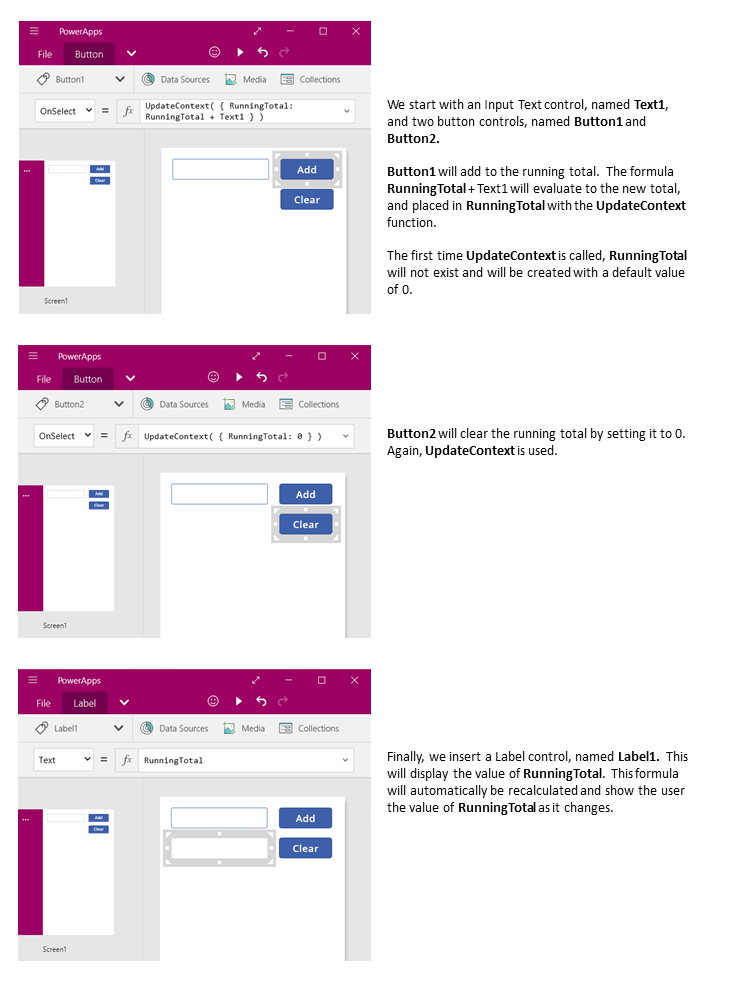

<properties
	pageTitle="PowerApps: Working with State"
	description="Reference information for working with state, context variables, and collections"
	services="powerapps"
	documentationCenter="na"
	authors="gregli-msft"
	manager="dwrede"
	editor=""
	tags=""/>

<tags
   ms.service="powerapps"
   ms.devlang="na"
   ms.topic="article"
   ms.tgt_pltfrm="na"
   ms.workload="na"
   ms.date="11/10/2015"
   ms.author="gregli"/>

# Working with Variables in PowerApps #

You may be asking: **where are the variables?**

If you are asking this question, you have probably used another programming tool in the past, such as VBA (Visual Basic for Applications) or JavaScript.  PowerApps is a little different, requiring a different approach.

When reaching for a variable, instead ask yourself: **what would I do in Excel?**  

PowerApps is modeled after Excel and what works well there often works in PowerApps too.  The equivalent of Excel's cells are PowerApps controls.  In other tools you may have explicitly performed a calculation and placed the result in a variable.  In PowerApps you create a formula that connects controls together and is automatically recalculated, just like Excel.  With this approach, your app will be easier to create, understand, and maintain. 

There is a place for variables in PowerApps.  PowerApps extends Excel's model with [behavior formulas]() that execute when, for example, a button is clicked.  Within a behavior formula, it is often helpful to set a variable to be used in other formulas.

## Working without variables ##

### Excel ###

Let's review how Excel works.  A cell can contain a value, such as a number or a string, or it can contain a formula that is based on and floats with the values of other cells.  After a user enters a new value into a cell, Excel dutifully recalculates all the dependent formulas based on the new value.  This behavior is automatic and does not require any programming.

Excel does not have variables.  While a cell's value can float with a formula, there is no way to remember the result of a formula and store it in a cell (or anywhere else).  If you change a cell's value, the entire spreadsheet may change, and any previously calculated values will be lost.  Of course an Excel user can copy and paste cells, but that is under the user's manual control and is not possible with formulas.

### PowerApps ###

PowerApps behave very much like Excel.  Instead of cells, controls are used that can be named and placed wherever the author desires on to screens.  The equivalent PowerApp of the Excel example consists of:
- Input Text control, named **Text1**.  This takes the place of cell **A1**.  This allows the user to type in the first value to add.
- Another Input Text control, named **Text2**.  This takes the place of cell **A2**.  This allows the user to type in the second value to add.
- Label control, named **Label1**.  This takes the place of cell **A3**.  This will show the result of the addition.
- Formula for the **Text** property of **Label1** which performs the addition: **Label1!Text = Text1 + Text2**.

This app has the same recalculation behavior as Excel.  Change the value of either of the text boxes, and the label's formula is recalculated automatically and the new result displayed.

PowerApps can use formulas for more than the primary value of a control.  For example formulas can be used to control formatting.  In this next example, a formula for the Color property of the label will automatically show negative values in Red.  The **If** function should look very familiar from Excel.

Formulas can be used for a wide spectrum of situations:
- By using your device's GPS, a map control can display you current location with a formula that uses **Location!Lattitude** and **Location!Longtitude**.  As you move, the map will automatically track your location.
- [Data sources](working-with-data-sources) can be updated by other users.  For example, items in a SharePoint list might be edited by others on your team.  When you refresh a data source, any dependent formulas are automatically recalculated and displayed on the updated data.  Furthering the example, a gallery's **Items** property may be set to the formula **Filter( SharePointList )** which will automatically display the newly filtered set of records.

### Benefits ###

Using formulas to build apps has many advantages:
- If you know Excel, you know PowerApps.  The model and formula language are the same.
- If you have used other programming tools, think about how much code would need to be written to accomplish the above examples.  In Visual Basic, event handlers would need to be written for the change event on each text box.  The code to perform the calculation in each of these is redundant and could get out of sync, or a common subroutine would need to be written.  In PowerApps, all of that was accomplished with a single formula.
- If you want to understand where **Label1**'s text is coming from, you know exactly where to look: the **Text** property's formula.  There is no other way to impact the text of this control.  In a traditional programming tool, any event handler or subroutine could change the value of the label, from anywhere in the program.  This can sometimes make it very hard to track down why something changed and from where.

In general, if your desired behavior can be accomplished through a formula, you will be better off. Let the recalc engine work for you.  
   
## The need for variables ##

Let's change our simpler adder app to act like an old fashioned adding machine, with a running total.  Pressing an "Add" button will add a number to the running total, and pressing a "Clear" button will reset the running total to zero.

Our adding machine uses something that Excel lacks: a button.  Button presses manually change the running total.  The running total is not calculated, nor can it be, its value is dependent on a series of actions taken by the user.  It must be remembered.  The running total is what most programming tools call a *variable*.    

You will sometimes need to use a variable for the app to behave the way you want.  But it comes with downsides:
- We must manually update the running total with each button click.  No longer will automatic recalculation do this for us.   
- The running total can no longer be calculated based on the values of other controls, it is dependent on how many times the button was pressed and the value that was then in the text box for each button press.  Did the user enter 77 and press "Add" twice, or did they use 24 and 130 for each of the additions?  You can't tell the difference after the total has reached 154.
- Changes to the total can come from different paths.  In this app both the "Add" and "Clear" buttons can update the total.  Which one is causing an undesired behavior in your app?

In general, the use of variables should be minimized.  But sometimes they are unavoidable.

## Context Variables ##

To create our adding machine, we require a variable to hold the running total.  The most simplest variables in PowerApps are called *context variables*.  The word "context" since they are limited to the context of a particular screen.

How context variables work:
- Context variables are used like any other named value in a formula.
- Context variables are created and set with the **[UpdateContext](funciton-updatecontext.md)** function.  If a context variable does not already exist when first updated, it will be created.
- Context variables can also be set when a screen is displayed, with the **[Navigate](function-nagivate.md)** function.  If you think of a screen as a kind of procedure or subroutine, this is similar to parameter passing in other programming tools.
- Context variables are limited to the context of the current screen.   They cannot be used or set outside of this context (except with **Navigate** as described above).

Let's build our adding machine using context variables:

TODO: Lifetime.

## Collections ##

There are times when being limited to the context of a screen is inadequate.  You may need a variable that can be used and set from any formula, on any screen.  In these cases, you can use a [collection](working-with-data-sources#collections) to hold a global variable.

How collections works:
- Collections are a data source, and therefore a table.  To access a single variable stored in a collection, you will need to use the **First** or **Lookup** functions.
- Collections are created and set with the **Collect** and **ClearCollect** functions.
- Collections can be accessed from anywhere in the app.

Let's move our adding machine app's running total from a context variable to a collection:

TODO: Uses table record notation
  
TODO: Lifetime.

## TODO ##

| State | Recalcs? | Settable?  |
|-------|----------|------------|
| User input | No | Yes, user input to the app |
| Control Properties | Yes | No, driven by an author written formula and user input |
| Ambient | Yes | No, defined by the system |
| Data Sources | Yes | Yes, by external users and with Patch and other data functions |
| Context Variables | No | Yes, with UpdateContext and Navigate |
| Collections | No | Yes, with Collect |

    

