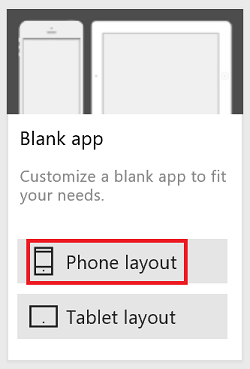
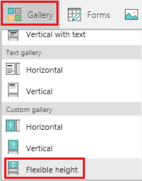
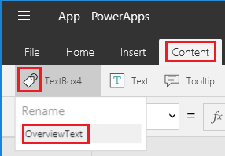
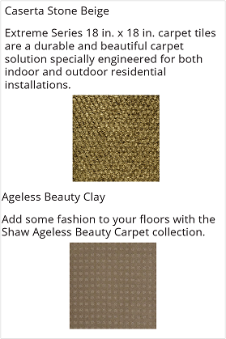

<properties
    pageTitle="Show items of different heights in a gallery | Microsoft PowerApps"
    description="Add and configure a flexible height gallery to automatically fit the amount of content in each item of the gallery"
    services=""
    suite="powerapps"
    documentationCenter="na"
    authors="fikaradz"
    manager="anneta"
    editor=""
    tags=""/>
<tags
    ms.service="powerapps"
    ms.devlang="na"
    ms.topic="article"
    ms.tgt_pltfrm="na"
    ms.workload="na"
    ms.date="04/01/2017"
    ms.author="fikaradz"/>

# Show items of different heights in a PowerApps gallery #
If different items in your data set contain different amounts of data in the same field, you can completely show items that contain more data without adding empty space after items that contain less data. Add and configure a **Flexible height** gallery control to size each item appropriately for its contents, and position each control so that it automatically appears just under the control above it.

**Suggested reading**

If you've never added controls to a gallery, follow the steps in [Show a list of items](add-gallery.md) before you proceed in this topic.

## Add data to a blank app ##
1. Download [this Excel file](https://az787822.vo.msecnd.net/documentation/get-started-from-data/FlooringEstimates.xlsx).

	

	This file contains information about flooring products, including a name, a category, an overview, and a link to an image for each product. The descriptions vary in length, so you'll use a **Flexible height** gallery control to ensure that its layout reflects the content of each item.

1. Upload the Excel file to a cloud account such as OneDrive, Dropbox, or Google Drive.

1. In PowerApps Studio, click or tap **New** on the **File** menu.

1. On the **Blank app** tile, click or tap **Phone layout**.

	

1. Add a connection to the **FlooringEstimates** table in the Excel file.

	For more information, see [Add a connection](add-data-connection.md).

## Add data to a gallery ##
1. On the **Insert** tab, click or tap **Gallery**, scroll to the bottom of the menu, and then click or tap **Flexible height**.

	

1. Resize the gallery to take up the entire screen.

1. Set the gallery's **[Items](controls/properties-core.md)** property to **FlooringEstimates**.

## Show the product names ##
1. In the upper-left corner of the gallery, click or tap the pencil icon to select the gallery template.

	

1. With the gallery template selected, add a **[Text box](controls/control-text-box.md)** control to it.

1. Set the **Text** property of the **Text box** control to this expression: 
**ThisItem.Name**

	

## Show the product overviews ##
1. With the gallery template selected, add another **Text box** control, and move it below the first **Text box** control.  

1. Set the **Text** property of the second **Text box** control to this expression:  **ThisItem.Overview**

1. With the second **Text box** control selected, click or tap the name-tag icon on the **Content** tab, and rename the control to **OverviewText**.

    

1. Set the **AutoHeight** property of the **OverviewText** box to **true**.

	This step ensures that the box will grow or shrink to fit its contents.

  	

## Show the product images ##
1. Resize the template so that it's twice as tall as it was.

	You can add controls to the template more easily as you build the app, and this change won't affect how the app looks when it runs.

1. With the gallery template selected, add an **[Image](controls/control-image.md)** control, and move it below the **OverviewText** box.

1. Ensure that the **Image** property of the **Image** control is set to this expression: 
	**ThisItem.Image**

	The overview text for each item varies in length, so the height of each item's **OverviewText** box will differ. We'll want the image to be directly below the overview text, so we'll need to dynamically calculate its location within the template.

1. Set the **[Y](controls/properties-core.md)** property of the image based on the position and the size of the **OverviewText** control, as in this formula:
 **OverviewText.Y + OverviewText.Height + 5**

	This formula ensures that the image is 5 pixels below the **OverviewText** box. Because we're using a **Flexible height** gallery control, each item will get the right amount of vertical space needed to display its content.

	

Apply the same concept if you want to add more controls: set each control's **Y** property based on the **Y** and **Height** properties of the control above it.

## Next steps ##
Learn more about how to work with a [gallery](working-with-forms.md) control and [formulas](working-with-formulas.md).
