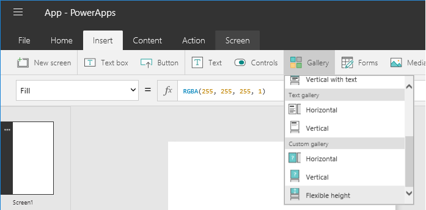
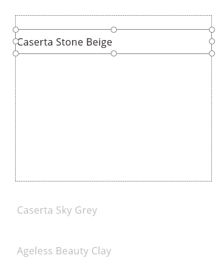
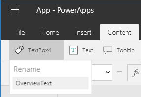
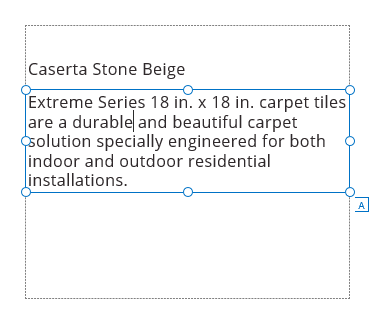
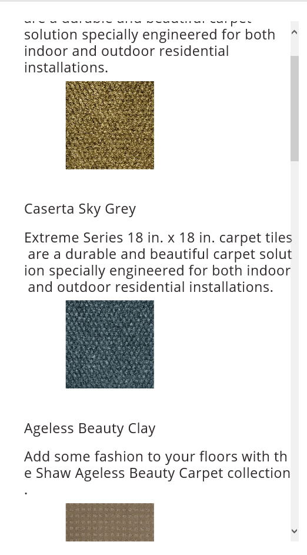

<properties
    pageTitle="Dynamic sizing and positioning | Microsoft PowerApps"
    description="Use a variable height gallery to show a dynamic list of items in your app"
    services=""
    suite="powerapps"
    documentationCenter="na"
    authors="fikaradz"
    manager="anneta"
    editor=""
    tags=""/>
<tags
    ms.service="powerapps"
    ms.devlang="na"
    ms.topic="article"
    ms.tgt_pltfrm="na"
    ms.workload="na"
    ms.date="10/16/2016"
    ms.author="fikaradz"/>

# Dynamic layout of lists  #

This tutorial shows you how to create a list of items where each item has a different amount of content inside (a.k.a. variable height list).  We will use a **Flexible height gallery** control which automatically adjusts the height of each item based on the size of its content.

This tutorial builds on concepts shown in [Show a list of items](add-gallery.md) tutorial and uses the same data set and connection.

**Prerequisites**

- Learn how to [show a simple list of items](add-gallery.md) in PowerApps.

## Add a Flexible height gallery ##

1. Create a new blank app for phone layout.

2. [Add a connection](add-data-connection.md) to the **FlooringEstimates** table from [this Excel file](https://az787822.vo.msecnd.net/documentation/get-started-from-data/FlooringEstimates.xlsx).  For more details on adding the data source, see the **[Show a list of items](add-gallery.md)** tutorial.

3. Add a **Flexible height gallery** from the **Insert** tab, **Gallery** sub-menu.
	

  Resize the gallery to take up the entire screen.

4. Assign the data source to the gallery by setting the **[Items](controls/properties-core.md)** property of the gallery to **FlooringEstimates**.

5.  Click on the pencil icon in the top-right corner to edit the gallery template. Once you populate the gallery with content, you can also click on the first gallery item to select the template.

  Note that you can resize the template item to make it easier to add controls to it. This will only affect the design experience, at runtime the height of each item will be set dynamically based on its content.

## Add controls to the gallery ##

1. With the gallery template selected, add a **[Text box](controls/control-text-box.md)** control to the gallery template.  

	

  The **Text** property of the Text box should be set to **ThisItem.Name**.

2. With the gallery template selected, add another **Text box** control and position it below the first text box.  

  The **Text** property of this Text box should be set to **ThisItem.Overview**.

3. With the second Text box selected, click on the name tag icon in the content tab and rename the control to **OverviewText**.

    

3. Set the **AutoHeight** property of the OverviewText Text box  to **true**.  This will ensure that the text box will be automatically sized to fit the entire text assigned to it.

  	

4. With the gallery template selected, add an **[Image](controls/control-image.md)** control and position it below the first text box.

The **Image** property of the Image should be set to **ThisItem.'Image [image]'**

## Dynamically position the image ##

Because the overview text for each item can vary in length, the height of each item's text box will be different.  Since we'll want to position the image to be directly below the overview text, we'll need to dynamically calculate its placement within the template.

To do so, we'll need to set the **[Y](controls/properties-core.md)** property of the Image to be based on the position and size of the OverviewText control.

1. Set the **[Y](controls/properties-core.md)** property of the gallery to this formula:

        OverviewText.Y + OverviewText.Height + 5

This ensures that the image's vertical placement is 5 pixels below the end of the OverviewText text box.  And since we are using a flexible height gallery, each item will get the right amount of vertical space needed to display its content.

If additional items need to be placed into the gallery template, the same concept can be applied.  Each item's Y property should be calculated based on the Y and height of the item that preceeds it.

## Next steps ##
- Learn more about working with a [gallery](working-with-forms.md) and [formulas](working-with-formulas.md).
