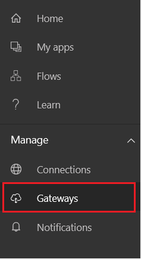
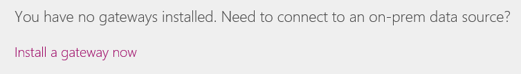

<properties
    pageTitle="Manage an on-premises data gateway | Microsoft PowerApps"
    description="Manage an on-premises data gateway and its connections"
    services=""
    suite="powerapps"
    documentationCenter="na"
    authors="archnair"
    manager="erikre"
    editor=""
    tags=""/>
<tags
    ms.service="powerapps"
    ms.devlang="na"
    ms.topic="article"
    ms.tgt_pltfrm="na"
    ms.workload="na"
    ms.date="06/28/2016"
    ms.author="archanan"/>

# Manage an on-premises data gateway #
Install an on-premises data gateway to transfer data quickly and securely between PowerApps and a data source that's not in the cloud, such as an on-premises SQL Server database or an on-premises SharePoint site. View all gateways for which you have administrative permissions, and manage permissions and connections for those gateways.

**Prerequisites**

- the user name and password that you used to [sign up](signup-for-powerapps.md) for PowerApps
- administrative permissions on a gateway.

	You have these permissions by default for each gateway that you install, and an administrator of another gateway can grant you these permissions for that gateway.

## Install a gateway ##
1. In the left navigation bar of [powerapps.com](https://web.powerapps.com), click or tap **Manage**, and then click or tap **Gateways**.

	

1. If you don't have administrative permissions for a gateway, click or tap [Install a gateway now](http://go.microsoft.com/fwlink/?LinkID=820931) (or **New Gateway** in the upper-right corner), and then follow the prompts in the wizard that appears.

	

	For details about how to install a gateway, see [Understand gateways](gateway-reference.md).

## View and manage permissions for a gateway ##
1. In the left navigation bar of [powerapps.com](https://web.powerapps.com), click or tap **Manage**, click or tap **Gateways**, and then click or tap a gateway.

1. Add a user to a gateway by clicking or tapping **Users**, specifying a user or group, and then specifying a permission level:

	- **Admin**: Administrator who has full control, including adding users and setting permissions for the gateway.
	- **Can use**: User who can create a connection on the gateway.
	- **Can use + share**: User who can create a connection on the gateway and automatically share it when sharing an app.

## View and manage connections on a gateway ##
1. In the left navigation bar of [powerapps.com](https://web.powerapps.com), click or tap **Manage**, click or tap **Gateways**, and then click or tap a gateway.

1. Click or tap **Connections**, and then click or tap a connection to view or modify its details.

1. To share a connection, click or tap **Share**, and then add or remove users.

	**Note**: You can share only some types of connections, such as SQL Server. For more information, see [Share app resources](share-app-resources.md).

For more information about how to manage a connection, see [Manage connections](./add-manage-connections.md).

## Next steps ##
- Create an app that connects to an on-premises data source, such as [SQL Server](connection-azure-sqldatabase.md) or [SharePoint](connection-sharepoint-online.md).
- [Share an app](share-app.md) that connects to an on-premises data source.
