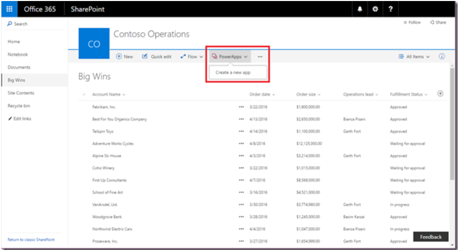
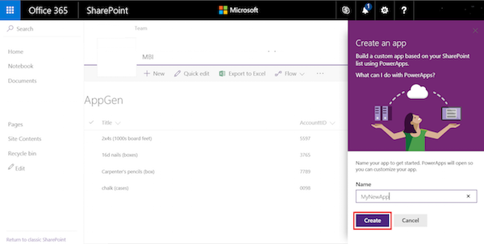
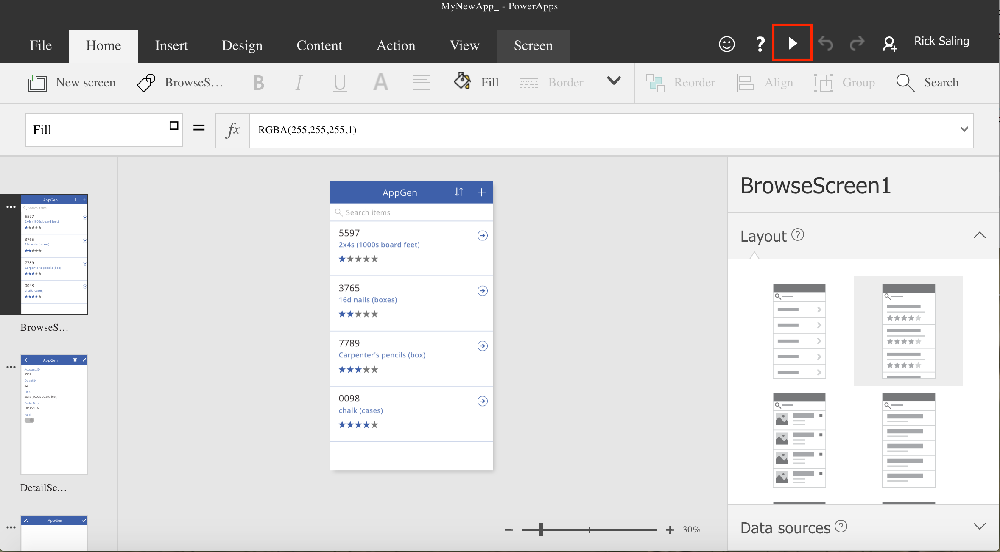
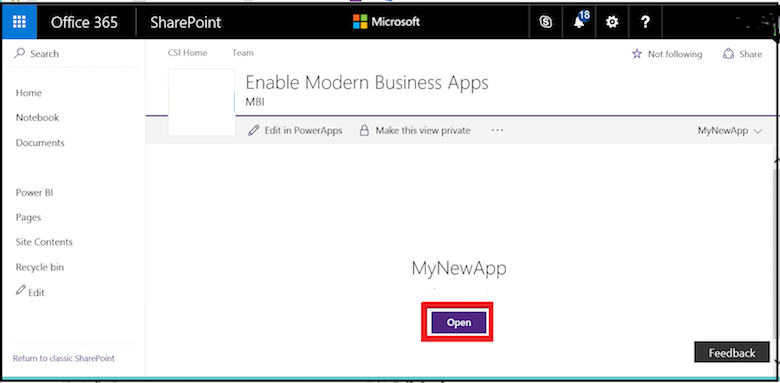
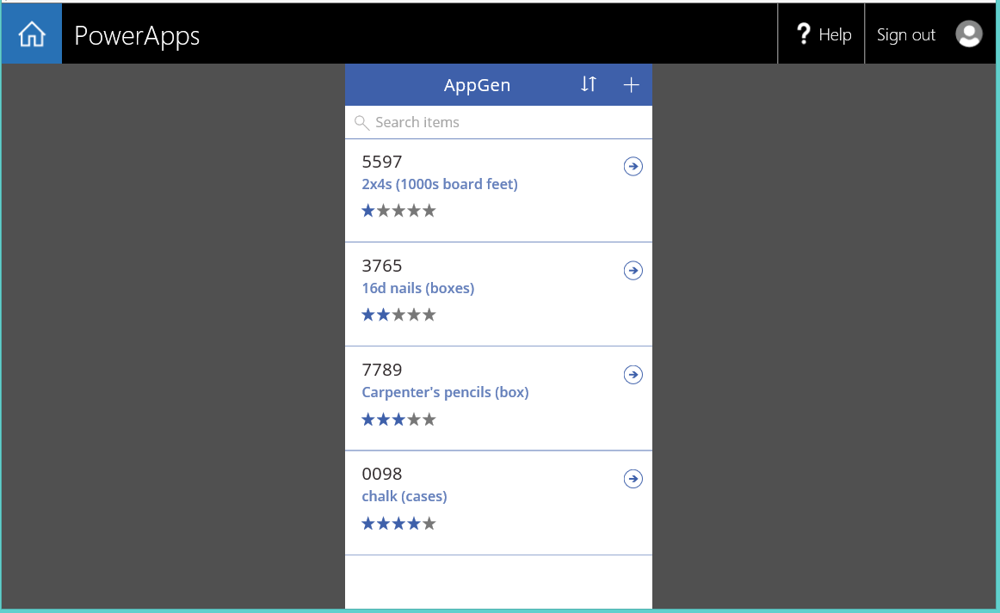

<properties
   pageTitle="Generate an app from within a SharePoint list | Microsoft PowerApps"
   description="Generate a three-screen app to manage items from within a SharePoint list, whether the site is on-premises or in the cloud."
   services=""
   suite="powerapps"
   documentationCenter="na"
   authors="RickSaling"
   manager="anneta"
   editor=""
   tags=""/>

<tags
   ms.service="powerapps"
   ms.devlang="na"
   ms.topic="article"
   ms.tgt_pltfrm="na"
   ms.workload="na"
   ms.date="01/21/2016"
   ms.author="ricksal"/>

# Generate an app from within SharePoint using PowerApps #

[AZURE.VIDEO nb:cid:UUID:639d7eaf-bae5-447c-a34b-ec539a01a15c]

In PowerApps, automatically generate an app in which users can manage items in a custom SharePoint Online list. The app will have three screens so that users can:

- view all items in the list
- view all fields for a specific item
- create or edit an item

If you create an app from the command bar of a custom list in SharePoint Online, the app appears as a view of that list. Users can run also the app on a Windows, iOS, or Android device, in addition to a web browser.

**Important**: PowerApps doesn't support all types of SharePoint data. For more information, see [Known issues](connection-sharepoint-online.md#known-issues).

## Generate an app ##
1. Open a custom list in SharePoint Online, click or tap **PowerApps** on the command bar, and then click or tap **Create an app**.

    

3. In the panel that appears, type a name for your app, and then click or tap **Create**.

    

	A new tab appears in your web browser and shows the app that you generated automatically based on your list.

      

6. Click or tap the browser tab for your SharePoint list, and then click or tap **Open**.

	**Note**: You might need to refresh the browser window (for example, by pressing F5) before the app will open.

    

	The app opens in a separate browser tab.

  

## Manage the app ##

- If you click or tap **Edit in PowerApps**, the app opens in a separate browser tab so that you can update the app in PowerApps Studio for the web.

- If you click or tap **Make this view public**, other people in your organization will be able to see it. By default, only you can see views that you create. If you want other people to be able to edit this app, you need to [share it with them](share-app.md) and grant **Contributor** permissions.

- If you click or tap **Remove this view**, you'll remove the view from SharePoint, but the app will still be in PowerApps unless you [delete it](delete-app.md).

## Next steps ##
- [Add and update items in the list](open-app-embedded-in-sharepoint.md).
- To customize the browse screen (which appears by default), see [Customize a layout](customize-layout-sharepoint.md).
- To customize the details or edit screens, see [Customize a form](customize-forms-sharepoint.md).
- If you want to delete this kind of app, remove the view from SharePoint, and [delete the app](delete-app.md) itself from PowerApps.
