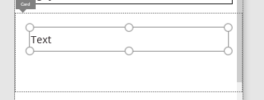
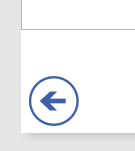

<properties	pageTitle="Create an app from scratch | Microsoft PowerApps"
	description="Create an app from the ground up by configuring each UI element and behavior to manage the everyday data that fuels your business."
	services=""
	suite="powerapps"
	documentationCenter="na"
	authors="sarafankit"
	manager="erikre"
	editor=""
	tags=""/>

<tags
   ms.service="powerapps"
   ms.devlang="na"
   ms.topic="get-started-article"
   ms.tgt_pltfrm="na"
   ms.workload="na"
   ms.date="04/17/2016"
   ms.author="ankitsar"/>

# Create an app from scratch #
Create your own app from scratch using any one of a variety of data sources. Specify the appearance and behavior of each UI element so that you can optimize the result for your exact goals and workflow.

By following this tutorial, you'll create an app that shows users a set of data on the first screen:


On another screen, users can create, update, or delete a record in that set of data:


**Prerequisites**

- [Sign up](signup-for-powerapps.md) for PowerApps, [install](http://aka.ms/powerappsinstall) it, open it, and then sign in by providing the same credentials that you used to sign up.
- Learn how to [configure a control](add-configure-controls.md) in PowerApps.
- A cloud-storage account, such as Box, Dropbox, Google Drive, OneDrive, or OneDrive for Business.

To follow this tutorial exactly, add this data to an Excel file named **eventsignup.xlsx**, [format the data as a table](https://support.office.com/en-us/article/Format-an-Excel-table-6789619F-C889-495C-99C2-2F971C0E2370) named **Schedule**, and then save the file to your cloud-storage account.

|Start Day|Start Time|Volunteer 1|Volunteer 2|
|---|---|---|---|
|Saturday|10am-noon|Vasquez|Kumashiro|
|Saturday|noon-2pm|Ice|Singhal|
|Saturday|2pm-4-pm|Myk|Mueller|
|Sunday|10am-noon|Li|Adams|
|Sunday|10am-noon|Singh|Morgan|
|Sunday|10am-noon|Batye|Nguyen|

## Create a blank app, and connect to data ##
1. In PowerApps, select **New** (near the left edge of the screen).

	

1. Under **Create an app**, select **Phone layout** on the **Blank app** tile.

	

1. Near the lower-right corner, select **Options**.

	

	The **Screen** tab of the **Options** pane appears.

1. Under **Data Sources**, select **Add data source**, and then perform one of these steps:

	- If you already have a connection to your cloud-storage account, select it.
	- If you don't have a connection to your cloud-storage account, select **Add Connection**, select your account type, select **Connect**, and then provide your credentials.

1. Under **Choose an Excel file**, browse to **eventsignup.xlsx**, and then select it.

	

1. Under **Choose a table**, select **Schedule**, and then select **Connect**.  

	

	The **Screen** tab shows which data sources you've added to your app. This tutorial requires only one source, but you can add sources later.

	

## Show the data ##
1. On the **Home** tab, select **Layouts**.

1. Select the option that contains a heading, a subtitle, and a body element.

	

	Several controls are added to the screen, including a **Search items** box and a [**Gallery**](control-gallery.md) control just under it.

1. Set the **Items** property of the gallery to this formula:

	**Sort(If(IsBlank(TextSearchBox1.Text), Schedule, Filter(Schedule, TextSearchBox1.Text in Text('Volunteer 1'))),'Volunteer 1', If(SortDescending1, SortOrder.Descending, SortOrder.Ascending))**

	This gallery shows the data from the **Schedule** table.

	- If the user types text in the search box, the gallery shows only those records in which that text appears in the **Volunteer 1** field.
	- If the user selects the sort button, the records are sorted based on the **Volunteer 1** column. If the user selects the sort button again, the sort order is reversed.

	

1. Set the **Text** property of the [**Text box**](control-text-box.md) control at the top of the screen to show **View records**.

	

## Create the ChangeScreen ##
1. [Rename the default screen](add-screen-context-variables.md#add-a-screen-and-navigation) to **ViewScreen**, add another screen, and name it **ChangeScreen**.

	

	

1. On the **ChangeScreen**, add a text box that identifies the screen

	

1. On the **Insert Tab**. select **Forms**, [add an **Edit Form**](./add-form.md), and adjust it on the screen to cover most of the screen

	

1.  On the **Formula Bar**, set the **DataSource** property of the form to:

	```
	Schedule
	```

1. Set the **Item** property of the form to:

	```
	BrowseGallery1.Selected
	```

1. On the **Options** pane, select show field option for all the fields

	

1. On the **Screen**, select **Add a custom card**, and then **Insert** a **Text box** in it.

	

	

1. On the **Formula Bar**, set the **Text** property of the **Text box** to show the errors from the Form:

	```
	Form1.Error
	```

1. Set the **AutoHeight** property of the **Text box** to *true*.

1. Add a **Back arrow** shape (Insert>Shapes) to the screen, and set its **OnSelect** property to [navigate](./functions/function-navigate.md") to the first screen:

	```
	Navigate(ViewScreen,ScreenTransition.None)
	```

	

1. Add a button to the bottom of the form, and set its **Text** property to **Save**

	  

1.  On the **Formula Bar**, set the **OnSelect** property of the **Save** button to [submit the form](./functions/function-form.md") to save the changes to the record and navigate back to **ViewScreen**:

	```
	SubmitForm(Form1);If(Form1.ErrorType=ErrorKind.None,Navigate(ViewScreen,ScreenTransition.None))
	```

1. Add a **Remove** button to bottom of the screen, and set its **OnSelect** property to [remove](./functions/function-remove-removeif.md) the record and navigate back to **ViewScreen**:

	```
	Remove(Schedule,BrowseGallery1.Selected);If(IsEmpty(Errors(Schedule)),Navigate(ViewScreen,ScreenTransition.None))
	```

	Your final **ChangeScreen** should look like:

	

## Set navigation from ViewScreen ##

1. On the **ViewScreen**, set the **OnSelect** property of the **Next arrow** of the first record in gallery to navigate to **ChangeScreen**

	```
	Navigate(ChangeScreen,ScreenTransition.None)
	```

	

1. On the **ViewScreen**, set the **OnSelect** property of the **Add** to create a record and navigate to **ChangeScreen**

	```
	NewForm(Form1);Navigate(ChangeScreen,ScreenTransition.None)
	```

	

## Run the app ##
As you customize the app, you can test your changes by running the app in **Preview** mode.

1. In the list of thumbnails, select **BrowseScreen1**, and then open preview by selecting the **Preview** icon near the upper-right corner (or by pressing **F5**).

	

1. On **ViewScreen1**, select the Nexy arrow for a record to show details about that record.

1. On **ChangeScreen**, change the information in one or more fields, and then save your changes using the Save button, or remove the record using the Remove button.

## Next steps ##
- Press Ctrl-S to save your app so that you can run it from other devices.
- [Share the app](share-app.md) so that other people can run it.
- Learn more about [formulas](./working-with-formulas.md) in PowerApps
