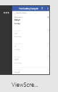

<properties	pageTitle="Create an app from scratch | Microsoft PowerApps"
	description="Create an app from the ground up by configuring each UI element and behavior to manage the everyday data that fuels your business."
	services=""
	suite="powerapps"
	documentationCenter="na"
	authors="sarafankit"
	manager="erikre"
	editor=""
	tags=""/>

<tags
   ms.service="powerapps"
   ms.devlang="na"
   ms.topic="get-started-article"
   ms.tgt_pltfrm="na"
   ms.workload="na"
   ms.date="07/30/2016"
   ms.author="ankitsar"/>

# Create an app from scratch #
Create your own app from scratch using any one of a variety of data sources, adding more sources later if you want. Specify the appearance and behavior of each UI element so that you can optimize the result for your exact goals and workflow.

**Note**: This topic was written for PowerApps Studio, but the steps are similar if you [open PowerApps in a browser](create-app-browser.md).

By following this tutorial, you'll create an app that contains two screens. On one screen, users can browse through a set of records:

On the other screen, users can create a record, update one or more fields in a record, or delete an entire record:

**Prerequisites**
- Add data to an Excel workbook, and [format that data as a table](https://support.office.com/en-us/article/Create-an-Excel-table-in-a-worksheet-E81AA349-B006-4F8A-9806-5AF9DF0AC664).

	To follow this tutorial exactly:

	- Name the Excel file **eventsignup.xls**.
	- Copy this data, and paste it into the file.

		|Start Day|Start Time|Volunteer 1|Volunteer 2|
	|---|---|---|---|
	|Saturday|10am-noon|Vasquez|Kumashiro|
	|Saturday|noon-2pm|Ice|Singhal|
	|Saturday|2pm-4-pm|Myk|Mueller|
	|Sunday|10am-noon|Li|Adams|
	|Sunday|10am-noon|Singh|Morgan|
	|Sunday|10am-noon|Batye|Nguyen|
	- Format the data as a table named **Schedule**.

- Upload your Excel file to a cloud-storage account such as Box, Dropbox, Google Drive, OneDrive, or OneDrive for Business.
- If you're new to PowerApps:
	- Learn how to [add a control and set its properties](add-configure-controls.md), which determine how the control appears and behaves.
	- Learn how to [add and rename a screen](add-screen-context-variables.md).

## Create a blank app, and connect to data ##
1. In PowerApps, click or tap **New** on the **File menu** (near the left edge of the screen).

	

1. Under **Create an app**, click or tap **Phone layout** on the **Blank app** tile.

	

1. In the right-hand pane, click or tap **Add data source**, and then perform either of these steps:

	- If you already have a connection to your cloud-storage account, click or tap it.
	- If you don't have a connection to your cloud-storage account, click or tap **Add Connection**, click or tap your account type, click or tap **Connect**, and then (if prompted) provide your credentials.

1. Under **Choose an Excel file**, browse to **eventsignup.xlsx**, and then click or tap it.

	

1. Under **Choose a table**, select the **Schedule** check box, and then click or tap **Connect**.

	

	The **Data sources** tab of the right-hand pane shows which data sources you've added to your app.

	

	This tutorial requires only one data source, but you can add more data sources later.

## Show the data ##
1. In the right-hand pane, click or tap the **Layout** tab, and then click or tap the option that contains a heading, a subtitle, and a body element.

	

	Several controls are added to the screen, including a search box and a **[Gallery](controls/control-gallery.md)** control. The gallery covers the entire screen under the search box.

1. Set the **[Items](controls/properties-core.md)** property of the gallery to this formula:

	**Sort(If(IsBlank(TextSearchBox1.Text), Schedule, Filter(Schedule, TextSearchBox1.Text in Text('Volunteer 1'))),'Volunteer 1', If(SortDescending1, SortOrder.Descending, SortOrder.Ascending))**

	This gallery shows the data from the **Schedule** table. In addition:

	- A search box can filter the gallery based on text that the user types. If a user types at least one letter in the search box, the gallery shows only those records for which the **Volunteer 1** field contains the text that the user typed.
	- The sort button can sort the records based on data in the **Volunteer 1** column. If a user clicks or taps that button, the sort order toggles between ascending and descending.

	

	More information about the **[Sort](functions/function-sort.md)**, **[Filter](functions/function-filter-lookup.md)**, and [other functions](formula-reference.md)

1. Set the **[Text](controls/properties-core.md)** property of the **[Text box](controls/control-text-box.md)** control at the top of the screen to show **View Records**.

	

## Create the ChangeScreen ##
1. Rename the default screen from **Screen1** to **ViewScreen**.

	

1. Add a screen, and rename it **ChangeScreen**.

	

1. Add a **[Text box](controls/control-text-box.md)** control that identifies the screen.

	

1. Add an **[Edit form](add-form.md)** control, and move and resize it to cover most of the screen.

	

	The form is named **Form1** by default unless you already added and removed a form. In that case, rename the form **Form1**.

1.  Set the **[DataSource](controls/control-form-detail.md)** property of the form to **Schedule** and its **[Item](controls/control-form-detail.md)** property to this formula:
 **BrowseGallery1.Selected**

1. In the right-hand pane, click or tap the eye icon for each field to show it.

	

1. Near the bottom of the form, click or tap **Add a custom card**, and then add a **[Text box](control-text-box.md)** control to it.

	

1. Set the **[AutoHeight](controls/control-text-box.md)** property of the **[Text box](control-text-box.md)** control **true** and its **[Text](controls/properties-core.md)** property to this formula:
 **Form1.Error**

	The text box will show any errors from the form.

1. Add a **Back arrow** to the lower-left corner of the screen, and set the arrow's **[OnSelect](controls/properties-core.md)** property to this formula:

	**ResetForm(Form1);Navigate(ViewScreen,ScreenTransition.None)**

 	When the user clicks or taps the arrow, the **[Navigate](functions/function-navigate.md)** function shows the **ViewScreen**.

1. Add a **[Button](controls/control-button.md)** control under the form, and set the button's **[Text](controls/properties-core.md)** property to **"Save"**.

	  

1.  Set the **[OnSelect](controls/properties-core.md)** property of the button to this formula::

	**SubmitForm(Form1); If(Form1.ErrorKind = ErrorKind.None, Navigate(ViewScreen, ScreenTransition.None))**

	When the user clicks or taps the button, the **[SubmitForm](functions/function-form.md)** function saves any changes to the data source, and the **ViewScreen** reappears.  

1.  At the bottom of the screen, add another button, set its **[Text](controls/properties-core.md)** property to **"Remove"**, and set its **[OnSelect](controls/properties-core.md)** property to this formula:

	**Remove(Schedule,BrowseGallery1.Selected); If(IsEmpty(Errors(Schedule)),Navigate(ViewScreen,ScreenTransition.None))**

	When the user clicks or taps this button, the **[Remove](functions/function-remove-removeif.md)** function removes the record, and the **ViewScreen** reappears.

1.  Set the **[Visible](controls/properties-core.md)** property of the **Remove** button to this formula:
 **Form1.Mode=FormMode.Edit**

	This step hides the **Remove** button when the user is creating a record.

	The **ChangeScreen** matches this example:

	

## Set navigation from ViewScreen
1. In the **ViewScreen**, click or tap the **Next arrow** for the first record in the gallery.

	

1. Set the **[OnSelect](controls/properties-core.md)** property of that arrow to this formula:

	**Navigate(ChangeScreen,ScreenTransition.None)**

1. In the upper-right corner, select the icon to add a record.

	

1. Set the **[OnSelect](controls/properties-core.md)** property of the selected icon to this formula:

	**NewForm(Form1);Navigate(ChangeScreen,ScreenTransition.None)**`

 	When the user clicks or taps this icon, **ChangeScreen** appears with each field empty, so that the user can create a record more easily.

## Run the app ##
As you customize the app, test your changes by running the app in Preview mode, as the steps in this section describe.

1. In the left navigation bar, click or tap the top thumbnail to select **ViewScreen**.

	

1. Open Preview mode by pressing F5 (or clicking or tapping the **Preview** icon near the upper-right corner).

	

1. Click or tap the Next arrow for a record to show details about that record.

1. On **ChangeScreen**, change the information in one or more fields and then save your changes by clicking or tapping **Save**, or remove the record by clicking or tapping **Remove**.

1. Close Preview mode by pressing Esc (or by clicking or tapping the close icon under the title bar).

	

## Next steps ##
- Press Ctrl-S to save your app in the cloud so that you can run it from other devices.
- [Share the app](share-app.md) so that other people can run it.
- Learn more about [galleries](add-gallery.md), [forms](add-form.md), and [formulas](working-with-formulas.md).
