<properties	pageTitle="Create an app from scratch | Microsoft PowerApps"
	description="Create an app from the ground up by configuring each UI element and behavior to manage the everyday data that fuels your business."
	services=""
	suite="powerapps"
	documentationCenter="na"
	authors="sarafankit"
	manager="erikre"
	editor=""
	tags=""/>

<tags
   ms.service="powerapps"
   ms.devlang="na"
   ms.topic="get-started-article"
   ms.tgt_pltfrm="na"
   ms.workload="na"
   ms.date="05/18/2016"
   ms.author="ankitsar"/>

# Create an app from scratch #
Create your own app from scratch using any one of a variety of data sources, adding more sources later if you want. Specify the appearance and behavior of each UI element so that you can optimize the result for your exact goals and workflow.

By following this tutorial, you'll create an app that shows users a set of data on the first screen:

On another screen, users can create, update, or delete a record in that set of data:

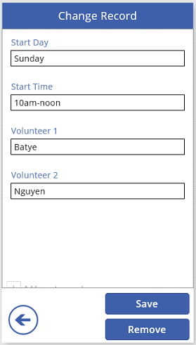

## Prerequisites

- Learn how to [add a control](add-configure-controls.md) and set the properties that determine its appearance, behavior, and other characteristics.
- A cloud-storage account, such as Box, Dropbox, Google Drive, OneDrive, or OneDrive for Business.
- Format your data as a table in Excel.

For more information, see [Common issues and resolutions](common-issues-and-resolutions.md).

## Format Excel data as a table

To follow this tutorial exactly:

1. Create an Excel file named **eventsignup.xlsx**.
1. Add the following data to the Excel file:  

	|Start Day|Start Time|Volunteer 1|Volunteer 2|
|---|---|---|---|
|Saturday|10am-noon|Vasquez|Kumashiro|
|Saturday|noon-2pm|Ice|Singhal|
|Saturday|2pm-4-pm|Myk|Mueller|
|Sunday|10am-noon|Li|Adams|
|Sunday|10am-noon|Singh|Morgan|
|Sunday|10am-noon|Batye|Nguyen|

1. Select any cell, and then select **Format as Table** on the **Home** tab of the ribbon.

1. In the **Format As Table** dialog box, select the **My table has headers** check box, and then select **OK**.

1. Near the left edge of the ribbon, type **Schedule** under **Table Name**, and then save your changes.

	For more information, see [Format Excel data as a table](https://support.office.com/en-us/article/Create-an-Excel-table-in-a-worksheet-E81AA349-B006-4F8A-9806-5AF9DF0AC664).

4. Copy the Excel file to your cloud-storage account.

## Create a blank app, and connect to data
1. In PowerApps, select **New** (near the left edge of the screen).

	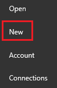

1. Under **Create an app**, select **Phone layout** on the **Blank app** tile.

	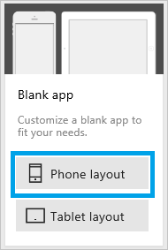

1. In the right-hand pane, click or tap the **Data sources** tab, click or tap **Add data source**, and then perform one of these steps:

	- If you already have a connection to your cloud-storage account, select it.
	- If you don't have a connection to your cloud-storage account, select **Add Connection**, select your account type, select **Connect**, and then provide your credentials.

1. Under **Choose an Excel file**, browse to **eventsignup.xlsx**, and then select it.

	

1. Under **Choose a table**, select **Schedule**, and then select **Connect**.  

	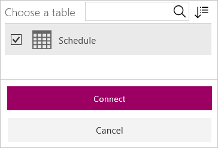

	The **Screen** tab shows which data sources you've added to your app. This tutorial requires only one data source, but you can add more data sources later.

	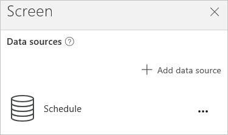

## Show the data
1. On the **Home** tab, select **Layouts**.

1. Select the option that contains a heading, a subtitle, and a body element.

	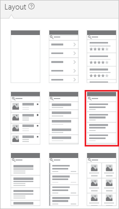

	Several controls are added to the screen, including a search box and a **[Gallery](controls/control-gallery.md)** control. The gallery covers the entire screen under the search box.

1. Set the **[Items](controls/properties-core.md)** property of the gallery to this formula:

	`Sort(If(IsBlank(TextSearchBox1.Text), Schedule, Filter(Schedule, TextSearchBox1.Text in Text('Volunteer 1'))),'Volunteer 1', If(SortDescending1, SortOrder.Descending, SortOrder.Ascending))`

	This gallery shows the data from the **Schedule** table.

	- If the user types text in the search box, the gallery shows only those records for which that text appears in the **Volunteer 1** field.
	- If the user selects the sort button, the records are sorted based on the **Volunteer 1** column. If the user selects the sort button again, the sort order is reversed.

	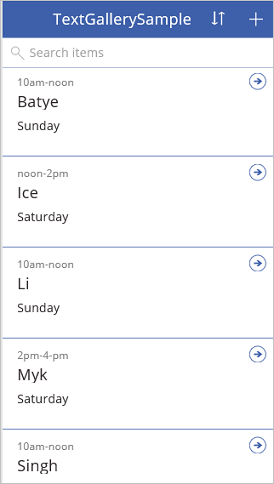

	[More information](formula-reference.md) about the **[Sort](functions/function-sort.md)**, **[Filter](functions/function-filter-lookup.md)**, and other functions

1. Set the **[Text](controls/properties-core.md)** property of the **[Text box](controls/control-text-box.md)** control at the top of the screen to show **View records**.

	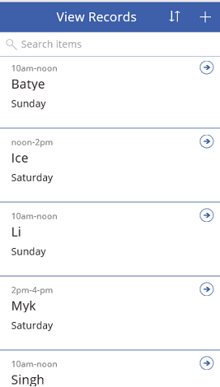

## Create the ChangeScreen
1. [Rename the default screen](add-screen-context-variables.md) to **ViewScreen**, add another screen, and name it **ChangeScreen**.

	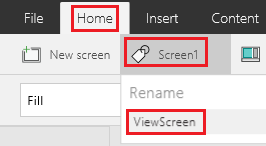

	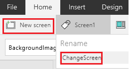

1. On the **ChangeScreen**, add a **[Text box](controls/control-text-box.md)** control that identifies the screen.

	

1. Add an **[Edit form](add-form.md)** control, and move and resize it to cover most of the screen.

	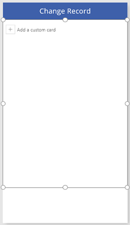

	The form is named **Form1** by default unless you already added and removed a form.

1.  Set the **[DataSource](controls/control-form-detail.md)** property of the form to **Schedule** and its **[Item](controls/control-form-detail.md)** property to this formula:

	`BrowseGallery1.Selected`

1. In the right-hand pane, select the option to show each field.

	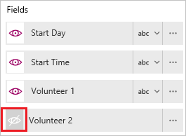

1. Near the bottom of the form, select **Add a custom card**, and then add a text box to it.

	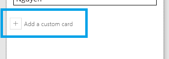

1. Set the **[AutoHeight](controls/control-text-box.md)** property of the text box to **true** and its **[Text](controls/properties-core.md)** property to this formula:

	`Form1.Error`

	The text box will show any errors from the form.

1. Add a **Back arrow**, and set its **[OnSelect](controls/properties-core.md)** property to this formula:

	`ResetForm(Form1);Navigate(ViewScreen,ScreenTransition.None)`

 	When the user selects the arrow, the **[Navigate](functions/function-navigate.md)** function shows the **ViewScreen**.

1. Add a **[Button](controls/control-button.md)** control under the form, and set the button's **[Text](controls/properties-core.md)** property to **Save**.

	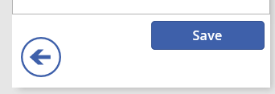  

1.  Set the **[OnSelect](controls/properties-core.md)** property of the button to this formula::

	`SubmitForm(Form1); If(Form1.ErrorKind = ErrorKind.None, Navigate(ViewScreen, ScreenTransition.None))`

	When the user selects the button, the **[SubmitForm](functions/function-form.md)** function saves any changes to the data source, and the **ViewScreen** reappears.  

1.  At the bottom of the screen, add a **Remove** button, and set its **[OnSelect](controls/properties-core.md)** property to this formula:

	`Remove(Schedule,BrowseGallery1.Selected);If(IsEmpty(Errors(Schedule)),Navigate(ViewScreen,ScreenTransition.None))`

	When the user selects this button, the record is [removed](functions/function-remove-removeif.md), and the **ViewScreen** reappears.

1.  Set the **[Visible](controls/properties-core.md)** property of the **Remove** button to this formula:

	`Form1.Mode=FormMode.Edit`

	This hides the **Remove** button when the user is creating a record.

	The **ChangeScreen** matches this example:

	

## Set navigation from ViewScreen
1. In the gallery on the **ViewScreen**, select the **Next arrow** for the first record.

	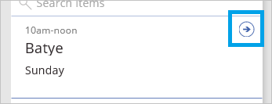

1. Set the **[OnSelect](controls/properties-core.md)** property of that arrow to this formula:

	`Navigate(ChangeScreen,ScreenTransition.None)`

1. In the upper-right corner, select the icon to add a record.

	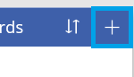

1. Set the **[OnSelect](controls/properties-core.md)** property of the selected icon to this formula:

	`NewForm(Form1);Navigate(ChangeScreen,ScreenTransition.None)`

 	When the user selects this icon, **ChangeScreen** appears with each field empty, so that the user can create a record more easily.

## Run the app
As you customize the app, test your changes by running it in **Preview**. To open Preview, select the **Preview** icon near the upper-right corner (or press F5).

1. In the list of thumbnails, select **ViewScreen**, and then open Preview.

1. Select the Next arrow for a record to show details about that record.

1. On **ChangeScreen**, change the information in one or more fields and then save your changes by selecting **Save**, or remove the record by selecting **Remove**.

## Next steps
- Press Ctrl-S to save your app in the cloud so that you can run it from other devices.
- [Share the app](share-app.md) so that other people can run it.
- Learn more about [galleries](add-gallery.md), [forms](add-form.md), and [formulas](working-with-formulas.md) in PowerApps.
