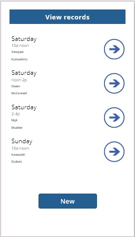
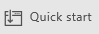
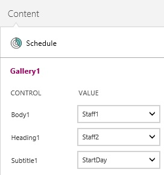
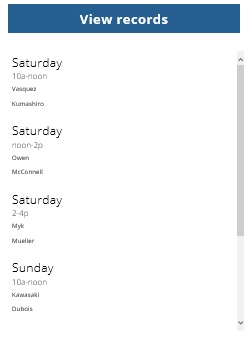

<properties	pageTitle="Create an app from a blank screen in PowerApps"
	description="Create an app automatically based on one of several templates for a variety of scenarios. Explore how the app works by default, and then customize the app to better fit the way you work."
	services="powerapps"
	authors="AFTOwen"/>

<tags
   ms.service="powerapps"
   ms.devlang="na"
   ms.topic="hero-article"
   ms.tgt_pltfrm="na"
   ms.workload="na"
   ms.date="10/20/2015"
   ms.author="anneta"/>

# Create an app from a blank screen #
Create your own app from scratch using any of a variety of data sources. (more intro)

[What is PowerApps?](http://www.kratosapps.com/en-us/tutorials)

By following this tutorial, you'll create an app that shows users a set of data on its first screen:

On another screen, users can create, update, or delete a record in that set of data:

**Prerequisites**

- Sign up for and install [PowerApps]()
- Familiarity with how to [configure a control](get-started-test-drive.md#configure-a-control) in PowerApps
- A set of data in the cloud, such as in DropBox or OneDrive

To follow this tutorial exactly:
1. Create an Excel file, and name it **eventsignup.xlsx**.

1. Add this data, which shows who has signed up to cover which shifts during a fictional event.

	

1. [Format the data as a table](https://support.office.com/en-us/article/Format-an-Excel-table-6789619F-C889-495C-99C2-2F971C0E2370), name the table **Schedule**, and save the file to a Dropbox account.

## Connect to a data source ##
1. In PowerApps, open the **File** menu, and then click **New**.

	

1. Leave the default option to create a phone app.

	

1. Under **Blank App**, click **Get Started**.

	

1. If you haven't created a data connection, follow these steps:
	1. Open the **File** menu, and then click **Connections**.

	
	1. Click **Available Connections**, click the connection that you want to use (such as **Dropbox**), and then click **Connect**.

	

	1. Provide the requested credentials, and then click **Sign in**.

	1. In the upper-left corner, click the Back arrow to return to the default workspace.

	

1. On the bottom edge of the screen, click **Options**.

	

	The **Screen** tab of the **Options** pane appears.
1.  Under **Data Sources**, click **Insert your data**.

	

1. Click the data source that you want to use (such as the Excel file that you created and uploaded for this tutorial), and then click **Connect**.

	

1. Under **Select a table**, click the table that you want to use (such as **Schedule**), and then click **Connect**.

	

	The **Screen** tab shows which data sources you've added to your app. This tutorial requires only one source, but you can add more sources to better fit your needs.

1. In the upper-right corner of the **Options** pane, click the **Close** icon.

## Show the data ##
1. On the **Insert** tab of the ribbon, click **Gallery**, and then click the text gallery in **Portrait** orientation.

	

1. Set the **Items** property of the gallery to **Schedule**.

	

1. In the lower-right corner, click **Quick Start**.

	

1. In the **Quick Start** pane, click **Content**.

	

1. In the **Heading1** list, click **StartDay**.
1. In the **Subtitle1** list, click **StartTime**.

1. (optional) Move the gallery down a bit, resize it to show more items, and add a label that identifies the screen.

	

## Add a label to the gallery ##
1. In the first item of the gallery, click the **Subtitle1** label, and reduce its height by about half.

	

	**Note:** When you change the first item in a gallery, which is the gallery template, you automatically change all other items in the gallery.

1. With the **Subtitle1** label still selected, click the **Insert** tab on the ribbon, and then click **Label**.

	

1. On the **Content** tab of the **Quick Start** pane, click **Staff2** in the **Label1** list.

1. On the **Home** tab of the ribbon, set the **Size** of the label's font to **11**.

	

1. Resize and move the **Staff2** label so it appears under the **Staff1** label.

	

## Add a screen and navigation ##
1. [Rename the default screen](add-screen-context-variables.md#add-a-screen-and-navigation) to **ViewScreen**, add another screen, and name it **ChangeScreen**.

	

1. On the **ViewScreen**, select the gallery template by clicking any item in the gallery except the first one and then clicking the pencil icon in the upper-left corner of the gallery.

	

1. On the **Insert** tab of the ribbon, click **Shapes**, and then click the Next arrow.

	

1. Move the arrow to the right edge of the gallery, and then set its **OnSelect** property to this formula:

	**Navigate(ChangeScreen,ScreenTransition!Fade,{Record:ThisItem})**
1. Click anywhere outside the gallery, click the **Insert** tab on the ribbon, and then click **Button**.

	

1. Move the button under the gallery, and configure the button so that it shows the word **New**.

	

1. Set the **OnSelect** property of the button to this formula:

 	**Navigate(ChangeScreen,ScreenTransition!Fade,{Record:Defaults(Schedule)})**

1. On the **ChangeScreen**, add a label that identifies it, and [add a Back arrow](add-screen-context-variables.md#add-a-screen-and-navigation) that returns to the **ViewScreen** when a user clicks the arrow.

	

## Add controls for adding or editing a record ##

1. On the **ChangeScreen**, add a label, and configure it to show **Day** in bold letters.

	

1. On the **Insert** tab, click **Text**, and then click **Input Text**.

	

1. Move the new input-text control just under the **Day** label.

	
1. Name the input-text control **inputDay**, and set its **Default** property to **Record!Day**.

1. Copy the label and the input-text control, paste them three times, and arrange them in a column that alternates labels with input-text controls.

	

1. Configure the pasted labels to show these strings:
	- **Time**
	- **Staff1**
	- **Staff2**

	

1. Name each input-text control based on the text of the label above it:
	- **inputTime**
	- **inputStaff1**
	- **inputStaff2**

1. Set the **Default** property of each input-text control based on the text of the label above it:
	- **Record!Time**
	- **Record!Staff1**
	- **Record!Staff2**

## Test the controls for adding or editing a record ##
1. On the **ViewScreen**, press F5, and then click the arrow for any item in the gallery.

	The **ChangeScreen** appears and shows the data for the item you specified. You can easily edit one or more fields in the record.

1. Click the Back arrow, and click the **New** button.

	The **ChangeScreen** appears and shows nothing in the input-text controls. You can easily add information in each field of the record.

1. Press Esc to return to the default workspace.

## Add buttons for saving changes and removing a record ##

1. On the **ChangeScreen**, add two buttons, move them to the bottom of the screen, and configure them to show **Save** and **Remove**.

1. Set the **OnSelect** property of the **Save** button to this formula:

	**UpdateContext({Record:Patch(Schedule,Record,{StartDay:inputDay!Text,StartTime:inputTime!Text,Staff1:inputStaff1!Text,Staff2:inputStaff2!Text})});If(IsBlank(Errors(Schedule,Record)),Navigate(ViewScreen,ScreenTransition!Fade))**

1. Set the **OnSelect** property of the **Remove** button to this formula:

	**UpdateContext({NewRecord:Remove(Schedule,Record)});If(IsEmpty(Errors(Schedule,Record)),Navigate(ViewScreen,ScreenTransition!Fade))**

1. Add a label, move it below the last input-text control, and set the label's **Text** property to this formula:

	**First(Filter(Errors(Schedule,Record),IsBlank(Column)))!Message**
