<properties	pageTitle="Create a PowerApp from a blank screen"
	description="Create a PowerApp from the ground up by configuring each UI element and behavior to manage the everyday data that fuels your business."
	services="powerapps"
	documentationCenter="na"
	authors="AFTOwen"
	manager="dwrede"
	editor=""
	tags=""/>

<tags
   ms.service="powerapps"
   ms.devlang="na"
   ms.topic="get-started-article"
   ms.tgt_pltfrm="na"
   ms.workload="na"
   ms.date="11/16/2015"
   ms.author="anneta"/>

# Create a PowerApp from a blank screen #
Create your own PowerApp from scratch using any of a variety of data sources. Specify the appearance and behavior of each UI element so that you can optimize the result for your exact goals and workflow.

[What are PowerApps?]()

By following this tutorial, you'll create a PowerApp that shows users a set of data on the first screen:

On another screen, users can create, update, or delete a record in that set of data:

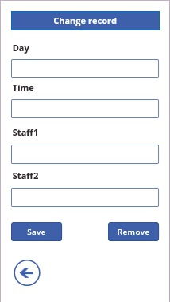

**Prerequisites**

- Install [PowerApps](http://aka.ms/powerappsinstall)
- Learn how to [configure a control](get-started-test-drive.md#configure-a-control) in PowerApps
- A cloud-storage account, such as DropBox, OneDrive, or Google Drive

To follow this tutorial exactly:

1. Create an Excel file, and name it **eventsignup.xlsx**.

1. Add this data, which shows who has signed up to cover which shifts during a fictional event.

	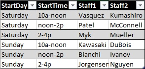

1. [Format the data as a table](https://support.office.com/en-us/article/Format-an-Excel-table-6789619F-C889-495C-99C2-2F971C0E2370), name the table **Schedule**, and save the file to a Dropbox account.

## Connect to a data source ##
1. In PowerApps, select **Connections** in the **File** menu (near the left edge of the screen).

	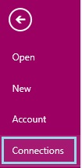

1. Select **Available Connections**, select the account that contains your data (such as **Dropbox**), and then select **Connect**.

	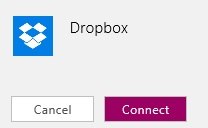

1. Provide your credentials, and then select **Sign in**.

	

1. Select **New** on the **File** menu (near the left edge of the screen).

	

1. Leave the default option to create a phone app.

	

1. Under **Blank App**, select **Get Started**.

	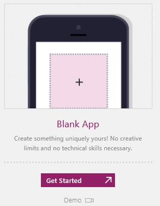

1. On the bottom edge of the screen, select **Options**.

	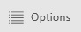

	The **Screen** tab of the **Options** pane appears.
1.  Under **Data Sources**, select **Insert your data**.

	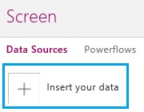

1. Select **Dropbox**, and then select the Excel file that you created and uploaded for this tutorial.

	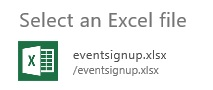

1. Under **Select a table**, select **Schedule**, and then select **Insert**.

	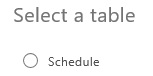

	The **Screen** tab shows which data sources you've added to your app. This tutorial requires only one source, but you can add more sources to better fit your needs.

1. In the upper-right corner of the **Options** pane, select the **Close** icon.

## Show the data ##
1. On the **Insert** tab of the ribbon, select **Gallery**, and then select the text gallery in **Portrait** orientation.

	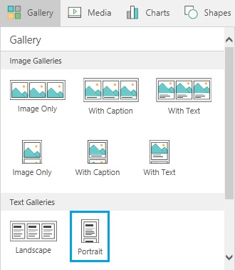

1. Set the **Items** property of the gallery to **Schedule**.

	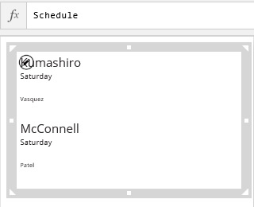

1. Rename the gallery to **BrowseGallery**.

	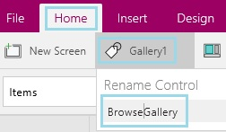

1. In the lower-right corner of the screen, select **Quick tools**.

	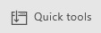

1. In the **Quick tools** pane, select **Content**.

	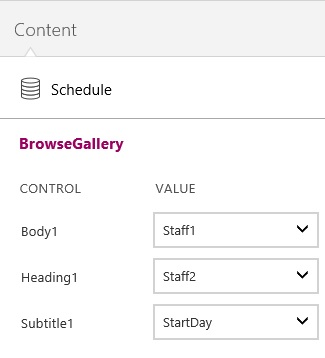

1. In the **Heading1** list, select **StartDay**.
1. In the **Subtitle1** list, select **StartTime**.

1. (optional) Move the gallery down a bit, resize it to show more items, and add a label that identifies the screen.

	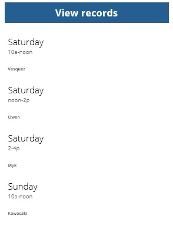

## Add a label to the gallery ##
1. In the first item of the gallery, select the **Subtitle1** label, and reduce its height by about half.

	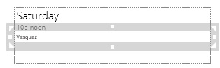

	**Note:** When you change the first item in a gallery, which is the gallery template, you automatically change all other items in the gallery.

1. With the **Subtitle1** label still selected, select the **Insert** tab on the ribbon, and then select **Label**.

	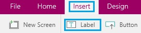

1. On the **Content** tab of the **Quick tools** pane, select **Staff2** in the **Label1** list.

1. On the **Home** tab of the ribbon, set the **Size** of the label's font to **11**.

	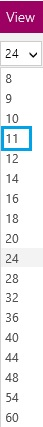

1. Resize and move the **Staff2** label so it appears under the **Staff1** label.

	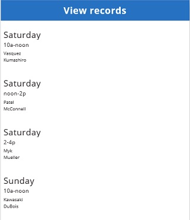

## Add a screen and navigation ##
1. [Rename the default screen](add-screen-context-variables.md#add-a-screen-and-navigation) to **ViewScreen**, add another screen, and name it **ChangeScreen**.

	

1. On the **ViewScreen**, select any item in the gallery except the first one, and then select the pencil icon in the upper-left corner of the gallery.

	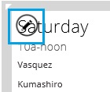

1. On the **Insert** tab of the ribbon, click **Shapes**, and then click the Next arrow.

	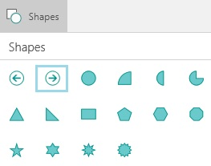

1. Move the arrow to the right edge of the gallery, and then set its **OnSelect** property to this formula:

	**Navigate(ChangeScreen,ScreenTransition!Fade,{Record:ThisItem})**

	This formula comprises the [**Navigate**](function-navigate.md) function and a [context variable](function-updatecontext.md).

1. Select the label at the top of the screen, select the **Insert** tab on the ribbon, and then click **Button**.

	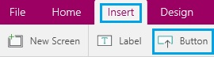

1. Move the button under the gallery, and configure the button so that it shows the word **New**.

	

1. Set the **OnSelect** property of the button to this formula:

 	**Navigate(ChangeScreen,ScreenTransition!Fade,{Record:Defaults(Schedule)})**

	This formula comprises the [**Navigate**](function-navigate.md) function and sets a [context variable](function-updatecontext.md) to the [default values](function-defaults.md) of the **Schedule** data source.

1. On the **ChangeScreen**, add a label that identifies it, and [add a Back arrow](add-screen-context-variables.md#add-a-screen-and-navigation) that returns to the **ViewScreen** when a user selects the arrow.

	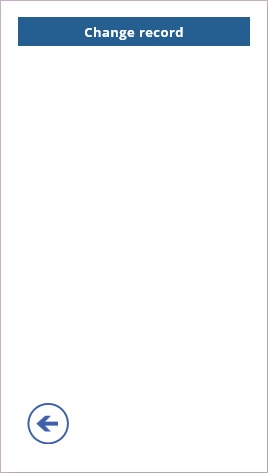

## Add controls for adding or editing a record ##

1. On the **ChangeScreen**, add a label, and configure it to show **Day** in bold letters.

	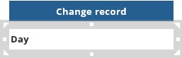

1. On the **Insert** tab, select **Text**, and then select **Input Text**.

	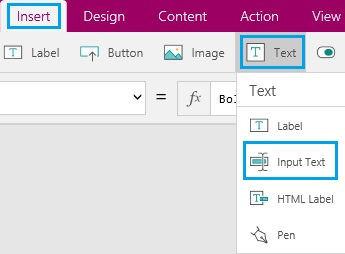

1. Move the new input-text control just under the **Day** label.

	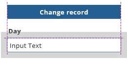
1. Name the input-text control **inputDay**, and set its **Default** property to **Record!StartDay**.

	You'll refer to that control by its name later in this topic, when you configure the **Save** button.

	By setting the **Default** property as the previous step instructs, you configure the input-text control to show the **StartDay** value that's stored in the **Record** context variable.

	- If the user navigates to this screen by selecting the Next arrow in a gallery item on the **ViewScreen**, this control shows the **StartDay** value for that item.
	- If the user navigates to this screen by selecting the **New** button on the **ViewScreen**, this control shows the data source's default value for the **Day** column. Because this data source has no defaults, the control will be blank.

1. Copy the label and the input-text control, paste them three times, and arrange them in a column that alternates labels with input-text controls.

	

1. Configure the pasted labels to show these strings:
	- **Time**
	- **Staff1**
	- **Staff2**

	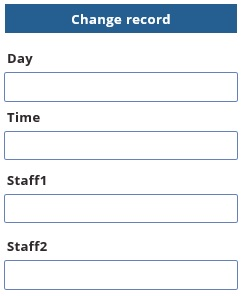

1. Name each input-text control based on the text of the label above it:
	- **inputTime**
	- **inputStaff1**
	- **inputStaff2**

1. Set the **Default** property of each input-text control based on the text of the label above it:
	- **Record!StartTime**
	- **Record!Staff1**
	- **Record!Staff2**

## Test the controls for adding or editing a record ##
1. On the **ViewScreen**, press F5, and then select the arrow for any item in the gallery.

	The **ChangeScreen** appears and shows the data for the item you specified. You can easily edit one or more fields in the record.

1. Select the Back arrow, and select the **New** button.

	The **ChangeScreen** appears and shows nothing in the input-text controls. You can easily add information in each field of the record.

1. Press Esc to return to the default workspace.

## Add buttons for saving changes and removing a record ##

1. On the **ChangeScreen**, add two buttons, move them to the bottom of the screen, and configure them to show **Save** and **Remove**.

1. Set the **OnSelect** property of the **Save** button to this formula:

	**UpdateContext({Record:Patch(Schedule,Record, {StartDay:inputDay!Text,StartTime:inputTime!Text, Staff1:inputStaff1!Text,Staff2:inputStaff2!Text})}); If(IsEmpty(Errors(Schedule,Record)),Navigate(ViewScreen,ScreenTransition!Fade))**

	In this formula, the [**Patch**](function-patch.md) function creates or updates an entry in the **Schedule** data source, and the entry contains the information in each text-input control.  	In addition, the [**If**](function-if.md) function opens the **ViewScreen** only if no [**Errors**](function-errors.md) occurred when the data source was updated.

1. Set the **OnSelect** property of the **Remove** button to this formula:

	**UpdateContext({NewRecord:Remove(Schedule,Record)});If(IsEmpty(Errors(Schedule,Record)),Navigate(ViewScreen,ScreenTransition!Fade))**

	In this formula, the [**Remove**](function-remove-removeif.md) function removes a specified record from the **Schedule** data source. Again, the [**If**](function-if.md) function opens the **ViewScreen** only if no [**Errors**](function-errors.md) occurred when the data source was updated.  

1. Add a label, move it below the last input-text control, and set the label's **Text** property to this formula:

	**Lookup(Errors(Schedule,Record),IsBlank(Column),Message)**

	In this formula, the [**Lookup**](function-first.md) function shows any errors that occurred when the data source was being updated.
