<properties	pageTitle="Create an app from scratch | Microsoft PowerApps"
	description="Create an app from the ground up by configuring each UI element and behavior to manage the everyday data that fuels your business."
	services=""
	suite="powerapps"
	documentationCenter="na"
	authors="AFTOwen"
	manager="dwrede"
	editor=""
	tags=""/>

<tags
   ms.service="powerapps"
   ms.devlang="na"
   ms.topic="get-started-article"
   ms.tgt_pltfrm="na"
   ms.workload="na"
   ms.date="01/06/2015"
   ms.author="anneta"/>

# Create an app from scratch #
Create your own app from scratch using any one of a variety of data sources. Specify the appearance and behavior of each UI element so that you can optimize the result for your exact goals and workflow.

By following this tutorial, you'll create an app that shows users a set of data on the first screen:

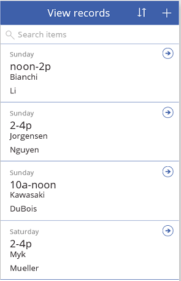

On another screen, users can create, update, or delete a record in that set of data:

**Prerequisites**

- Install [PowerApps](http://aka.ms/powerappsinstall)
- Learn how to [configure a control](get-started-test-drive.md#configure-a-control) in PowerApps
- A cloud-storage account, such as DropBox, OneDrive, or Google Drive

To follow this tutorial exactly:

1. Create an Excel file, and name it **eventsignup.xlsx**.

1. Add this data, which shows who has signed up to cover which shifts during a fictional event.

	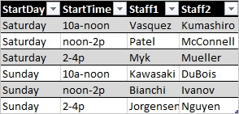

1. [Format the data as a table](https://support.office.com/en-us/article/Format-an-Excel-table-6789619F-C889-495C-99C2-2F971C0E2370), named **Schedule**, and save the file to a Dropbox account.

## Connect to a data source ##
1. In PowerApps, select **Connections** in the **File** menu (near the left edge of the screen).

	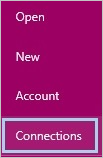

1. Select **Available Connections**, select the account that contains your data (such as **Dropbox**), and then select **Connect**.

	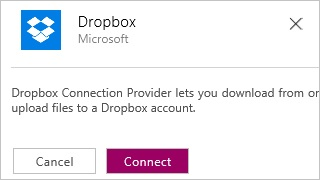

1. Provide your credentials, and then select **Sign in**.

	

1. Select **New** on the **File** menu (near the left edge of the screen).

	

1. Leave the default option to create a phone app.

	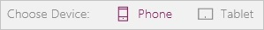

1. Under **Start from scratch**, select **Get started**.

	

1. Near the lower-right corner, select **Options**.

	

	The **Screen** tab of the **Options** pane appears.
1.  Under **Data Sources**, select **Insert your data**.

	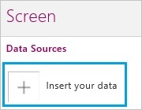

1. Select **Dropbox**, and then select the Excel file that you created and uploaded for this tutorial.

	

1. Under **Select a table**, select **Schedule**, and then select **Insert**.

	

	The **Screen** tab shows which data sources you've added to your app. This tutorial requires only one source, but you can add more sources to better fit your needs.

1. In the upper-right corner of the **Options** pane, select the **Close** icon.

	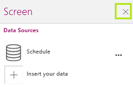

## Show the data ##
1. On the **Home** tab of the ribbon, select **Layouts**, and then select the option that contains a heading, a subtitle, and a body element.

	

1. Set the **Items** property of the gallery to this formula: 
**Sort(If(IsBlank(TextSearchBox1.Text), Schedule, Filter(Schedule, TextSearchBox1.Text in Text(Staff1))), Staff1, If(SortDescending1, SortOrder.Descending, SortOrder.Ascending))**

	This formula shows the data from the **Schedule** table. If the user types in the search box, the gallery shows only those records in which the **Staff1** column contains the search text. If the user selects the sort button, the sort order toggles between ascending and descending, based on the **Staff1** column.

	

1. In the lower-right corner of the screen, select **Quick tools**.

	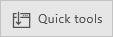

1. In the **Quick tools** pane, select the **Content** tab.

	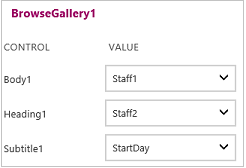

1. In the **Heading1** list, select **StartDay**.

1. In the **Subtitle1** list, select **StartTime**.

1. Change the text box at the top of the screen to show **View records**, and resize the gallery to show four items.

	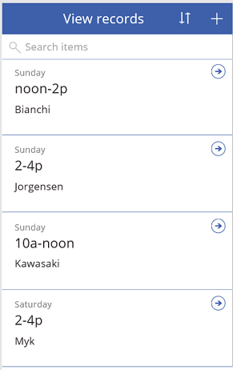

## Add a text box to the gallery ##
1. In the first item of the gallery, select the **Body1** text box.

	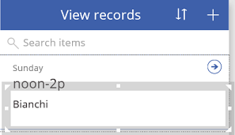

	**Note:** The first item in a gallery is the gallery template. When you change it, you automatically change all other items in the gallery.

1. Set the text box's **PaddingTop** property to **0** and its **Height** property to **50**.

1. Copy the text box, paste it, and then move the copy so that it appears just under the original text box.

1. Set the **Text** property of the copied text box to **ThisItem.Staff2**.

	

## Create the ChangeScreen ##
1. [Rename the default screen](add-screen-context-variables.md#add-a-screen-and-navigation) to **ViewScreen**, add another screen, and name it **ChangeScreen**.

	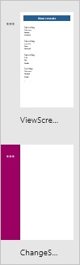

1. On the **ViewScreen**, set the **OnSelect** property of the arrow in the first item of the gallery to this formula: 
**Navigate(ChangeScreen,ScreenTransition.Fade,{Record:ThisItem})**

	This formula comprises the [**Navigate**](function-navigate.md) function and a [context variable](function-updatecontext.md).

1. In the upper-right corner, set the **OnSelect** property of the plus button to this formula: 
**Navigate(ChangeScreen,ScreenTransition.Fade,{Record:Defaults(Schedule)})**

	This formula also comprises the [**Navigate**](function-navigate.md) function and sets a [context variable](function-updatecontext.md) to the [default values](function-defaults.md) of the **Schedule** data source.

1. On the **ChangeScreen**, add a text box that identifies the screen, and [add a Back arrow](add-screen-context-variables.md) that returns to the **ViewScreen** when a user selects the arrow.

	

## Configure the ChangeScreen ##

1. On the **ChangeScreen**, add a text box, and configure it to show **Day** in bold letters.

	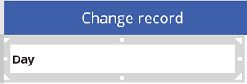

1. On the **Insert** tab, select **Text**, and then select **Input Text**.

	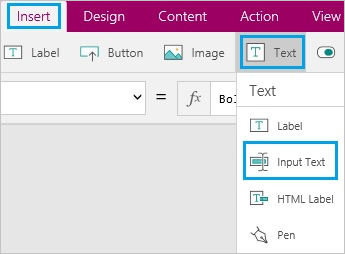

1. Move the new input-text control just under the **Day** text box.

	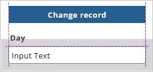
1. Name the input-text control **inputDay**, and set its **Default** property to **Record.StartDay**.

	You'll refer to that control by its name later in this topic, when you configure the **Save** button.

	By setting the **Default** property as the previous step instructs, you configure the input-text control to show the **StartDay** value that's stored in the **Record** context variable.

	- If the user navigates to this screen by selecting an arrow in the **BrowseGallery**, this control shows the **StartDay** value for the item that the user selected.
	- If the user navigates to this screen by selecting the **New** button on the **ViewScreen**, this control shows the data source's default value for the **Day** column. Because this data source has no defaults, the control will be blank.

1. Copy the text box and the input-text control, paste them three times, and arrange them in a column that alternates text boxes with input-text controls.

	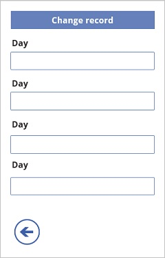

1. Configure the pasted text boxes to show these strings:
	- **Time**
	- **Staff1**
	- **Staff2**

	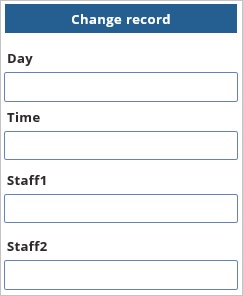

1. Name each input-text control based on the text above it:
	- **inputTime**
	- **inputStaff1**
	- **inputStaff2**

1. Set the **Default** property of each input-text control based on the text above it:
	- **Record.StartTime**
	- **Record.Staff1**
	- **Record.Staff2**

## Test the ChangeScreen ##
1. On the **ViewScreen**, press F5, and then select the arrow for any item in the gallery.

	The **ChangeScreen** appears and shows the data for the item you specified. You can easily edit one or more fields in the record.

1. Select the Back arrow, and select the **New** button.

	The **ChangeScreen** appears and shows nothing in the input-text controls. You can easily add information in each field of the record.

1. Press Esc to return to the default workspace.

## Save changes, and remove a record ##

1. On the **ChangeScreen**, add two buttons, move them to the bottom of the screen, and configure them to show **Save** and **Remove**.

1. Set the **OnSelect** property of the **Save** button to this formula:

	**UpdateContext({Record:Patch(Schedule,Record,  {StartDay:inputDay.Text,StartTime:inputTime.Text,  Staff1:inputStaff1.Text,Staff2:inputStaff2.Text})});  If(IsEmpty(Errors(Schedule,Record)), Navigate(ViewScreen,ScreenTransition.Fade))**

	In this formula, the [**Patch**](function-patch.md) function creates or updates an entry in the **Schedule** data source, and the entry contains the information in each text-input control.  	In addition, the [**If**](function-if.md) function opens the **ViewScreen** only if no [**Errors**](function-errors.md) occurred when the data source was updated.

1. Set the **OnSelect** property of the **Remove** button to this formula:

	**UpdateContext({NewRecord:Remove(Schedule,Record)});  If(IsEmpty(Errors(Schedule,Record)), Navigate(ViewScreen,ScreenTransition.Fade))**

	In this formula, the [**Remove**](function-remove-removeif.md) function removes a specified record from the **Schedule** data source. Again, the [**If**](function-if.md) function opens the **ViewScreen** only if no [**Errors**](function-errors.md) occurred when the data source was updated.  

1. Add a text box, move it below the last input-text control, and set the text box's **Text** property to this formula:

	**Lookup(Errors(Schedule,Record),IsBlank(Column),Message)**

	In this formula, the [**Lookup**](function-first.md) function shows the message from any errors that occurred when the data source was being updated.

## Next steps ##
- Test the app in Preview by adding, editing, and removing records.
- [Publish the app, and share it with others](get-started-test-drive.md).
