<properties
	pageTitle="Create a PowerApp from a set of data | Microsoft PowerApps"
	description="Create a PowerApp automatically based on an existing set of data that you specify and then customize the UI to better suit your needs."
	services=""
	suite="powerapps"
	documentationCenter="na"
	authors="AFTOwen"
	manager="dwrede"
	editor=""
	tags=""/>

<tags
   ms.service="powerapps"
   ms.devlang="na"
   ms.topic="get-started-article"
   ms.tgt_pltfrm="na"
   ms.workload="na"
   ms.date="11/22/2015"
   ms.author="anneta"/>

# Create a PowerApp from a set of data
Create a PowerApp automatically based on data that you specify, explore how the PowerApp works by default, and then customize it to better fit how you work.

[What are PowerApps?](http://aka.ms/pamktg)

**Prerequisites**

- Install [PowerApps](http://aka.ms/powerappsinstall)
- Learn how to [configure a control](get-started-test-drive.md#configure-a-control) in PowerApps
- A set of data, such as a list in SharePoint

For this tutorial, the data source is a list named **Top Charts** in a SharePoint Online site.

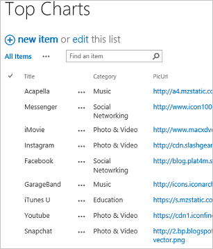

## Video demonstration

[AZURE.VIDEO nb:cid:uuid:dd5b313a-0d00-80c4-ef13-f1e592bab129]

## Build a PowerApp ##

1. In PowerApps, select **Connections** on the **File** menu (near the left edge of the screen).

	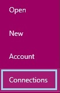

1. Select **Add connection**.

	

1. Select the kind of data source you want to use, and then select **Connect**.

	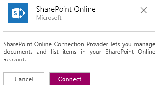

1. Provide your credentials, and then select **New** on the **File** menu.

	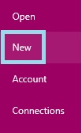

1. Under **Start from your data**, select **Get started**.

	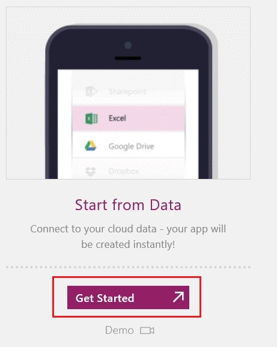

1. Specify the data source that you want to use, as in this example:

	1. Under **My Connections**, select **SharePoint Online**.

	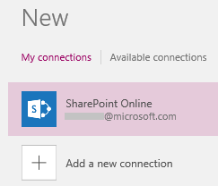

	1. Under **Select a site**, select **New site**, type or paste the URL of the site you want to use, and then select **Connect**.

	**Note:** Provide the URL of the site itself, without the specific list.

	

	1. Under **Select a list**, select the list that you want to use, and then select **Connect**.

		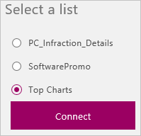

Your PowerApp is built.

## Customize a PowerApp ##
When a PowerApp is built automatically, heuristics are used to suggest the best layout and content based on the data. You might need to adjust the default settings to optimize the PowerApp for your needs.

1. If **BrowseScreen1** isn't already showing, show it by selecting its thumbnail in the left navigation pane.

	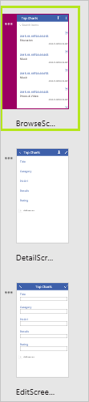

1. If the **Quick tools** pane isn't already showing, show it by selecting **Quick tools** near the lower-left corner.

	

1. In the **Quick tools** pane, select the **Layout** tab, and then select the option that includes icons.

	

	The layout of **BrowseScreen1** changes to reflect your selection.

	

	**Note:** If you open the **Layout** tab with **DetailScreen1** or **EditScreen1** showing, you can select different options, which reflect the data on that screen.

1. In the **Quick tools** pane, select the **Content** tab.

1. Select **Title** in the **Heading2** list, select **PicURL** in the **Image1** list, and select **Category** in the **Subtitle2** list.

	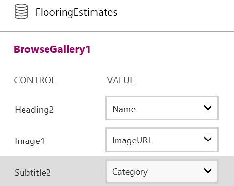

	The content of **BrowseScreen1** changes to reflect your selections.

	

1. In the **Quick tools** pane, select the **Theme** tab, and then select a different theme, such as **Lavender**.

	

	As the thumbnails in the left navigation bar show, each screen in the app changes to reflect your selection.

	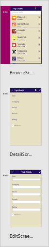

## Run the PowerApp ##
1. With **BrowseScreen1** showing, open Preview by pressing F5 or by selecting the Preview icon near the upper-right corner.

	

1. On **BrowseScreen1**, select the arrow for a record to show details about that record.

	

1. On **DetailsScreen1**, select the edit icon (in the upper-right corner) to edit the record.

	

1. On **EditScreen1**, change the information in one or more fields, and then select the checkmark in the upper-right corner to save your changes.

	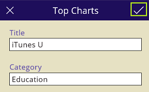

## Next step ##
When you finish customizing your app, you can [save and share it with other people](get-started-test-drive.md#save-and-share-your-powerapp).
