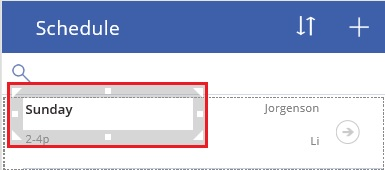
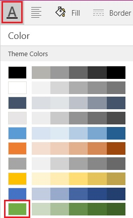
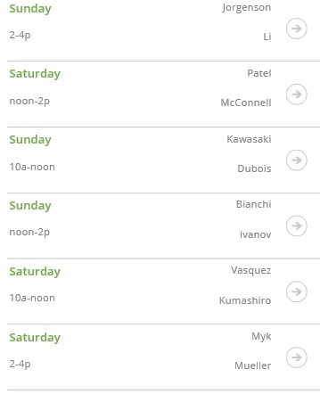
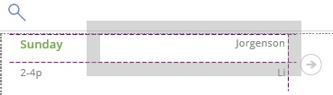
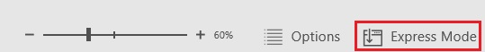
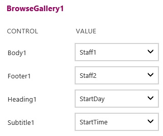
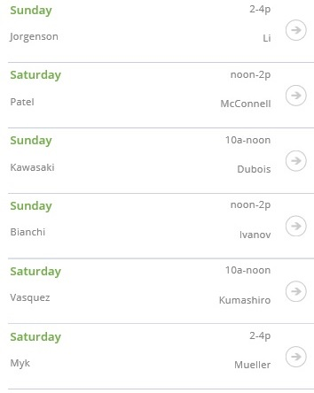

<properties
	pageTitle="Create an app from data in KratosApps"
	description=""
	services="kratosapps"
	authors="AFTOwen"
 />

<tags
   ms.service="kratosapps"
   ms.devlang="na"
   ms.topic="get-started-article"
   ms.tgt_pltfrm="na"
   ms.workload="na"
   ms.date="10/06/2015"
   ms.author="anneta"/>

# Create an app from data
Create an app automatically based on a set of data that you specify. The app will have a sample interface, so that you can explore how the app works by default. If you want to manage your data differently, you can customize the app to better fit how you work.

[What is KratosApps?]()

**Prerequisites**

In addition to signing up for and installing KratosApps, you'll also need a set of data in the cloud, such as in DropBox or OneDrive.

## Connect to data ##
1. Sign in to KratosApps, and then click **New** in the left navigation bar.

	

1. Leave the default option to create a phone app.

	

1. Under **Start from Data**, click **Get started**.

	

1. If you don't already have a connection to a data source:
	1. Click **Available Connections**, and then click an option in the list that appears.

	For this tutorial, the data source is an Excel file in Dropbox. The file, named **eventsignup.xls**, contains this data [formatted as a table](https://support.office.com/en-us/article/Format-an-Excel-table-6789619F-C889-495C-99C2-2F971C0E2370) and named **Schedule**.

	
	1. Name the connection you're about to create, click **Add Connection**, and provide any requested credentials to connect to that data source.

	

1. Click a data set, and then click **Connect**.

	

1. Click a table, and then click **Connect**.

	

An app is created from the data that you specified.

## Exploring the app ##

When the app is created, it appears in the default workspace, where you can customize the app to better fit your needs. Before you make changes, you'll explore how the app works in **Preview**. By running an app in **Preview**, you can completely test an app before you share it with others.

1. Press F5 to open **Preview**.

	

	The first screen, named **BrowseScreen**, shows which people are signed up for each shift in a schedule. You can sort the data, add an item, and search for an item by using the elements near the top of the screen.

1. Click the arrow for the first item to show details about that item.

	

	The **DetailScreen** appears, showing all data for the item you specified. You can delete or update that item by using the elements near the top of the screen.

	

1. Click the pencil icon to update the item.

	

	The **EditScreen** appears, with text boxes so that you can change the item, in addition to a cancel icon in the upper-left corner and a save icon in the upper-right corner.

	**Note:** If you click the plus sign on the **BrowseScreen**, the **EditScreen** appears with all the text boxes blank so that you can create an item.

	

1. Replace either or both of the names with whatever names you want, and then click the save icon.

	

	The updated data appears in the app and the source.

1. Press Esc to return to the default workspace, in which you can customize the app.

## Customizing the app ##
You can customize elements on any of the default screens, and you can even [add and delete screens]() to better suit your needs. To customize how the **BrowseScreen** shows data, you change an element in the first item, which automatically updates the same element for all other items.
1. In the first item, click the day name to select that label.

	

1. On the **Home** tab, click the text-color option, and then click the green option in the list that appears.

	

	The day in each item appears in green.

	

1. In the first item, click the name that appears in the upper-right corner, and move it until the two names are aligned on their right edges.

	

	All names are aligned on their right edges.

1. If **Express Mode** isn't already showing, click **Express Mode** near the lower-right corner.

	

1. In **Express Mode**, click **Content** to show options for changing the kinds of data that appears in each element on the screen.

	

1. In the **Heading1** list, choose **Shift**.
1. In the **Subtitle** list, choose **Leader**.

 	The shift time moves to the upper-right corner of each item, and both people appear near the bottom instead of near the right edge.

	

## Save and share your app ##
After you finish developing and testing your app, you share it with other people by saving it to the portal and then sending mail that your app is available. You specify which people can run your app or even customize it to create their own versions.

1. On the **File** menu, click **App Settings**.

	

2. Update any of these settings.

	- the name of your app
	- the color of your app's tile

		

	- the image on your app's tile

		

	- the aspect ratio of your app

		

	If you change the aspect ratio, click **Apply**.

2. On the **File** menu, click **Save As**.
3. Under **Save As**, leave the default value of **PowerApps**, and then click **Save**.

	

6. On the **File** menu, click **Share**.

	An email template appears.

1. In the **To** text box, type the email addresses of the people with whom you want to share your app.

	

1. In the drop-down list, click **Can View** to allow users to run your app, or click **Can edit** to allow users to run your app and create their own versions of it.

	

1. Edit the text in the **Subject** and **Message** text boxes, and then click **Share**.

	The people with whom you shared your app will receive an email message that contains a link they can click to install KratosApps and run your app.
