<properties
	pageTitle="Create an app from Excel data | Microsoft PowerApps"
	description="Create an app automatically based on an Excel file in the cloud, customize the app, and then explore how it works."
	services=""
	suite="powerapps"
	documentationCenter="na"
	authors="sarafankit"
	manager="erikre"
	editor=""
	tags=""/>

<tags
   ms.service="powerapps"
   ms.devlang="na"
   ms.topic="get-started-article"
   ms.tgt_pltfrm="na"
   ms.workload="na"
   ms.date="05/18/2016"
   ms.author="ankitsar"/>

# Create an app from Excel data #

[AZURE.VIDEO nb:cid:UUID:9380084d-bc9a-484f-960e-4554c6bf67b2]

Create an app automatically based on an Excel file in the cloud, customize the app, and then explore how it works.

## Prerequisites ##
- [Sign up](signup-for-powerapps.md) for PowerApps, [install](http://aka.ms/powerappsinstall) it, open it, and then sign in by using the same credentials that you used to sign up.

	This topic was written for PowerApps Studio, but the steps are similar if you [open PowerApps in a browser](create-app-browser.md).

- Either download [this Excel file](https://az787822.vo.msecnd.net/documentation/get-started-from-data/FlooringEstimates.xlsx), or create your own with the data [formatted as a table](https://support.office.com/en-us/article/Create-an-Excel-table-in-a-worksheet-E81AA349-B006-4F8A-9806-5AF9DF0AC664), and then upload the file to a cloud-storage account such as Box, Dropbox, Google Drive, OneDrive, or OneDrive for Business. The tutorial shows how to use OneDrive, but the process is similar for the other types of accounts.

**Note**: You can just as easily create an app based on a [SharePoint list,](app-from-sharepoint.md), Salesforce data, or a table in Dynamics CRM.

## Create the app ##
1. In PowerApps Studio, click or tap **New** (near the left edge of the screen).

	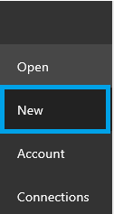

1. Under **Create an app from your data**, click or tap **Phone layout** on the tile for your cloud-storage account (such as OneDrive).

	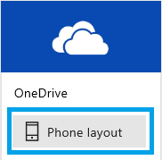

1. If you haven't connected PowerApps to your account, click or tap **Connect** when prompted, and then provide your credentials.

	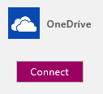  

1. Under **Choose an Excel file**, browse to **FlooringEstimates.xlsx**, and then click or tap it.

	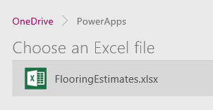  

1. Under **Choose a table**, click or tap **FlooringEstimates**, and then click or tap **Connect**.  

	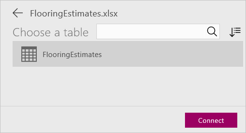

PowerApps builds an app that has three screens:

- **BrowseScreen1** shows a list of all items and some information about them so that users can easily browse for the item they want.
- **DetailScreen1** shows all information about a single item.
- **EditScreen1** provides an **[Edit form](add-form.md)** control for adding an item or updating information about an item.

## Change the app layout ##
When an app is built automatically, heuristics suggest the best layout and content based on the data. You might need to change the app for your needs.

1. If you haven't used PowerApps before, take the intro tour (or click or tap **Skip**).

	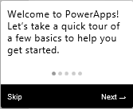

	**Note**: You can always take the tour later by clicking or tapping the question-mark icon near the upper-right corner and then clicking or tapping **Take the intro tour**.

1. In the right-hand pane, click or tap a layout that includes images (such as the one highlighted in this graphic):

	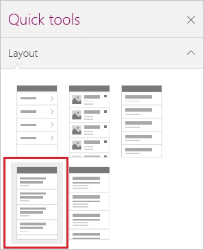

	The layout of **BrowseScreen1** changes to reflect your selection.

	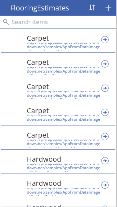

	**Note:** If **DetailScreen1** or **EditScreen1** is selected, the **Layout** tab offers different options, which reflect the types of data on the selected screen.

## Show different data ##
1.  Just under the search box in the app that you're building, click or tap **Carpet** to select that **Text box** control and its associated list in the right-hand pane.

	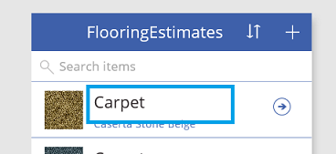

1. In the right-hand pane, click or tap **Name** in the selected list.

	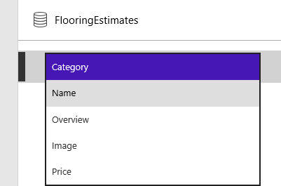

1. Click or tap the **Text box** control just under the one that you selected in the previous step.

	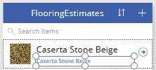

1. In the right-hand pane, click or tap **Category** in the selected list.

	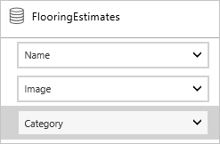

	**BrowseScreen1** changes to show your selections.

	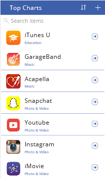

	**Note** By default, you can scroll through the list (called a gallery) by using a mousewheel or by swiping up and down. To show the scrollbar, [set the gallery's **[ShowScrollbar](controls/control-gallery.md)** property](add-configure-controls.md) to **true**.

## Reorder fields in a form ##
1. In the left navigation bar, click or tap the middle thumbnail to select **DetailScreen1**.

	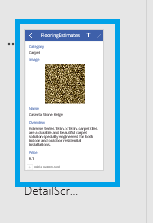

1. Click or tap the **Name** field to show its title bar.

	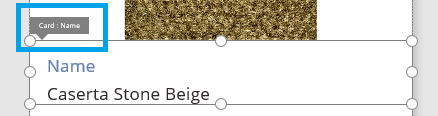

1. Drag the title bar so that the field appears above **Category**.

	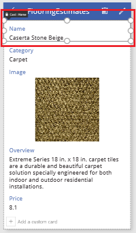

## Change a control ##
1. In the left navigation bar, click or tap the bottom thumbnail to select **EditScreen1**.

	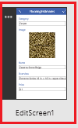

1. Click or tap **Overview** to select that card.

	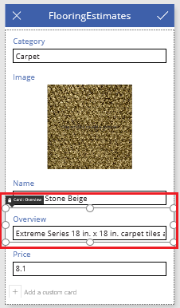

1. In the right-hand pane, click or tap the down arrow for the selected card, scroll down, and then click or tap **Edit multi-line text** to show the overview of each product in a control that's large enough to display the text.

	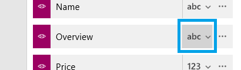

## Run the app ##
As you customize an app, you can test your changes by running the app in **Preview** mode, as the steps in this section demonstrate.

1. In the left navigation pane, click or tap the top thumbnail to select **BrowseScreen1**, and then open Preview mode by pressing **F5** (or by clicking or tapping the **Preview** icon near the upper-right corner).

	

1. On **BrowseScreen1**, click or tap the arrow for a record to show details about that record.

	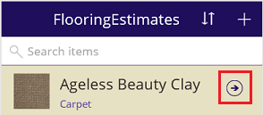

1. On **DetailsScreen1**, click or tap the edit icon (in the upper-right corner) to edit the record.

	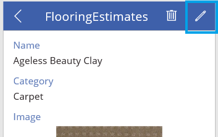

1. On **EditScreen1**, change the information in one or more fields, and then click or tap the check mark in the upper-right corner to save your changes.

	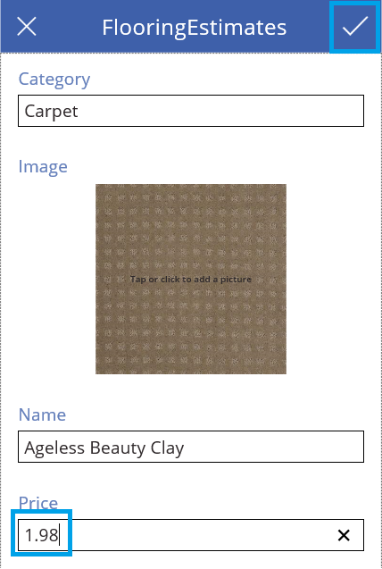

1. Close Preview mode by pressing Esc (or clicking or tapping the close icon below the title bar).

	

## Next steps ##
- Press Ctrl-S to save your app so that you can run it from other devices.
- Customize your app further, as [Create an app from scratch](get-started-create-from-blank.md) describes.
- [Share the app](share-app.md) so that other people can run it.
