<properties
	pageTitle="Create a PowerApp from an existing data set"
	description="Create a PowerApp automatically based on an existing set of data that you specify and then customize the UI to better suit your needs."
	services="powerapps"
	documentationCenter="na"
	authors="AFTOwen"
	manager="dwrede"
	editor=""
	tags=""/>

<tags
   ms.service="powerapps"
   ms.devlang="na"
   ms.topic="get-started-article"
   ms.tgt_pltfrm="na"
   ms.workload="na"
   ms.date="11/15/2015"
   ms.author="anneta"/>

# Create a PowerApp from data
Create a PowerApp automatically based on data that you specify, explore how the PowerApp works by default, and then customize it to better fit how you work.

[What are PowerApps?](http://www.kratosapps.com/tutorials)

**Prerequisites**

- Install [PowerApps](http://aka.ms/powerappsinstall )
- Learn how to [configure a control](get-started-test-drive.md#configure-a-control) in PowerApps
- A set of data in the cloud, such as in DropBox or OneDrive

For this tutorial, the data source is an Excel file in Dropbox. The file, named **eventsignup.xls**, contains this data [formatted as a table](https://support.office.com/en-us/article/Format-an-Excel-table-6789619F-C889-495C-99C2-2F971C0E2370) and named **Schedule**.

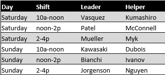

## Connect to data ##

1. Under **Start from your data**, select **Get started**.

	

1. In the list of connections, select the one that contains the data you want to use, select the data, and then select **Connect**.

	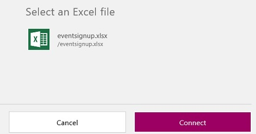

1. Select a table, and then select **Connect**.

	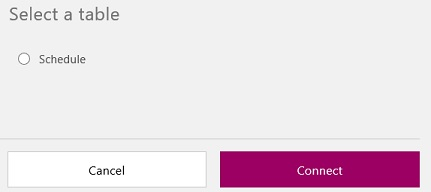

A PowerApp is created from the data that you specified.

## Explore the PowerApp ##

When the PowerApp is created, it appears in the default workspace, where you can customize the PowerApp to better fit your needs. Before you make changes, you'll explore how the PowerApp works in **Preview**. By running a PowerApp in **Preview**, you can completely test the PowerApp before you share it with others.

1. Press F5 to open **Preview**.

	The first screen, named **BrowseScreen1**, shows which people are signed up for each shift in a schedule.

	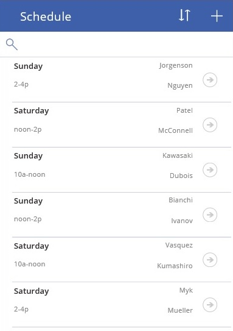

1. Select the up and down arrows near the top of the screen to reverse the sort order (by the name of the first volunteer).

	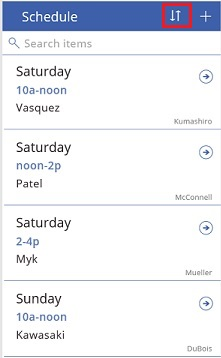

1. In the **Search items** box, type **n** to show only those shifts for which the name of the first volunteer contains that letter.

	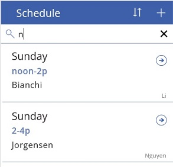

1. Select the arrow for the first item to show details about that item.

	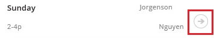

	The **DetailScreen1** appears, showing all data for the item you specified. You can delete or update that item by using the elements near the top of the screen.

	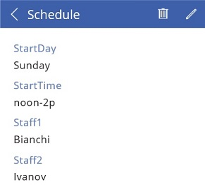

1. Select the pencil icon to update the item.

	

	The **EditScreen1** appears, with text boxes so that you can change the item, a cancel icon in the upper-left corner, and a save icon in the upper-right corner.

	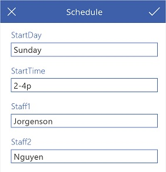

	**Note:** If you select the plus sign on **BrowseScreen1**, **EditScreen1** appears with all the text boxes blank so that you can create an item.

1. Replace either or both of the names with whatever names you want, and then select the save icon.

	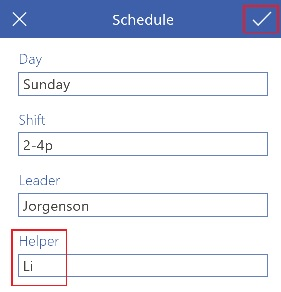

	Your change or changes appear in **DetailsScreen1** and in your data source in the cloud.

1. Press Esc to return to the default workspace, in which you can customize your PowerApp.

## Change the layout, the content, and the theme ##
You can customize a PowerApp by adding or deleting a screen, changing a property of a screen, and changing a specific element on a screen.

1. Display **BrowseScreen1** by selecting its thumbnail in the left navigation bar.

	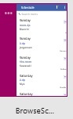

1. Near the lower-right corner of the screen, select **Quick tools**.

	

1. In the **Quick tools** pane, select the **Layout** tab, and then select a different layout, such as the one shown in this graphic.

	

	**BrowseScreen1** shows the day of each shift and the name of each volunteer but not the time of each shift.

	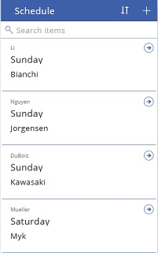

1. In the **Quick tools** pane, select the **Content** tab, and then select **StartTime** in the **Heading12** list.

	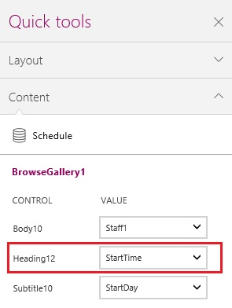

	The time of each shift appears above the day and the name of a volunteer.

	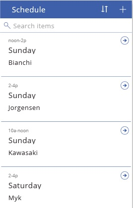

1. In the **Quick tools** pane, select **Theme**, and then select a different theme, such as **Red**.

	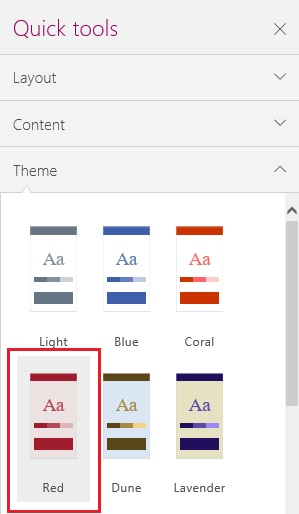

	The colors on all screens in the PowerApp change to reflect the new theme, as the left navigation bar shows.

	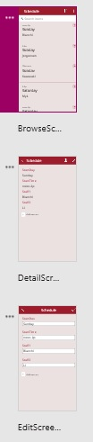

## Customize the app further ##

1. On **BrowseScreen1**, select the name of the volunteer for the first shift in the list.

	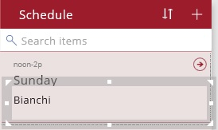

	The label is now selected so that you can change its properties. When you change the property of an element in the first item of a gallery, you automatically change that property of the same element in all other items of the gallery.

1. On the **Home** tab of the ribbon, click the **FontWeight** button, and then click **Bold**.

	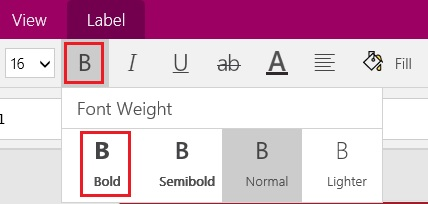

	The volunteer name in each item of the gallery appears in bold text.

	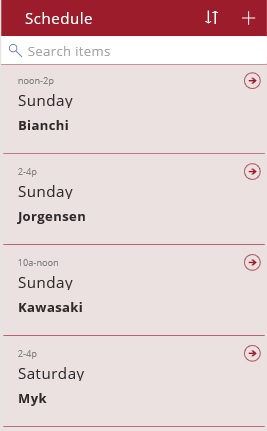

1. Select the time information for the first shift in the list.

	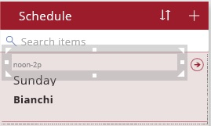

1. Drag the white square on the right edge of the selection box so that the label just fits the information it contains.

	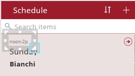

1. Resize the other two labels the same way, and then move all three labels (by dragging their selection boxes) so that they appear in a row that's horizontally aligned with the arrow for each item.

	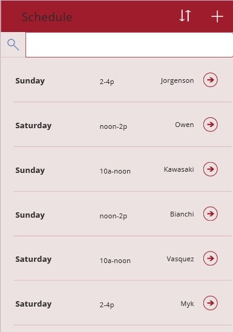

1. Select the line near the bottom of the first item in the list, and then press Delete.

	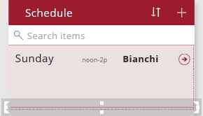

1. Select the empty space in the first item in the list, below the labels that you just aligned.

	The gallery template is selected.

	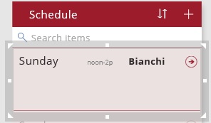

1. Resize the gallery template to show more items on the screen.

	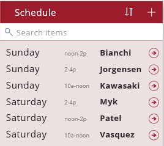

When you finish customizing your app, you can [save and share it with other people](get-started-test-drive.md#save-and-share-your-app).
