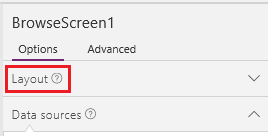

<properties
	pageTitle="Generate an app from Excel data | Microsoft PowerApps"
	description="Create an app automatically based on an Excel file in the cloud, customize the app, and then explore how it works."
	services=""
	suite="powerapps"
	documentationCenter="na"
	authors="sarafankit"
	manager="anneta"
	editor=""
	tags=""/>

<tags
   ms.service="powerapps"
   ms.devlang="na"
   ms.topic="get-started-article"
   ms.tgt_pltfrm="na"
   ms.workload="na"
   ms.date="10/16/2016"
   ms.author="ankitsar"/>

# Generate an app from Excel data #
Create an app automatically based on an Excel file in the cloud, customize the app, and then explore how it works.

## Prerequisites ##
- [Sign up](signup-for-powerapps.md) for PowerApps, [install](http://aka.ms/powerappsinstall) it, open it, and then sign in by using the same credentials that you used to sign up.

	This topic was written for PowerApps Studio for Windows, but the steps are similar if you [open PowerApps in a browser](create-app-browser.md).

- You can review this tutorial for general concepts only, or you can follow it exactly if you complete these steps:

	1. Download [this Excel file](https://az787822.vo.msecnd.net/documentation/get-started-from-data/FlooringEstimates.xlsx).

		**Important**: If you decide to use your own Excel file, make sure that the data is formatted as a table. For more information, see [Create an Excel table in a worksheet](https://support.office.com/en-us/article/Create-an-Excel-table-in-a-worksheet-E81AA349-B006-4F8A-9806-5AF9DF0AC664).

	1. Upload the Excel file to a [cloud-storage account](cloud-storage-blob-connections.md) such as OneDrive.

	The tutorial shows how to use OneDrive, but the process is similar for the other types of accounts.

**Note**: You can just as easily generate an app based on a [custom SharePoint list](app-from-sharepoint.md).

## Create the app ##
1. In PowerApps Studio, click or tap **New** on the **File** menu (near the left edge of the screen).

	

1. Follow any of these steps:

	- If a tile for your cloud account appears under **Start with your data**, click or tap **Phone layout** on that tile.

		

	- If a tile for your cloud account doesn't appear under **Start with your data**, click the arrow at the end of the row of tiles. If an entry for your cloud account appears in the list of connections, click or tap that entry.

	- If your cloud account doesn't appear under **Start with your data** or in the list of connections, click or tap **New connection**, and then click or tap the entry for your cloud account. Click or tap **Connect**, and then follow the prompts.

		

1. Under **Choose an Excel file**, browse to **FlooringEstimates.xlsx**, and then click or tap it.

	  

1. Under **Choose a table**, click or tap **FlooringEstimates**, and then click or tap **Connect**.  

	

PowerApps builds an app that has three screens:

- **BrowseScreen1** shows a list of all items and some information about them so that users can easily browse for the item they want.
- **DetailScreen1** shows all information about a single item.
- **EditScreen1** provides an **[Edit form](add-form.md)** control for adding an item or updating information about an item.

## Change the app layout ##
When an app is built automatically, heuristics suggest the best layout and content based on the data. You might need to change the app for your needs.

1. If you haven't used PowerApps before, take the intro tour to get familiar with the PowerApps interface (or click or tap **Skip**).

	

	**Note**: You can always take the tour later by clicking or tapping the question-mark icon near the upper-right corner and then clicking or tapping **Take the intro tour**.

1. In the right-hand pane, click or tap the **Layout** tab to open it.

	

1. On the **Layout** tab, click to tap the layout that includes images, headers, and descriptions:

	

	The layout of **BrowseScreen1** changes to reflect your selection.

	

## Show different data ##
1.  Just under the search box in the app that you're building, click or tap **Carpet** to select that **Text box** control and its associated list in the right-hand pane.

	

1. In the right-hand pane, open the highlighted list, and then click or tap **Name**.

	

1. Open the bottom list, and then click or tap **Category**.

	

	**BrowseScreen1** changes to show your selections.

	

	**Note**: By default, you can scroll through the list (called a gallery) by using a mousewheel or by swiping up and down. To use a trackpad (or a mouse without a wheel), select the gallery, click or tap **ShowScrollbar** in the property list, and replace **false** with **true** in the formula bar.

## Reorder fields in a form ##
1. In the left navigation bar, click or tap the middle thumbnail to select **DetailScreen1**.

	

1. Click or tap the image to show options for customizing the form in the right-hand pane.

	

1. In the list of fields, drag the **Name** field to the top of the list.

	

	The screen reflects your change.

	

## Change a control ##
1. In the left navigation bar, click or tap the bottom thumbnail to select **EditScreen1**.

	

1. Click or tap **Overview** to select that card.

	

1. In the right-hand pane, click or tap the down arrow for the selected card, scroll down, and then click or tap **Edit multi-line text** to show the overview of each product in a control that's large enough to display the text.

	

## Run the app ##
As you customize an app, you can test your changes by running the app in **Preview** mode, as the steps in this section demonstrate.

1. In the left navigation pane, click or tap the top thumbnail to select **BrowseScreen1**.

1. Open Preview mode by pressing **F5** (or by clicking or tapping the **Preview** icon near the upper-right corner).

	

1. On **BrowseScreen1**, click or tap the arrow for a record to show details about that record.

	

1. On **DetailsScreen1**, click or tap the edit icon (in the upper-right corner) to edit the record.

	

1. On **EditScreen1**, change the information in one or more fields, and then click or tap the check mark in the upper-right corner to save your changes.

	

1. Close Preview mode by pressing Esc (or by clicking or tapping the close icon below the title bar).

	

## Known limitations

There are currently [certain limitations](./connections/cloud-storage-blob-connections.md#Sharing-Excel-Tables) with connectors involving Excel files. These affect apps that you share within your organization.

## Next steps ##
- Press Ctrl-S to save your app so that you can run it from other devices.
- Customize your app further, as [Create an app from scratch](get-started-create-from-blank.md) describes.
- [Share the app](share-app.md) so that other people can run it.
