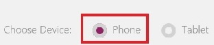

<properties
	pageTitle="Create an app from data in KratosApps"
	description=""
	services="kratosapps"
	authors="AFTOwen"
 />

<tags
   ms.service="kratosapps"
   ms.devlang="na"
   ms.topic="get-started-article"
   ms.tgt_pltfrm="na"
   ms.workload="na"
   ms.date="10/06/2015"
   ms.author="anneta"/>

# Create an app from data
Create an app automatically based on a set of data that you specify. The app will have a sample interface, so that you can explore how the app works by default. If you want to manage your data differently, you can customize the app to better fit how you work.

[Find out more about KratosApps](), such as how to [create an app from a template]() or [build your own app from scratch]().

**Prerequisites**

In addition to signing up for and installing KratosApps, you'll also need a set of data in the cloud, such as in DropBox or OneDrive.

## Connect to data ##
1. Sign in to KratosApps, and then click **New** in the left navigation bar.

	

1. Leave the default option to create a phone app.

	

1. Under **Start from Data**, click **Get started**.

	

1. Under **My Connections**, click a data source that you or your organization created.

1. Click a data set, and then click **Connect**.

1. Click a table, and then click **Connect**.
## Save and share your app ##
After you finish developing and testing your app, you share it with other people by saving it to the portal and then sending mail that your app is available. You specify which people can run your app or even customize it to create their own versions.

1. On the **File** menu, click **App Settings**.

	

2. Update any of these settings.

	- the name of your app
	- the color of your app's tile

		

	- the image on your app's tile

		

	- the aspect ratio of your app

		

	If you change the aspect ratio, click **Apply**.

2. On the **File** menu, click **Save As**.
3. Under **Save As**, leave the default value of **PowerApps**, and then click **Save**.

	

6. On the **File** menu, click **Share**.

	An email template appears.

1. In the **To** text box, type the email addresses of the people with whom you want to share your app.

	

1. In the drop-down list, click **Can View** to allow users to run your app, or click **Can edit** to allow users to run your app and create their own versions of it.

	

1. Edit the text in the **Subject** and **Message** text boxes, and then click **Share**.

	The people with whom you shared your app will receive an email message that contains a link they can click to install KratosApps and run your app.
