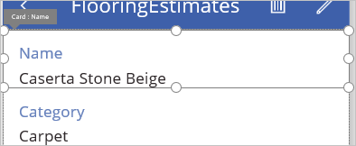
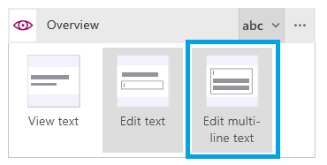

<properties
	pageTitle="Create an app from Excel data | Microsoft PowerApps"
	description="Create an app automatically based on an Excel file in the cloud, customize the app, and then explore how it works."
	services=""
	suite="powerapps"
	documentationCenter="na"
	authors="sarafankit"
	manager="erikre"
	editor=""
	tags=""/>

<tags
   ms.service="powerapps"
   ms.devlang="na"
   ms.topic="get-started-article"
   ms.tgt_pltfrm="na"
   ms.workload="na"
   ms.date="05/18/2016"
   ms.author="ankitsar"/>

# Create an app from Excel data #

[AZURE.VIDEO nb:cid:UUID:9380084d-bc9a-484f-960e-4554c6bf67b2]

Create an app automatically based on an Excel file in the cloud, customize the app, and then explore how it works.

## Prerequisites

- [Sign up](signup-for-powerapps.md) for PowerApps and [install](http://aka.ms/powerappsinstall) PowerApps. When you open PowerApps, sign in using the same credentials that you used to sign up.
- A Box, Dropbox, Google Drive, OneDrive, or OneDrive for Business account into which you've saved [this Excel file](https://az787822.vo.msecnd.net/documentation/get-started-from-data/FlooringEstimates.xlsx), which contains sample data for this tutorial. The tutorial shows how to use OneDrive, but the process is similar for the other types of accounts.
- Format your Excel data as a table. [Create an app from scratch](get-started-create-from-blank.md) lists the steps. The sample Excel file is already formatted as a table. You can also use your own Excel data.

**Note** You can just as easily create an app based on a [SharePoint](app-from-sharepoint.md) list, Salesforce data, a table in Dynamics CRM, or another [data source](add-manage-connections.md).

## Create the app ##
1. In PowerApps, select **New** (near the left edge of the screen).

	

1. Under **Create an app from your data**, select **Phone layout** on the **OneDrive** tile.

	

1. If you haven't connected to OneDrive before, select **Connect** when prompted, and then provide your credentials.

	  

1. Under **Choose an Excel file**, browse to **FlooringEstimates.xlsx**, and then select it.

	  

1. Under **Choose a table**, select **FlooringEstimates**, and then select **Connect**.  

	

PowerApps builds an app that has three screens:

- **BrowseScreen1** shows a list of all items and some information about them so that users can easily browse for the item they want.
- **DetailScreen1** shows all information about a single item.
- **EditScreen1** provides an **[Edit form](add-form.md)** control for adding an item or updating information about an item.

## Customize the app ##
When an app is built automatically, heuristics suggest the best layout and content based on the data. You might need to change the app for your needs.

1. If you haven't used PowerApps before, take the intro tour by reading each description before selecting **Next** (and selecting **Done** at the end), or select **Skip**.

    

1. On the **Home** tab of the ribbon, select **Layouts**, and then select then select an option that includes images.

	

	The layout of **BrowseScreen1** changes to reflect your selection.

	

	**Note:** If you open the **Layout** tab with **DetailScreen1** or **EditScreen1** showing, you can choose different options, which reflect the data on that screen.

1. In the list, select the upper text box for the first item.

	

1. In the right-hand pane, select **Name** in the top list.

    

1. In the design workspace, select the lower text box for the first item.

1. In the right-hand pane, select **Category** in the bottom list.

	**BrowseScreen1** changes to show your selections.

	

	**Note** By default, you can scroll through the list (called a gallery) by using a mousewheel or by swiping up and down. To show the scrollbar, [set the gallery's **[ShowScrollbar](controls/control-gallery.md)** property](add-configure-controls.md) to **true**.

1. In the list of thumbnails, select **DetailScreen1**.

    

1. Select **Name** so that field's title bar appears, and then drag the title bar so that the field appears above **Category**.

    

    

1. In the list of thumbnails, select **EditScreen1**.

    

1. In the right-hand pane, select the card selector for **Overview**.

    

1. Select the **Edit multi-line text** card option.

    

## Run the app ##
As you customize the app, you can test your changes by running the app in **Preview** mode.

1. In the list of thumbnails, select **BrowseScreen1**, and then open preview by selecting the **Preview** icon near the upper-right corner (or by pressing **F5**).

	

1. On **BrowseScreen1**, select the arrow for a record to show details about that record.

	

1. On **DetailsScreen1**, select the edit icon (in the upper-right corner) to edit the record.

	

1. On **EditScreen1**, change the information in one or more fields, and then select the check mark in the upper-right corner to save your changes.

	

## Next steps ##
- Press Ctrl-S to save your app so that you can run it from other devices.
- Customize your app further, as [Create an app from scratch](get-started-create-from-blank.md) describes.
- [Share the app](share-app.md) so that other people can run it.
