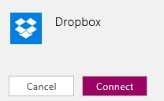
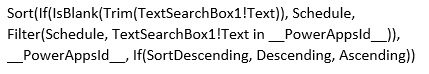
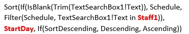

<properties
	pageTitle="Create an app from data in KratosApps"
	description=""
	services="kratosapps"
	authors="AFTOwen"
 />

<tags
   ms.service="kratosapps"
   ms.devlang="na"
   ms.topic="get-started-article"
   ms.tgt_pltfrm="na"
   ms.workload="na"
   ms.date="10/06/2015"
   ms.author="anneta"/>

# Create an app from data
Create an app automatically based on data that you specify, explore how the app works by default, and then customize the app to better fit how you work.

[What is KratosApps?]()

**Prerequisites**

- Sign up for and install [KratosApps]()
- A set of data in the cloud, such as in DropBox or OneDrive
- Familiarity with how to [configure a control](get-started-test-drive.md#configure-a-control) in KratosApps

## Connect to data ##
You can create an app based on data from any of several kinds of sources. For this tutorial, the data source is an Excel file in Dropbox. The file, named **eventsignup.xls**, contains this data [formatted as a table](https://support.office.com/en-us/article/Format-an-Excel-table-6789619F-C889-495C-99C2-2F971C0E2370) and named **Schedule**.

1. Sign in to KratosApps, and then click **New** in the left navigation bar.

	

1. Leave the default option to create a phone app.

	

1. Under **Start from Data**, click **Get started**.

	

1. If you don't already have a connection to a data source:
	1. Click **Available Connections**, and then click an option in the list that appears.
	1. Name the connection you're about to create, click **Add Connection**, and provide any requested credentials to connect to that data source.

	

1. Click a data set, and then click **Connect**.

	

1. Click a table, and then click **Connect**.

	

An app is created from the data that you specified.

## Explore the app ##

When the app is created, it appears in the default workspace, where you can customize the app to better fit your needs. Before you make changes, you'll explore how the app works in **Preview**. By running an app in **Preview**, you can completely test an app before you share it with others.

1. Press F5 to open **Preview**.

	

	The first screen, named **BrowseScreen**, shows which people are signed up for each shift in a schedule. You can sort the data, add an item, and search for an item by using the elements near the top of the screen.

1. Click the arrow for the first item to show details about that item.

	

	The **DetailScreen** appears, showing all data for the item you specified. You can delete or update that item by using the elements near the top of the screen.

	

1. Click the pencil icon to update the item.

	

	The **EditScreen** appears, with text boxes so that you can change the item, a cancel icon in the upper-left corner, and a save icon in the upper-right corner.

	

	**Note:** If you click the plus sign on the **BrowseScreen**, the **EditScreen** appears with all the text boxes blank so that you can create an item.

1. Replace either or both of the names with whatever names you want, and then click the save icon.

	

	The updated data appears in the app and the source.

1. Press Esc to return to the default workspace, in which you can customize the app.

## Change the layout, the content, and the theme ##
You can customize the default app by adding or deleting a screen, changing a property of a screen, and changing a specific element on a screen.

1. If the Quick Start pane isn't showing, click **Quick start** near the lower-right corner.

	The Quick Start pane opens and shows the **Layout** tab by default.

1. With **BrowseScreen1** showing, choose a different layout, such as **List4**.

	**BrowseScreen1** shows the day and staff information but not the time information from the shift schedule.

1. In the Quick Start pane, click **Content**.

	The **Content** tab opens.

1. In the **Heading2** list, click **StartDay**. and, in the **Subtitle2** list, click **StartTime**.

	**StartDay** and **StartTime** appear near the left edge of the screen, and **Staff1** appears near the right edge.

1. In the Quick Start pane, click **Theme**.

	The **Theme** tab opens.

1. Click a different theme, such as **Burgundy**.

	The colors on all screens in the app change to reflect the new theme.

## Customize the app further ##

1. On the **BrowseScreen1** screen, click **Sunday** just under the search icon.

	The label is now selected so that you can change its properties. When you change the property of an element in the first item of a gallery, you automatically change that property of the same element in all other items of the gallery.

1. On the **Home** tab of the ribbon, click the **FontWeight** button, and then click **Bold**.

	The day information in all items of the gallery appear in bold.

1. Click the time information in the first item of the gallery to select that label.

1. Drag the white square on the right edge of the selection box so that the label just fits the information it contains.

1. Move all three labels, by dragging their selection boxes, so that they appear in a row, horizontally aligned with the arrow for each item.

## Change the sort and filter criteria

1. With **BrowseScreen1** showing, click below the last item.

	The gallery that contains the schedule data is selected so that you can change its properties. In the properties list, the **Items** property is selected automatically, and its default value is this expression:

	

1. Change value of the **Items** property to this expression, which shows the updates in red bold.

	

1. Press F5, and then click the sort button, near the top of the screen, more than once.

	The items are sorted alphabetically by **StartDay**, switching between ascending and descending order.

1. In the search box, type one or more letters in at least one of the **Staff1** names.

	The screen shows only shifts that are staffed by people whose names contain the text that you specify. 

1. Press Esc to return to the default workspace.

When you finish customizing your app, you can share it with other people, as the last procedure in [Create an app with a template](get-started-test-drive.md) describes.
