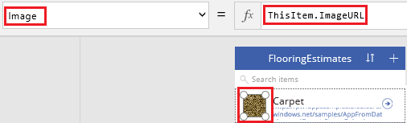

<properties
	pageTitle="Create an app from a set of data | Microsoft PowerApps"
	description="Create an app automatically based on an existing set of data that you specify and then customize the UI to better suit your needs."
	services=""
	suite="powerapps"
	documentationCenter="na"
	authors="AFTOwen"
	manager="erikre"
	editor=""
	tags=""/>

<tags
   ms.service="powerapps"
   ms.devlang="na"
   ms.topic="get-started-article"
   ms.tgt_pltfrm="na"
   ms.workload="na"
   ms.date="01/06/2015"
   ms.author="anneta"/>

# Create an app from a set of data

Create an app automatically based on data that you specify, explore how the app works by default, and then customize it to better fit how you work.

**Prerequisites**

- Learn how to [configure a control](add-configure-controls.md).
- Download this [Excel file](https://pwrappssamples.blob.core.windows.net/samples/FlooringEstimates.xlsx), and save it in your OneDrive account.

**Note:** You can create an app based on a [SharePoint list](app-from-sharepoint.md), [Salesforce data](app-from-saleforce.md), or [a table in Dynamics CRM](app-from-dynamics.md) just as easily.

## Create the app ##

1. In PowerApps, click or tap **New** on the **File** menu (near the left edge of the screen).

	

1. Under **Start from your data**, click or tap **Get started**.

	

1. Click or tap **Add a new connection**, click or tap **OneDrive**, and then click or tap **Connect**.

	  

1. When prompted, provide your credentials.

1. Under **Select an Excel file**, click or tap **flooringestimates.xlsx**, and then click or tap **Connect**.

	  

1. Under **Select a table**, click or tap the **FlooringEstimates** table, and then click or tap **Connect**.  

	  

PowerApps builds an app that contains three screens:

- **BrowseScreen1** shows some information about each item so that users can easily browse for the item they want.
- **DetailScreen1** shows all information about a single item.
- **EditScreen1** shows controls with which users can add an item or update information about an item.

When an app is built automatically, heuristics suggest the best layout and content based on the data. You might need to adjust the default settings to optimize the app for your needs.

## Customize the app ##

1. In the **Layout** tab of the **Quick tools** pane, click or tap an option that includes icons.

	

	The layout of **BrowseScreen1** changes to reflect your selection.

	

	**Note:** If you open the **Layout** tab with **DetailScreen1** or **EditScreen1** showing, you can choose different options, which reflect the data on that screen.

1. Click or tap the first image in the list, and then set its **Image** property to **ThisItem.ImageURL**.

	

1. Set the **Text** property of upper text box to **ThisItem.Name**, and set the **Text** property of lower text box to **ThisItem.Category**.

	The content of **BrowseScreen1** changes to reflect your selections.

	

	**Note:** By default, you can scroll through the list (called a gallery) by using a mousewheel or by swiping up and down. To show the scrollbar, [set the gallery's **ShowScrollbar** property](get-started-test-drive.md#configure-a-control) to **true**.

1. In the **Quick tools** pane, click or tap the **Theme** tab, and then click or tap a different theme, such as **Lavender**.

	

	As the thumbnails in the left navigation bar show, each screen in the app changes to reflect your selection.

	

1. To sort and filter the list by name instead of by category, set the **Items** property of the list to this formula:
 **Sort(If(IsBlank(TextSearchBox1.Text), FlooringEstimates, Filter(FlooringEstimates, TextSearchBox1.Text in Text(Name))), Name, If(SortDescending1, Descending, Ascending))**

## Run the app ##
1. With **BrowseScreen1** showing, open Preview by pressing F5 (or by clicking or tapping the Preview icon near the upper-right corner).

	

1. On **BrowseScreen1**, click or tap the arrow for a record to show details about that record.

	

1. On **DetailsScreen1**, click or tap the edit icon (in the upper-right corner) to edit the record.

	

1. On **EditScreen1**, change the information in one or more fields, and then select the checkmark in the upper-right corner to save your changes.

	

## Next steps ##

- You can further customize your app by performing similar tasks to those that [Create an app from scratch](get-started-create-from-blank.md) describes.
- [Save and share your app](get-started-test-drive.md#save-and-share-your-app) with other people.
