<properties
    pageTitle="Automate tasks by creating Logic Flows | Microsoft PowerApps"
    description="Create Logic Flows to automatically perform one or more actions, such as sending mail, when one or more conditions are met, such as someone adding a row to a SharePoint list."
    services=""
    suite="powerapps"
    documentationCenter="na"
    authors="stepsic-microsoft-com"
    manager="dwrede"
    editor=""
    tags=""
 />
<tags
    ms.service="powerapps"
    ms.devlang="na"
    ms.topic="get-started-article"
    ms.tgt_pltfrm="na"
    ms.workload="na"
    ms.date="11/14/2015"
    ms.author="stepsic"/>

# Create Logic Flows in PowerApps#
Create a logic flow to perform a task automatically when an event triggers an action. For example, create a logic flow that notifies you by mail as soon as someone tweets about a keyword. In this scenario, a tweet is the trigger, and sending mail is the action.

## Video example ##

[AZURE.VIDEO nb:cid:UUID:b95d313a-0d00-80c4-bb62-f1e5920004d6]

**Prerequisites**

- An Twitter account
- An Office 365 account (from which you can send email)
- Web browser

## Create a trigger

1. In your web browser, open [powerapps.com](http://go.microsoft.com/fwlink/?LinkId=708209), and then select **Create a flow**.

    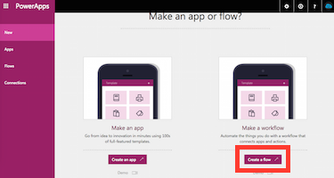

3. Select **Create from blank**.

    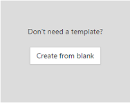

4. In the box that says **How would you like to start?**, type or paste **Twitter**.

1. In the list of actions, select **Twitter - When a new tweet appears**.

    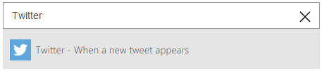

5. If you haven't already connected your Twitter account to PowerApps, select **Sign in to Twitter**, and then provide your credentials.

    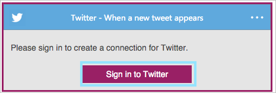

6. In the **QUERY TEXT** box type the keyword you are interested in searching.

    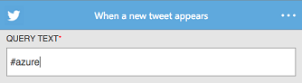

## Create an action ##
In this procedure, you'll add the action to send email and then you'll test that action. By following these steps, you'll learn the basics of actions and how to configure your logic flow to make it work the way you want.

1. Under the trigger condition that you created in the previous procedure, select the "+" button.

	

2. Select **Add action**.

    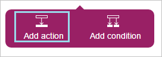

3. In the box that shows **What would you like to do next?**, type or paste **send email**, and then click **Office365 - Send Email**.

  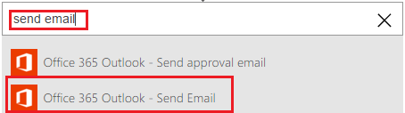

4. If prompted, provide your Office 365 credentials.

  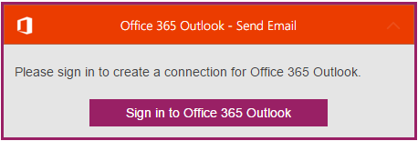

5. In the form that appears, type a subject in the **Subject** box and your email address in the **To** box.

	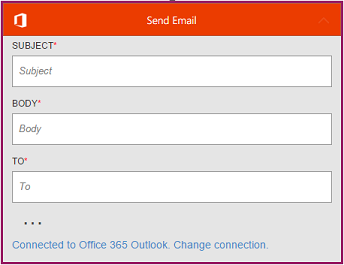

6. In the **Body** box, type or paste **New tweet:**, and then select a parameter (such as **Tweet text**) to add a placeholder for it to your message.

	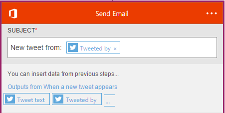

7. Type the end of your message, including any other parameters you want to include.

8. Name your PowerFlow in the box near the bottom of the screen, and then select **Done**.
	

    The list of your logic flow reflects your changes.

9. In the future, if you want to change the logic flow, select the edit icon, which looks like a pencil, next to the logic flow that you created in this procedure.

	

## Test your logic flow ##

1. Go to twitter and tweet with the keyword you indicated.

    Within a minute, an email message notifies you of the new tweet.

## Turn on or off your Logic Flow ##

You don't need to always keep your Logic Flow running. If you want to temporarily stop receiving email notifications, you can turn your flow off.

1. Open the PowerApps portal, and then click **Flows** in the left navigation bar.

2. In the list of Logic Flows, click the turn-off icon, which looks like a pause button, next to the Logic Flow that you want to turn off.

    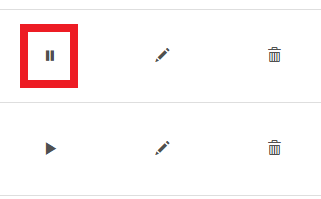

3. To turn it on again, in the list of Logic Flows, click the turn-on icon, which looks like a play button, next to the Logic Flow that you want to turn on.

## Delete your Logic Flow ##

You can delete a Logic Flow from the portal if you're done with that Logic Flow and no longer want to get notifications from it.

1. Open the PowerApps portal, and then click **Flows** in the left navigation bar.

2. In the list of Logic Flows, click the delete icon, which looks like a trash can, next to the Logic Flow that you want to delete.

    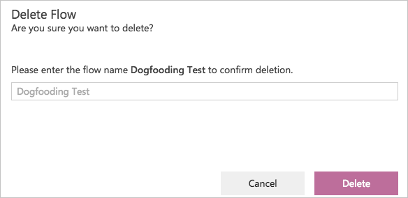

3. In the confirmation dialog box, type the full name of your Logic Flow into the text box, and then click **Delete**.

## Next Steps ##

- [Add steps](multi-step-logic-flow.md), such as different ways to be notified, to your logic flow.
- [Run tasks on a schedule](run-tasks-on-a-schedule.md), when you want something to happen every day or every hour
- [Add a logic flow to a PowerApp](add-logic-flow.md) to allow your app to kick off logic in the cloud.
