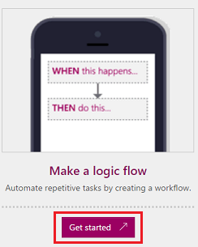

<properties
    pageTitle="Automate tasks by creating Logic Flows | Microsoft PowerApps"
    description="Create Logic Flows to automatically perform actions, such as sending mail, when events occur, such as someone adding a row to a SharePoint list."
    services=""
    suite="powerapps"
    documentationCenter="na"
    authors="stepsic-microsoft-com"
    manager="dwrede"
    editor=""
    tags=""
 />
<tags
    ms.service="powerapps"
    ms.devlang="na"
    ms.topic="get-started-article"
    ms.tgt_pltfrm="na"
    ms.workload="na"
    ms.date="11/24/2015"
    ms.author="stepsic"/>

# Create Logic Flows#

[AZURE.VIDEO nb:cid:UUID:b95d313a-0d00-80c4-bb62-f1e5920004d6]

Create a logic flow to perform a task automatically when you want an event to kick off an action. For example, create a logic flow that notifies you by mail as soon as someone sends a tweet that contains a keyword you specify. In this example, sending a tweet is the event, and sending mail is the action.

**Prerequisites**

- An account on [powerapps.com](http://go.microsoft.com/fwlink/?LinkId=708209)
- An Twitter account
- An Office 365 account (from which you can send email)

## Specify an event

1. In [powerapps.com](http://go.microsoft.com/fwlink/?LinkId=708209), select **Get started** under **Make a logic flow**.

	

1. Select **Create from blank**.

    

1. In the box that says **How would you like to start?**, type or paste **Twitter**.

1. In the list of events, select **Twitter - When a new tweet appears**.

	

5. If you haven't already connected your Twitter account to PowerApps, select **Sign in to Twitter**, and then provide your credentials.

    

6. In the **QUERY TEXT** box, type the keyword that you want to find.

	

## Specify an action ##
In this procedure, you'll add the action to send email, and then you'll test that action. By following these steps, you'll learn the basics of actions and how to configure your logic flow to make it work the way you want.

1. Under the event that you created in the previous procedure, select the "+" button.

	

2. Select **Add action**.

	

3. In the box that shows **What would you like to do next?**, type or paste **send email**, and then click **Office365 Outlook - Send Email**.

  

4. If prompted, provide your Office 365 credentials.

  

5. In the form that appears, type or paste your email address in the **TO** box.

	

1. In the **SUBJECT** box, type or paste **New tweet from: **, and then select the **Tweeted by** parameter to add a placeholder for it.

	

1. In the **BODY** box, select the **Tweet text** parameter to add a placeholder for it, and then type the end of your message, including any other parameters you want to include.

8. Name your logic flow in the box near the bottom of the screen, and then select **Done**.

	

	The list of your logic flow reflects your changes.

1. Test your logic flow by tweeting with the keyword you indicated.

	Within a minute, an email message notifies you of the new tweet.

## Change, pause, resume, or delete a logic flow ##
1. In [powerapps.com](http://go.microsoft.com/fwlink/?LinkId=708209), select **Logic flows** in the left navigation bar.

2. In the list of logic flows, do any of the following:

	- To change a logic flow, select the icon that looks like a pencil next to the logic flow that you want to change.

	

	- To pause your logic flow, select the icon that looks like a pause button next to the logic flow that you want to pause.

	

	- To resume a logic flow, select the icon that looks like a play button next to the logic flow that you want to resume.

	

	- To delete a logic flow, select the icon that looks like a trash can next to the logic flow that you want to delete, type the full name of your logic flow into the confirmation dialog box, and then click **Delete**.

	

## Next steps ##

- [Add steps](multi-step-logic-flow.md), such as different ways to be notified, to your logic flow.

- [Run tasks on a schedule](run-tasks-on-a-schedule.md), when you want an action to occur every day, on a certain date, or after a certain number of minutes.

- [Add a logic flow to an app](using-logic-flows.md) to allow your app to kick off logic in the cloud.
