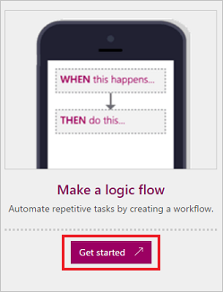
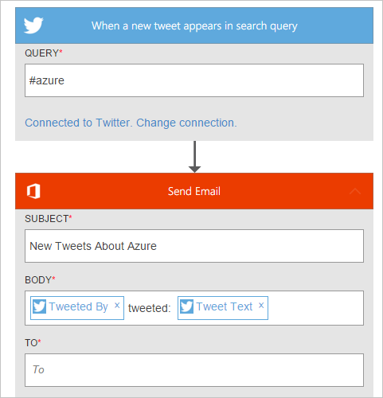

<properties
    pageTitle="Create Logic Flows from a template | Microsoft PowerApps"
    description="Create Logic Flows from any of several built-in templates."
    services=""
    suite="powerapps"
    documentationCenter="na"
    authors="stepsic-microsoft-com"
    manager="dwrede"
    editor=""
    tags=""
 />

<tags
  ms.service="powerapps"
    ms.devlang="na"
    ms.topic="article"
    ms.tgt_pltfrm="na"
    ms.workload="na"
    ms.date="11/14/2015"
   ms.author="stepsic"/>

# Create Logic Flows from a template #
Create Logic Flows from any of several built-in templates that can, for example, send you an email message when anyone sends a tweet that includes a particular keyword.

**Note:** [Create a logic flow from scratch](get-started-logic-flow.md) if you want to start from a blank canvas.

**Prerequisites**

- An account on [powerapps.com](http://go.microsoft.com/fwlink/?LinkId=708209)
- An account on Twitter
- An account on Office 365 (from which you can send email)

## Choose your template

1. Open [powerapps.com](http://go.microsoft.com/fwlink/?LinkId=708209), and then select **Get started** under **Make a logic flow**.

	

	A list of categories appears on the left, and all of the templates appear on the right.

1. In **Get Email Notification for Tweets**, select **Use this template**, and then provide your credentials for Twitter and Office 365.

	Your logic flow appears, showing all trigger conditions and actions.

	

## Finish your logic flow ##

1. Specify data in any empty fields that are marked with a red asterisk (*), such as the address to which you want messages sent.

1. (optional) In the **QUERY** box, specify a different keyword.

1. Near the bottom of the screen, specify a name for your logic flow, and then select **Done**.

	

## Next steps ##

- [Add steps](multi-step-logic-flow.md), such as different ways to be notified, to your logic flow.
